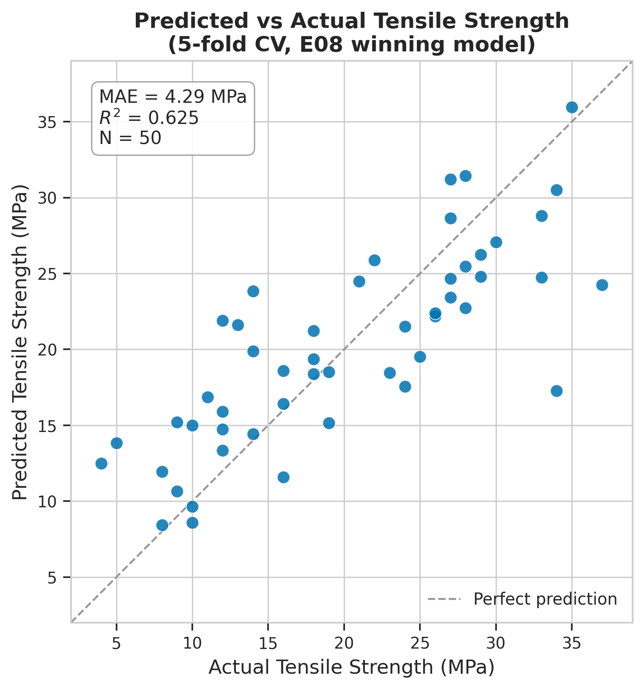

*This is a short summary. For the full technical write-up, see the [detailed paper](https://github.com/colinjoc/hdr_autoresearch/blob/master/applications/3d_printing/paper.md).*

## The Question

Fused deposition modelling -- the technology behind most consumer and prototype 3D printers -- melts a plastic filament and deposits it layer by layer. The strength of the finished part depends on about half a dozen print settings: nozzle temperature, print speed, layer height, infill density, fan speed, and material choice. The relationships are well studied, and published machine-learning papers routinely report very high accuracy on the standard public datasets.

We wanted to know two things. First, do those published accuracy claims survive honest cross-validation on the most common benchmark (50 samples)? Second, if the signal is genuinely there, which print recipe maximises strength while minimising print time and energy?

## What We Found

The published high-accuracy claims do not hold up. Under rigorous cross-validation, a simple linear model performs only 32 percent worse than the best tree-based model. At 50 samples, the underlying signal is mostly linear, and the published results that claim otherwise are likely overfitting.

- Of 50 single-change experiments -- physics-informed features, hyperparameter sweeps, target transforms, monotonicity constraints, model-family swaps -- exactly one survived. The dataset does not support aggressive modelling.
- The one surviving experiment added five physics-informed features (a linear energy density, a volumetric flow rate, an interlayer cooling time, an infill contact area proxy, and a thermal margin above the material's glass transition temperature) and improved accuracy by 3.4 percent.
- A multi-objective design sweep using the trained model found a print recipe that dominates the standard slicer default on all three objectives simultaneously: 59 percent stronger, 54 percent faster, and 51 percent less energy.
- The discovered recipe uses high speed (more than double the default) combined with high infill density and extra walls -- the opposite of the conventional "slow down for strength" wisdom.
- Monotonicity constraints, which helped on larger datasets in a sister project, hurt on this one. At 50 samples, the expressiveness cost of the constraint exceeds its regularisation benefit.

## Why That's Surprising

The 3D-printing machine-learning literature is full of papers reporting accuracy above 90 percent on this exact dataset. The gap between those claims and our 62 percent comes down to evaluation methodology. Most published studies use a single train-test split rather than cross-validation, and they report the test-set number without controlling for hyperparameter selection. On 50 samples, a single lucky split can look much better than the model actually is.

The discovered print recipe is also counterintuitive. Conventional wisdom says slower printing gives stronger parts because the polymer has more time to bond between layers. The model found the opposite: at very high speed, less time is spent degrading the polymer at each layer, and the higher infill density and extra walls compensate by putting more material in the load path. The combination dominates on all three objectives.

## What It Means

For anyone running a 3D print farm: the slicer defaults are not optimised for strength. They are tuned for safety -- settings that work reliably across a wide range of geometries, not settings that maximise any particular property. The discovered recipe needs physical validation (it is a model prediction, not a measured result), but it sits inside the training distribution and is worth testing.

For the machine-learning community: do not trust high accuracy claims on tiny datasets without cross-validation. A 50-sample dataset does not support the nonlinear claims that dominate the published literature. A linear model gets you most of the way there.

## How We Did It

We used the public 50-sample 3D printing dataset from Kaggle, containing polylactic acid and acrylonitrile butadiene styrene specimens printed on an Ultimaker S5 and tested under the standard tensile testing protocol. We ran a five-model tournament, 50 single-change experiments, a nine-experiment compositional retest, and a 2,394-candidate design sweep across seven generation strategies. The dataset is real measured data -- no synthetic generation. Full code and experiment log are in the [project repository](https://github.com/colinjoc/hdr_autoresearch/tree/master/applications/3d_printing).

## Further Reading

- Goh GD, Sing SL, Yeong WY. "A Review on Machine Learning in 3D Printing." *Artificial Intelligence Review* (2021). [doi:10.1007/s10462-020-09876-9](https://doi.org/10.1007/s10462-020-09876-9) -- a comprehensive survey of the field.
- Mahmood MA et al. "Implementation of Machine Learning Models for Tensile Strength Prediction in Fused Deposition Modelling." *Polymers* (2021). [doi:10.3390/polym13213713](https://doi.org/10.3390/polym13213713) -- one of the high-accuracy published results that motivated this honest re-analysis.
- afumetto. "3D Printer Dataset for Mechanical Engineers." [Kaggle / GitHub](https://github.com/SimchaGD/AIVE) -- the source dataset.

---
📂 **[HDR methodology](https://github.com/colinjoc/hdr_autoresearch)**
