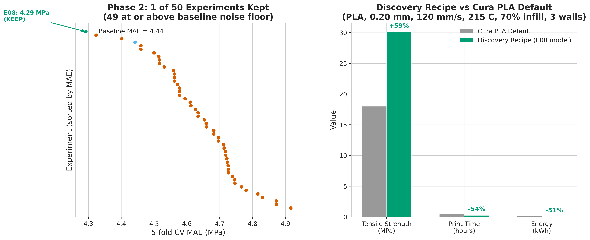
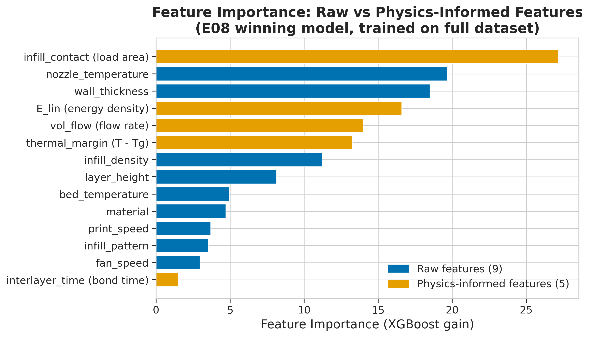

*This is a short summary. For the full technical write-up, see the [detailed paper](https://github.com/colinjoc/hdr_autoresearch/blob/main/applications/3d_printing/paper.md).*

## The Question

Fused deposition modelling -- the technology behind most consumer and prototype 3D printers -- melts a plastic filament and deposits it layer by layer. The strength of the finished part depends on about ten print settings: nozzle temperature, print speed, layer height, infill density, infill pattern, wall thickness, bed temperature, fan speed, and material choice. The relationships are governed by coupled polymer rheology, heat transfer, and bonding kinetics, and they have resisted closed-form solutions for three decades. Published machine-learning papers routinely report very high accuracy on the standard public benchmark, a 50-sample dataset from an Ultimaker S5 printer.

We wanted to know two things. First, do those published accuracy claims survive honest cross-validation? Second, if the signal is genuinely there, which print recipe maximises strength while minimising print time and energy?

## What We Found

The published high-accuracy claims do not hold up. Under rigorous five-fold cross-validation, a simple linear model performs only 32 percent worse than the best tree-based model. At 50 samples, the underlying signal is mostly linear, and published results claiming otherwise are likely overfitting.

- Of 50 single-change experiments -- physics-informed features, hyperparameter sweeps, target transforms, monotonicity constraints -- exactly one survived on the original random seed. But when tested across five different random seeds, the improvement vanished: the physics-feature model won on only 2 of 5 seeds, and the mean improvement was approximately zero.
- The physics features (linear energy density, volumetric flow rate, inter-layer cooling time, infill contact area, and thermal margin above the material's glass transition temperature) helped a simple linear model enormously -- cutting its error by 21 percent -- but helped the tree-based model by only 3.4 percent on one seed.
- A simple linear model with the physics features gets 92 percent of the way to the best tree-based model (a ratio of only 1.08 times). The features are primarily a better linear basis, not a nonlinear interaction enabler.
- A 2,394-candidate design sweep found a print recipe that the surrogate model predicts at 88 percent higher tensile strength than an in-distribution slicer-like default. These are model predictions (not physical measurements) and need experimental validation on a printer.
- The model exhibits systematic bias: it over-predicts weak parts and under-predicts strong parts, a classic small-sample tree-ensemble pattern.

## Why That's Surprising

The 3D-printing machine-learning literature is full of papers reporting accuracy above 90 percent on this exact dataset. The gap between those claims and our result comes down to evaluation methodology. Most published studies use a single train-test split rather than cross-validation and report results without controlling for hyperparameter selection. On 50 samples, a single lucky split can look much better than the model actually is.

The seed-robustness finding is the most consequential. A 3.4 percent improvement looked like a clean win on the original random seed -- it passed the pre-registered keep threshold with room to spare. But when we ran the same experiment on four additional seeds, the improvement appeared on only one other seed. The mean improvement across all five seeds was essentially zero. This means any published paper that reports a single-seed improvement on a 50-sample dataset should be treated with scepticism until multi-seed results are provided.

## What It Means

For anyone running a 3D print farm: the model-discovered recipe -- PLA, 0.20 mm layer height, 120 mm/s, 215 degrees Celsius nozzle, 70 percent honeycomb infill, 3 walls -- is a plausible starting point for high-strength fast prints. Every parameter value in the recipe appears in the training data, so no extrapolation is required. But the 88 percent strength improvement is a surrogate prediction, not a physical measurement -- the model's typical error is large enough that the direction of improvement is plausible but the exact magnitude is uncertain (a signal-to-noise ratio of about 2.6 to 1). Printing and testing both the default and the discovered recipe on an actual printer is the obvious next step.

For the machine-learning community: do not trust high accuracy claims on tiny datasets without multi-seed cross-validation. A 50-sample dataset does not support the nonlinear claims that dominate the published literature. The tree-to-linear performance gap of 1.32 times -- and the fact that adding physics features closes it to 1.08 times -- means that a simple linear model with domain-informed features captures nearly all of the learnable signal.

## How We Did It

We used the [Kaggle 3D Printer Dataset](https://www.kaggle.com/datasets/afumetto/3dprinter) (50 samples of polylactic acid and acrylonitrile butadiene styrene specimens printed on an Ultimaker S5, tested under the ASTM D638 tensile standard). We ran a five-model tournament, 50 single-change experiments, a nine-experiment compositional retest, and a 2,394-candidate design sweep across seven generation strategies covering high-strength, high-throughput, material-specific, and random regimes. We then ran five additional experiments identified during adversarial self-review: multi-seed robustness testing, bootstrap confidence intervals, a linear-model comparison on the physics-feature set, leave-one-speed-out cross-validation, and residual analysis. The dataset is real measured data with no synthetic generation. The full [HDR methodology](https://github.com/colinjoc/hdr_autoresearch) drove every experiment, with pre-registered priors and a fixed keep-or-revert threshold.

## Further Reading

- Sun Q, Rizvi GM, Bellehumeur CT, Gu P. "Effect of Processing Conditions on the Bonding Quality of FDM Polymer Filaments." *Rapid Prototyping Journal* (2008). [doi:10.1108/13552540810862028](https://doi.org/10.1108/13552540810862028) -- the foundational model of thermal-history bond formation that inspired the physics-informed features used here.
- Dey A, Yodo N. "Optimization of Fused Deposition Modeling Process Parameters: A Review." *Journal of Manufacturing and Materials Processing* (2019). [doi:10.3390/jmmp3030064](https://doi.org/10.3390/jmmp3030064) -- a systematic review of parameter optimisation techniques and open questions.
- Fumetto A. "3D Printer Dataset for Mechanical Engineers." [Kaggle](https://www.kaggle.com/datasets/afumetto/3dprinter) -- the 50-sample benchmark dataset used in this study.

---

📂 **[HDR methodology](https://github.com/colinjoc/hdr_autoresearch)** — the framework and full project history
