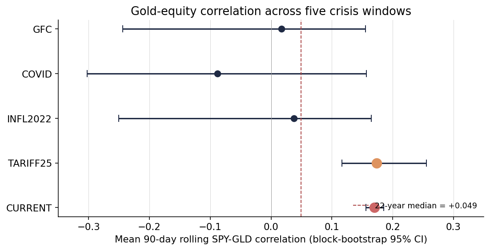
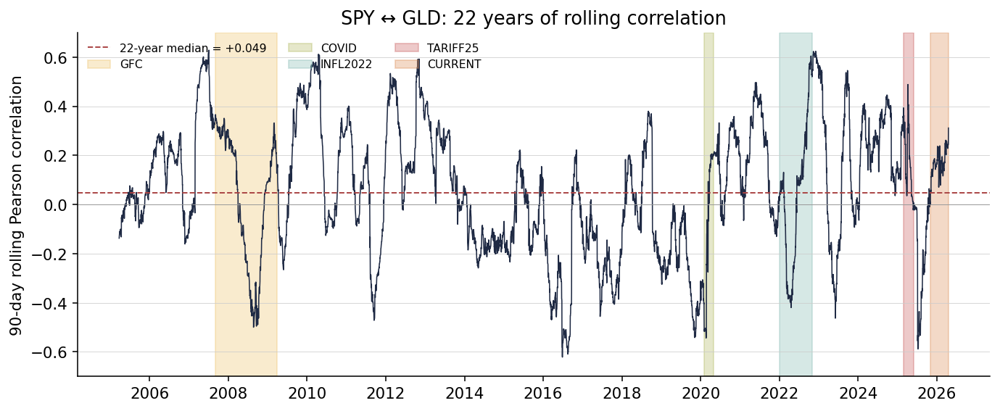
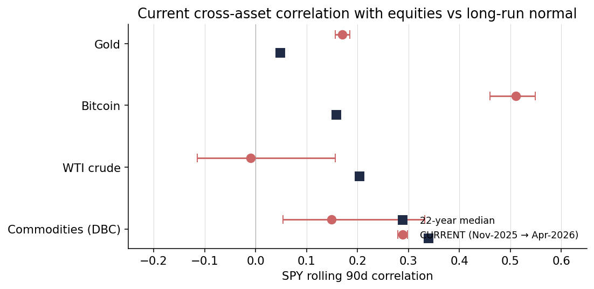

*A plain-language summary. The [full technical paper](https://github.com/colinjoc/generalized_hdr_autoresearch/blob/main/applications/asset_correlation_regimes/paper.md) has the tables, derivations, and experiment logs. This is an **exploratory** project — the goal was personal understanding, not publication. See [About HDR](/hdr/) for how this work was produced and reviewed.*

**Bottom line.** Over 22 years of daily data, the rolling 90-day correlation between the S&P 500 and gold has averaged close to zero. In late 2025 and early 2026 it has run in a narrow band around +0.17. That is atypical. It is also not unprecedented — the 2022 inflation shock and the spring-2025 tariff episode both reached the same level. Bitcoin is the cleaner story: its correlation with US equities is now roughly three times its long-run average and the elevation holds across any rolling window we check. Oil and broad commodities are actually *less* correlated with equities than usual. The casual claim that "everything is moving together in 2025" does not survive contact with the data.

## The question

A gold price chart and a stock index chart in late 2025 look unusually similar. Both go up together, both wobble on the same days. That is not how the textbook story goes. Gold is supposed to be a safe haven — an asset that zigs when equities zag, giving portfolios some protection when markets fall. If gold is tracking stocks, something is off.

We set out to check whether "something is off" is a real finding, or whether the current pattern fits comfortably inside what has already happened in the last two decades. The approach was deliberately simple: build a clean rolling-correlation panel for the S&P 500 (via SPY) against gold (GLD), bitcoin (BTC), oil (WTI), and a broad commodity basket (DBC) from 2004 to today, then partition the history into macroeconomic regimes and compare the current window to each.

## The first answer was wrong

The initial analysis reported that the current gold-equity correlation was "the highest in 22 years." The confidence intervals looked tight. The number looked solid. A Phase 2.75 adversarial review, run as an independent sub-agent with no prior context, caught the mistake in a single pass.

The problem was the bootstrap. Standard resampling confidence intervals assume the observations you are resampling are independent of each other. A 90-day rolling correlation computed daily is the opposite of independent: each day's value shares 89 of its 90 days of underlying returns with the previous day's value. The lag-1 autocorrelation in these series runs from 0.87 to 0.997 depending on the window. Once you account for that, the effective number of independent observations in each crisis window is not a few hundred. It is between one and eight.

Moving to a block bootstrap — which resamples contiguous chunks rather than isolated days — widens the confidence intervals by factors of roughly two to eight. And under honest intervals, the "highest in 22 years" headline collapses. The March–May 2025 tariff window has a point estimate of +0.174, marginally *above* the current +0.170. Three of four prior crisis windows have intervals that overlap the current window. Only the 2007–2009 financial crisis is cleanly separated.

This is the kind of mistake that survives casual peer review and only falls apart when someone re-derives the statistics from first principles. It is now written up as a retraction in the technical paper.

<figure>
  
  <figcaption><strong>Figure 1.</strong> Mean 90-day SPY-gold correlation and block-bootstrap 95 percent confidence interval across five crisis windows. The current window (red) and the spring-2025 tariff window (orange) are statistically indistinguishable. The long-run median (+0.049) sits well below both.</figcaption>
</figure>

## What the 22-year record actually shows

Gold's long-run rolling correlation with the S&P 500 has a median of +0.049 — essentially zero. The wings reach to −0.4 and +0.5 depending on the period. The recent +0.17 sits well above the median but nowhere near the top of the historical range. What is unusual is not the level; it is the persistence. The correlation has been stuck in a +0.15 to +0.19 band for more than five months.

<figure>
  
  <figcaption><strong>Figure 2.</strong> The 22 years of SPY-gold rolling correlation, with the five identified crisis windows shaded and the long-run median as a dashed line. The current elevation is visible but not extraordinary compared to the 2022 inflation shock or the spring-2025 tariff episode.</figcaption>
</figure>

## The cross-asset picture

The casual "everything is moving together" narrative gets less support when you look beyond gold.

<figure>
  
  <figcaption><strong>Figure 3.</strong> Current window (red, with block-bootstrap 95 percent intervals) versus long-run median (blue) for four risk assets. Gold and bitcoin are above their 22-year norms; oil and broad commodities are below.</figcaption>
</figure>

- **Bitcoin** is the cleanest finding. Its current correlation with equities is +0.51 against a long-run median of +0.16 — about three times the normal level. The elevation is robust across any rolling window we try. This is consistent with the post-January-2024 regime shift triggered by the approval of spot bitcoin exchange-traded funds: institutional capital now holds bitcoin alongside stocks and treats it as part of the same risk bucket. The "digital gold" framing of 2020 is empirically dead.
- **Gold** is the atypical-but-not-unprecedented case discussed above.
- **Oil (WTI)** is essentially uncorrelated with equities in the current window (−0.01) against a long-run median of +0.20. Less, not more, correlated than usual.
- **Broad commodities (DBC)** are at +0.15 against +0.34 normally. Again, less correlated than usual.

If the narrative were "global risk-on, everything rallies together," oil and commodities should be near their long-run levels of +0.2 to +0.35. They are not. A more accurate description is: during an episode of aggressively hawkish US trade policy and a choppy dollar, the commodity-equity link weakens while the gold-equity link strengthens. That is the opposite of a generic risk-on story.

## The window-length trap

One more robustness check matters. The +0.17 gold number is a 90-day rolling correlation. At 30 days it is +0.25. At 250 days it is +0.03 — indistinguishable from the long-run median. The "elevation" is concentrated in the last few months; it is not yet a multi-year phenomenon. Any claim about this needs to specify the window. A piece that says "gold is now positively correlated with stocks" without naming the window length is, at best, imprecise.

## Can macro variables predict any of this?

No. We ran a three-way tournament — linear regression, gradient-boosted trees, and random forests — on the rolling correlation series with the usual macroeconomic suspects as features: federal funds rate, three-month change in the federal funds rate, inflation, dollar index, 10-year Treasury yield, realised equity volatility, and seasonality. Every model, on every target, produced strongly negative out-of-sample R² under properly-embargoed cross-validation. A negative R² means the model does worse than predicting the training-set average.

Which could mean rolling correlations are genuinely unpredictable from these features, or that the feature set is too thin. We cannot settle that here. What we can say is that slow-moving macroeconomic indicators do not forecast the rolling correlation one quarter ahead. Anyone who claims they do should be asked to share their cross-validation setup.

## Limitations, honestly

- The crisis windows (GFC, COVID, 2022 inflation, 2025 tariff, "current") were chosen after looking at the correlation series. Any claim that the current window is elevated against "normal" is partially circular, which is why we report the current-start-date sensitivity explicitly: moving the start from September to December changes the mean from +0.10 to +0.18.
- The regime thresholds (25-basis-point Fed move, 3.5 percent inflation, 3 percent dollar change, 15 percent drawdown) are also post-hoc. They are useful buckets for reading the data; they are not a pre-registered test.
- The current window is 5.5 months. At an effective sample size of about eight independent observations, it cannot support strong inferential claims — only descriptive ones.
- Bitcoin data starts in September 2014, so the 2008 financial crisis has no bitcoin comparison.
- We did not attempt a DCC-GARCH robustness check. For an exploratory project this is acceptable; a publication-target version of this work would need one.
- The Geopolitical Risk Index, which would be a natural regime variable given the 2022–present backdrop, was unreachable at all fetch attempts. It was dropped from the conditioning set.

## The transferable lesson

For anyone doing rolling-correlation work, the methodological finding is more useful than the empirical one. Default bootstrap confidence intervals are IID. Rolling statistics on daily data are not. If your observations share 89 of 90 days of underlying information, your confidence intervals will be two to eight times too tight. You will find "statistically significant" effects that vanish under honest resampling. A moving-block bootstrap with a block length on the order of the rolling window is the minimum correct tool. The block-bootstrap script from this project is about 40 lines of code; it fits on a single screen. Any production inference on rolling correlations should use something like it.

The broader lesson is the value of an adversarial reviewer who has no context. The initial analysis looked fine to the person who ran it. A fresh pair of eyes — running the same scripts, checking the same assumptions — caught a factor-of-eight error in under an hour. When working alone, the equivalent is writing down what an adversary would attack, then playing that adversary before you share the result.

## Further reading

- Forbes and Rigobon (2002), "No contagion, only interdependence: measuring stock market comovements" — why naive correlation spikes in crises can be an artefact.
- Baur and Lucey (2010), "Is gold a hedge or a safe haven? An analysis of stocks, bonds and gold" — the modern safe-haven definition.
- Conlon and McGee (2020), "Safe haven or risky hazard? Bitcoin during the COVID-19 bear market" — bitcoin's decisive failure as a safe haven in March 2020.
- Tang and Xiong (2012), "Index investment and the financialization of commodities" — the post-2004 structural break that put commodities and equities on the same cycle.
- Künsch (1989), "The jackknife and the bootstrap for general stationary observations" — the moving-block bootstrap that fixes the CI problem in this project.
- López de Prado (2018), *Advances in Financial Machine Learning* — purged cross-validation for overlapping-window targets.
- [Full technical paper](https://github.com/colinjoc/generalized_hdr_autoresearch/blob/main/applications/asset_correlation_regimes/paper.md).
