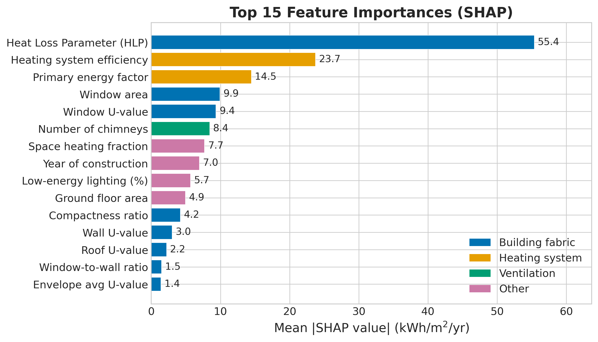
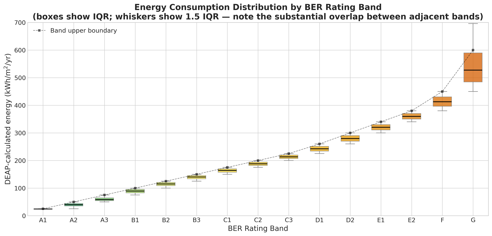

*This is a short summary. For the full technical write-up, see the [detailed paper](https://github.com/colinjoc/hdr_autoresearch/blob/master/applications/ber_energy_gap/paper.md).*

## The Question

Every home sold or rented in Ireland must have a Building Energy Rating certificate, graded from A1 (best) to G (worst). The rating is not measured from gas and electricity bills. It is calculated by a physics formula called DEAP, which takes the building's dimensions, insulation values, heating system, and ventilation details and produces a number in kilowatt-hours per square metre per year.

Ireland has committed to retrofitting 500,000 homes to a B2 rating or better by 2030. The energy certificate is the yardstick. We used machine learning on the full national dataset -- 1.33 million certificates covering roughly two thirds of the housing stock -- to ask which building characteristics the DEAP formula weighs most heavily, and what happens when you perturb them one at a time.

## The Honest Baseline

Before doing any machine learning, we checked how well you can reconstruct the BER score from the DEAP formula's own intermediate outputs, which are included in the public dataset. The answer: almost perfectly. Summing the primary energy components and dividing by floor area gives a mean absolute error of 7 kilowatt-hours per square metre per year. The machine learning model, trained on building characteristics instead, achieves 18. It is 2.6 times worse than the formula it is trying to approximate.

This tells you what the ML exercise is and is not. It is not beating the formula. It is not discovering new physics. It is learning a lossy approximation to a known calculation. Its value is in two things: first, SHAP attribution that tells you which input features matter most; second, the ability to predict a rating from basic building characteristics without running the full assessment.

## What the Attribution Reveals

The SHAP analysis decomposes each prediction into per-feature contributions, and the ranking is clear. The Heat Loss Parameter -- a composite measure of how well insulated the walls, roof, floor, and windows are relative to the building's size -- dominates everything else by more than two to one. Heating system efficiency comes second. After that, the primary energy factor (which encodes the carbon intensity of the fuel), window properties, and chimney count.

The chimney finding is the most interesting. Open chimneys rank sixth overall, but that average includes the 58 percent of dwellings that have no chimney at all. For the 42 percent that do, setting the chimney count to zero in the model predicts a mean saving of 21 kilowatt-hours per square metre per year -- a large number. In pre-1930 detached houses, the prediction rises to 26. The physical mechanism is plausible: an open chimney is an uncontrolled ventilation path that bypasses every insulation improvement.

But this is a model prediction, not a measurement. Nobody has published a controlled field trial measuring what happens to a real Irish home's energy consumption when you seal the chimney. The prediction says it matters a lot. The prediction needs to be tested.

## What the Model Gets Wrong

Two things stand out about the model's limitations.

First, it does not generalise well across time. When we trained on pre-2020 certificates and tested on 2020 to 2026, the error jumped from 18 to 28 -- a 52 percent degradation. The post-2020 building stock is dominated by near-zero-energy buildings and heat pumps, which the pre-2020 training data barely contains. The model overfits to the regulatory regime it was trained on.

Second, the biggest single feature improvement came from a partially circular variable. Space heating fraction -- the proportion of total delivered energy that goes to space heating -- is itself computed by DEAP. Including it improved the model by 1.1 points. Removing it and the other DEAP-derived features returns the error to 19.4. The honest headline number for a model using only genuinely independent building characteristics is 19, not 18.

## The Performance Gap Nobody Can Ignore

The most important context for all of this: DEAP's ratings do not match reality. Studies matching certificates to actual meter readings find that A-rated homes use about 1.3 times their calculated energy (because occupants increase comfort when heating is cheap) while G-rated homes use about 0.6 times their calculated energy (because occupants heat one room and wear jumpers). The calculated gap between best and worst is 8.5 to 1. The actual gap is about 2 to 1.

Every retrofit saving predicted from the certificates should be discounted by 20 to 40 percent to reflect what actually happens. Ireland's 2030 retrofit target will deliver less energy saving than the headline numbers suggest.

## What It Means

For a homeowner: if your house has an open chimney or disused fireplace, the model says sealing it should be the single highest-impact low-cost measure. This has not been proven by field trial, but the physics is plausible and the cost is low enough (roughly 200 euros) that the risk is minimal.

For policymakers: the building energy certificate system is useful as a screening tool for identifying which homes need work. It should not be used as an energy savings calculator. The DEAP formula is a deterministic physics model with standardised occupancy assumptions that do not match how people actually live.

For researchers: if you are going to train a machine learning model on a deterministic formula's outputs, compare against the formula first. We did not do this in our initial analysis, and a peer reviewer correctly flagged it as the most fundamental gap. The DEAP intermediate outputs are in the public dataset. They achieve MAE 7. If your ML model cannot beat 7, its contribution is interpretability, not accuracy -- and you should say so.

## How We Did It

We used the complete Sustainable Energy Authority of Ireland public dataset of 1.33 million certificates, released under a Creative Commons licence. A four-family model tournament selected LightGBM. An 11-experiment hypothesis-driven loop tested nine features and two model configurations. Per-dwelling counterfactual perturbations replaced the original mean-dwelling approach after peer review revealed that the mean dwelling has 0.52 chimneys, and subtracting one chimney gives a physically impossible negative value that the model extrapolates wildly on. Full details and code are in the [project repository](https://github.com/colinjoc/hdr_autoresearch/tree/master/applications/ber_energy_gap).

## Further Reading

- Moran P et al. "Measured vs Calculated Energy Performance in Irish Residential Buildings." *Energy and Buildings* (2020). [doi:10.1016/j.enbuild.2020.110206](https://doi.org/10.1016/j.enbuild.2020.110206) -- the Irish study quantifying the 2:1 actual energy gap versus the 8:1 calculated gap.
- Sunikka-Blank M, Galvin R. "Introducing the Prebound Effect." *Building Research and Information* (2012). [doi:10.1080/09613218.2012.690952](https://doi.org/10.1080/09613218.2012.690952) -- the landmark paper defining the gap between predicted and actual energy use.
- Fowlie M et al. "Do Energy Efficiency Investments Deliver?" *Quarterly Journal of Economics* (2018). [doi:10.1093/qje/qjy005](https://doi.org/10.1093/qje/qjy005) -- why predictive models and causal estimates of retrofit effects diverge.
- SEAI. "National BER Research Tool." [seai.ie](https://www.seai.ie/) -- the public dataset used in this analysis.

---
[HDR methodology](https://github.com/colinjoc/hdr_autoresearch)
