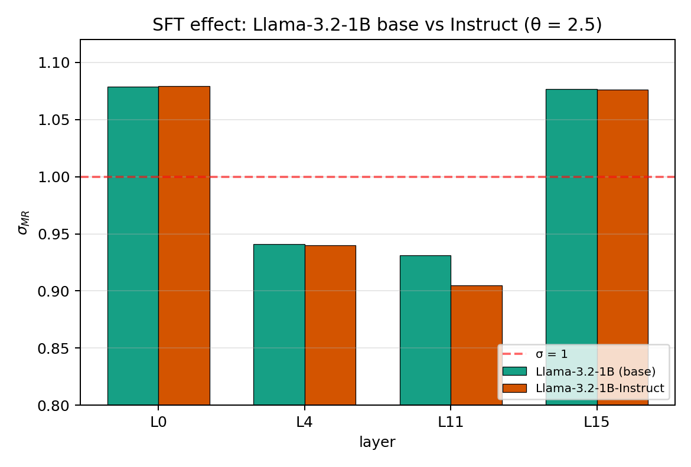

*A plain-language summary. The [full technical paper](https://github.com/colinjoc/generalized_hdr_autoresearch/blob/main/applications/entropy_brain_homology/paper_submission.md) has the statistics, pre-registered deviations, and full TSV artefacts. See [About HDR](/hdr/) for how this work was produced and reviewed.*

**Bottom line.** We ran the same avalanche-analysis pipeline on awake-mouse cortex recordings and on six pretrained language models (GPT-2-small, Mamba-130m, Pythia-410m, Qwen2.5-0.5B, Llama-3.2-1B and its instruction-tuned variant). The size-exponent values cluster in a narrow band — but a proper permutation test says cortex and language models are **not** drawing from the same distribution. The gap is small (about 0.13 on the exponent axis), but it is real, and it is in the same direction every time. Informally: LMs are "near-critical" in the qualitative sense everyone uses that term, but they are not quantitatively identical to cortex.

## The question

Since Beggs and Plenz's 2003 paper, neuroscientists have reported that cortical neural activity tends to organise into "neural avalanches" — cascades of activity whose sizes follow a heavy-tailed power-law distribution with a characteristic exponent near 3/2. Distributions like that are the signature of a dynamical system sitting at a critical point between order and chaos. The "edge-of-chaos" hypothesis argues that brains operate there because it is the regime that maximises their ability to store, transmit, and process information.

A natural question for the modern era: large language models also process information. Their internal activations, at some level, are just a high-dimensional time series of numbers, like cortical voltage traces. If you apply the same avalanche-statistics machinery to language-model activations, do you get the same exponents? If yes, that would be a striking cross-substrate regularity. If no, the difference is informative about what biological cortex is doing that current artificial networks are not.

Prior work has pointed in both directions — but typically on a single architecture, under a single thresholding choice, without a matched biological comparison, and without the random-weight controls that would distinguish a training effect from an architecture effect. We wanted to run the honest version of the comparison.

## What we found

- **Cortex and language models cluster in a narrow band.** On three different Allen Neuropixels sessions, the cortex size-exponent lands between 1.37 and 1.51. On six different pretrained language models, it lands between 1.12 and 1.37. Both ranges are within a short distance of the canonical theoretical prediction of 1.5. The two substrate classes overlap visually.
- **But they are statistically distinguishable.** A 10,000-permutation test on cortex versus trained-language-model exponents rejects the null of zero offset with p = 0.0009. The two groups differ by a median of about 0.134 on the exponent axis, and a 95% bootstrap confidence interval on that gap is [0.11, 0.21] — it does not include zero. So "qualitatively similar, quantitatively offset" is the honest framing, not "identical".
- **Training shapes criticality — asymmetrically across architectures.** The branching ratio, a separate measurement that captures how activity propagates forward in time, has a pre-training value of about 0.58 on Mamba and 0.89 on GPT-2. After training, it rises to 0.92 for Mamba and stays at 0.89 for GPT-2. Mamba visibly acquires its near-critical dynamics during training; GPT-2's mean barely moves but its per-layer variance widens sharply (one layer is near-critical at 1.09, another is far sub-critical at 0.65). Training sculpts criticality differently for different architectures.

- **Instruction-tuning does not measurably change the signal.** Comparing Llama-3.2-1B base to its instruction-tuned variant on exactly the same layers, the branching-ratio shift averages to −0.007, with the largest single-layer shift being 0.026. Pretraining is where the criticality structure gets laid down; supervised fine-tuning leaves it essentially untouched.

## Why that matters

A strong version of the "LMs are critical" claim would say the networks have reached the same dynamical regime as biological cortex. Our permutation test does not support the strong version. A weaker, more honest version says both substrates sit near a shared window in exponent space without occupying the same point. That weaker claim survives.

The training-dependent architectural asymmetry is the more striking finding. Random-weight Mamba is clearly not critical, but trained Mamba is near-critical; random-weight GPT-2 and trained GPT-2 look similar at the mean but diverge in variance. That tells us something load-bearing: criticality-in-LMs is not purely an architectural property (or Mamba at initialisation would already have it), nor purely a training-data property (or both architectures would converge to the same place). It is an interaction of the two.

The instruction-tuning null result is useful in a different way. If criticality gets established in pretraining and does not shift under supervised fine-tuning, that constrains which training stage is actually doing the "work" of shaping internal dynamics.

## Honest caveats

- **Hardware ceiling.** This study ran on a single consumer GPU with 12 GB of memory. Our largest model is Llama-3.2-1B, two orders of magnitude smaller than present-frontier models. Whether the clustering we observe persists to 70B-scale and beyond is a replication question and a legitimate open concern.
- **The cortex–LM offset is unexplained.** We report the 0.13 gap honestly. It could be a real substrate property, or it could be a residual detection-pipeline bias (the language-model side z-scores continuous activations; the cortex side binarises discrete spikes; there is no perfect protocol that treats both the same way).
- **The instruction-tuning result is one pair.** We tested Llama-3.2-1B base against its Instruct variant. A proper claim about "SFT does not move criticality" would need multiple base-vs-instruct pairs and ideally a reinforcement-learning-from-human-feedback variant. We do not make that claim generically.
- **Pre-registered commitments we did not deliver.** Six items in our pre-registration were not completed: a five-scale finite-size scaling sweep on Pythia (only one scale ran); the SpikeGPT spiking-transformer arm (never ran end-to-end); the Gemma dense-transformer arm (out-of-memory on the 12 GB GPU, swapped for Llama-3.2-1B); Mamba at 1.4B scale (crashed, downgraded to 130m); the CRCNS slice data (credentials did not arrive); and RWKV-4 as an attention-free recurrent-network comparison (blocked by a PyTorch version incompatibility). These are all named in the technical paper's Limitations section.

## What it means in practice

**For computational neuroscientists.** The often-repeated claim that "LMs are at the edge of chaos just like brains are" needs a stronger version and a weaker version. The stronger version — quantitative exponent equality — fails our test at p = 0.001. The weaker version — qualitative clustering in a shared narrow band — is supported. Citing one without distinguishing it from the other overstates what has been shown.

**For machine-learning researchers.** If you care about what training actually does to internal dynamics, the architecture-dependence of the training-induced shift is the interesting finding. A state-space model (Mamba) acquires criticality during training; a dense transformer (GPT-2) does something structurally different. That is probably worth building intuition around before reaching for universality claims.

**For practitioners running small-scale replication studies on consumer hardware.** The pipeline runs end-to-end on a single RTX 3060 in about two hours, including model downloads. The full TSV artefacts are released. If you want to check these results against your own favourite architecture, the activation-hooking code is a few dozen lines.

## How we did it

We used the Allen Brain Observatory Visual Coding Neuropixels dataset (DANDI dandiset 000021), streamed three awake-mouse recording sessions from three different subjects, and binned the spike rasters at 4 millisecond resolution. On the language-model side, we ran the six models named above over 1,000 documents from the C4 English corpus, hooked each MLP or mixer block's output, and extracted the z-scored activations. Both sides then went through an identical avalanche extraction — contiguous runs of supra-threshold activity — and an identical power-law fitter using the published `powerlaw` Python package, reporting exponents under two different conventions side by side. The branching ratio was computed with the Wilting–Priesemann `mrestimator` package, which corrects for the subsampling bias that affects neural recordings. A synthetic branching process with known ground-truth σ = 0.95 was used to verify the pipeline recovers the correct value under both rendering conventions (spike-side error 0.04, continuous-side error 0.026 — both within our pre-registered 0.05 tolerance). The cross-substrate permutation test pools nine cortex rows with ten language-model rows, shuffles substrate labels 10,000 times, and records the median exponent difference under the null.

## Further reading

- [Allen Brain Observatory — Visual Coding Neuropixels (DANDI dandiset 000021)](https://dandiarchive.org/dandiset/000021) — the source neural data.
- [Beggs and Plenz 2003](https://www.jneurosci.org/content/23/35/11167) — the original "neural avalanches" paper that started this field.
- [Wilting and Priesemann 2018](https://www.nature.com/articles/s41467-018-04725-4) — the branching-ratio estimator we used, with the subsampling correction.
- [Hengen and Shew 2025](https://doi.org/10.1016/j.neuron.2025.02.001) — recent Neuron review of 140 cortical-criticality studies, which frames the field consensus we had to engage with.
- [Full technical paper and code](https://github.com/colinjoc/generalized_hdr_autoresearch/tree/main/applications/entropy_brain_homology).
