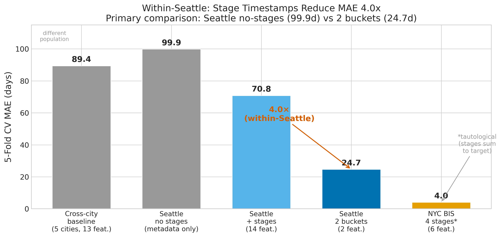
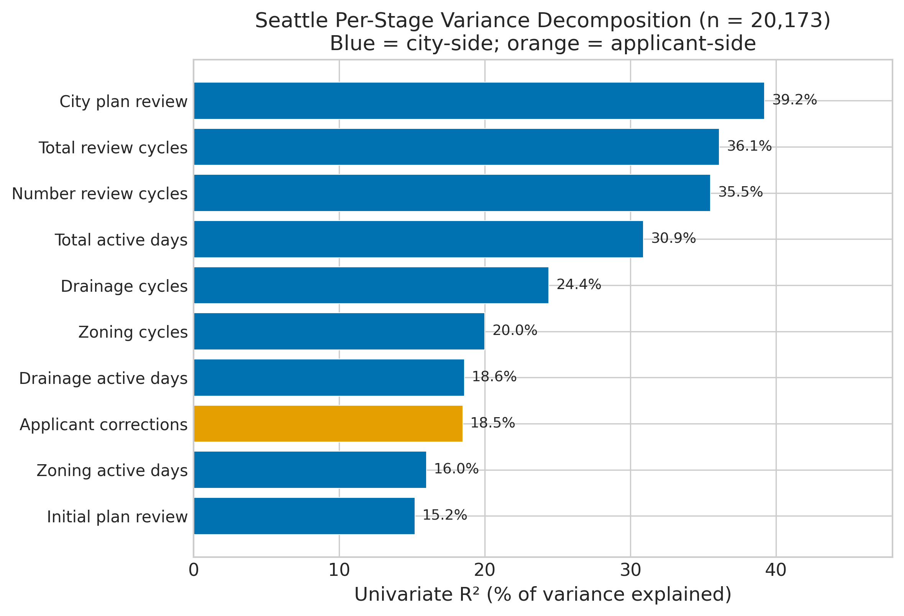
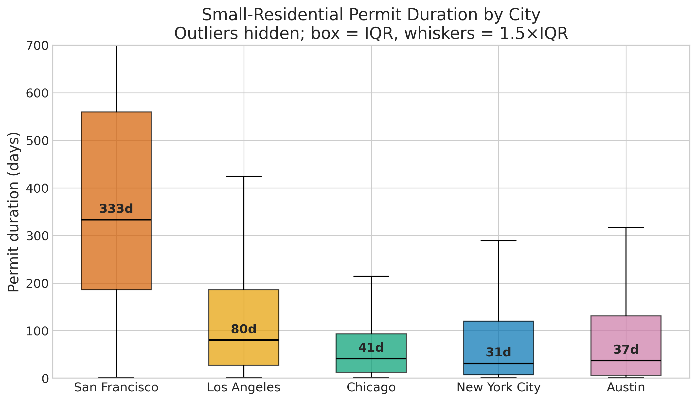

*A plain-language summary. The [full technical paper](https://github.com/colinjoc/hdr_autoresearch/blob/main/applications/building_permits/paper.md) has the diagnostics and experiment logs. See [About HDR](/hdr/) for how this work was produced and reviewed.*

**Bottom line.** No amount of model tuning will tell you why a US building permit is slow, because almost no city publishes the data that would let you answer the question. Seattle does. On its data alone, the prediction error drops fourfold — not because the model is smarter, but because the city actually releases how long each reviewer took. Every other city could follow suit tomorrow.

## The question

A duplex permit in Austin, Texas takes about 91 days. The same permit in San Francisco can take over 600. This order-of-magnitude gap has real consequences. Every day a permit sits in a queue, the developer pays carrying costs on land and construction loans, the future tenant waits longer, and the housing shortage deepens.

Every major US city now publishes its permit records as open data. We pulled 50,000 small residential permit records from San Francisco, New York, Los Angeles, Chicago, and Austin and asked: can a machine-learning model predict how long a permit will take, and can it tell us where the time is going?

## What we found

The baseline model predicted permit duration with a typical error of about 89 days. Nothing we tried moved that number. We tested 34 different ideas — calendar features, reform cut-offs, neighbourhood effects, rolling workload counts, hyperparameter sweeps, target transforms, alternative model families. Not one cleared the improvement threshold. The best of them shaved a third of a day off.

- The generic metadata US cities publish — valuation, square footage, permit type, neighbourhood, filing date — simply does not contain enough information to predict duration. A tree-based model was only about 11 percent better than a plain linear model, which means there is no hidden nonlinearity waiting to be unlocked. The data just is not there.
- Seattle breaks the pattern. It publishes per-stage timestamps: how long each reviewer took and how long the applicant spent on corrections. Using those two numbers alone, the typical error in Seattle collapses from 100 days to 25 — a fourfold improvement. On unseen later years the result holds.
- New York City publishes four internal timestamps. Using those, the typical error drops to 4 days — though this is close to a tautology, since the stages approximately sum to the total.
- The breakthrough came from better data, not better models. The winning Seattle model was shallower and simpler than the baseline it replaced.
- Applicants blame themselves, but Seattle's data shows the opposite. City plan-review time explains 39 percent of the variance in total duration. Applicant correction cycles explain only 19 percent. Drainage and zoning reviews together account for more than half the stage-level variance.

## Why that matters

The machine-learning literature on process mining has produced strong results on Dutch building permits, hospital patient flows, and insurance claims. We expected the same approach to work in the US because the data looked similar on the surface: a start date, an end date, and a dozen metadata columns in between. The assumption was that somewhere in that metadata there would be a signal.

There was not. A building permit is not one process. It is a sequence of six to ten internal stages — plan review, structural review, fire safety review, correction cycles, re-reviews — each with its own reviewer and its own queue. Total duration is the sum of those stages plus the wait between them. US cities record only the first timestamp and the last, so the decomposition is invisible to anyone outside city hall. Predicting the total from the endpoints is like predicting how long a road trip will take when all you know is the departure city and the destination.

Seattle shows the whole picture changes when a city publishes the middle. The highest-leverage intervention is not a better algorithm. It is a disclosure rule.

## What it means in practice

**For city officials.** Publish per-stage timestamps. Seattle already does. The data is machine-readable, freely available, and immediately useful. If more cities followed, researchers and policymakers could identify which stages are slow, which reviewers are overloaded, and which process reforms actually worked.

**For housing policy researchers.** The dollar stakes are meaningful. Under sensitivity assumptions varying per-day carrying cost from 100 to 500 dollars, halving applicant correction time in Seattle alone would save roughly 11 to 56 million dollars per year. In New York City, halving the post-approval pickup delay would save 18 to 88 million per year. These are upper bounds, but the order of magnitude is policy-relevant.

**For applicants.** Three fast-track channels produce dramatic differences: New York's professional self-certification clears in 6 days versus 76 for the standard queue; Los Angeles plan check at counter runs four times faster; Chicago express review, 7.5 times faster. These are unadjusted comparisons and almost certainly overstate the causal effect, but the magnitudes suggest expanding eligibility could substantially reduce waits.

## How we did it

We assembled a stratified sample of 50,000 small residential permits from five US cities using the [Socrata open data feeds](https://data.seattle.gov/Permitting/Plan-Review/tqk8-y2z5), including the [Seattle Plan Review dataset](https://data.seattle.gov/Permitting/Plan-Review/tqk8-y2z5) — the only US municipal feed with per-reviewer-cycle timestamps — covering 2015 to 2026. A model tournament picked the best family. Every single-change experiment tested on the cross-city sample reverted. A separate per-stage decomposition on the Seattle subset was validated under both shuffled cross-validation and a temporal train-on-the-past, test-on-the-future split.

## Further reading

- [Full technical paper](https://github.com/colinjoc/hdr_autoresearch/blob/main/applications/building_permits/paper.md) — methodology, full experiment log, variance decomposition, and dollar projections.
- Gyourko J, Saiz A, Summers A. ["A New Measure of the Local Regulatory Environment for Housing Markets."](https://doi.org/10.1177/0042098007087341) *Urban Studies* (2008) — the Wharton Residential Land Use Regulatory Index, used to measure permit friction nationally.
- van Dongen B. ["BPI Challenge 2015."](https://doi.org/10.4121/uuid:31a308ef-c844-48da-948c-305d167a0ec1) *4TU.ResearchData* (2015) — the Dutch building-permit process-mining benchmark that inspired this project.
