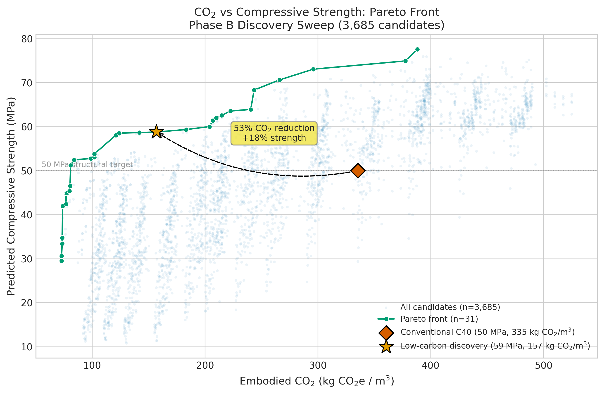
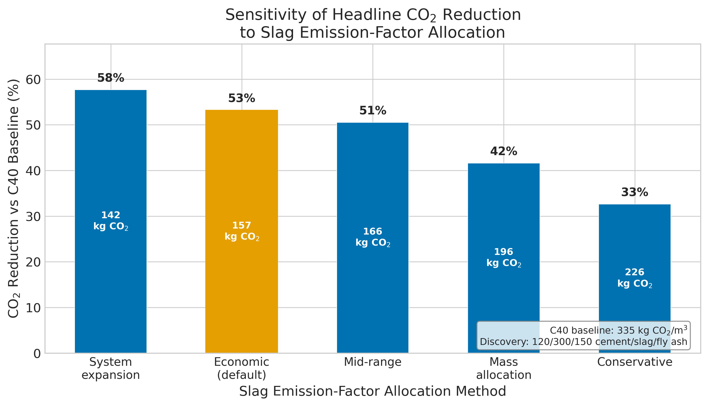
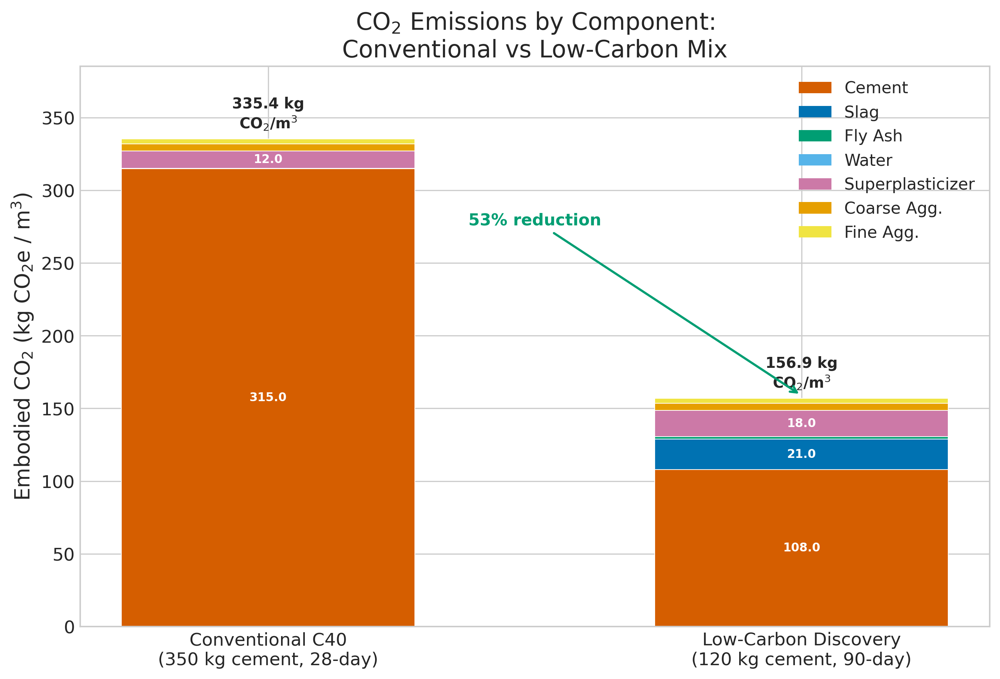

*This is a short summary. For the full technical write-up, see the [detailed paper](https://github.com/colinjoc/hdr_autoresearch/blob/master/applications/concrete/paper.md).*

## Cement Makes Up 8 Percent of Global Emissions. Can You Replace Most of It?

Concrete is the most consumed material on Earth -- about 30 billion tonnes per year. Cement, the active ingredient that makes concrete harden, produces roughly 8 percent of all human-caused carbon dioxide emissions. In a standard structural mix, cement alone accounts for 94 percent of the embodied carbon.

The most established approach to reducing that footprint is to replace cement with industrial byproducts: blast-furnace slag from steel production and fly ash from coal combustion. Both react slowly with water to form the same binding compounds as cement, but with a fraction of the carbon cost. The trade-off is time -- these mixes take 56 to 90 days to reach full strength instead of the standard 28 days.

We ran an automated experiment loop on the standard 1,030-sample UCI Concrete dataset to see if a transparent, reproducible methodology could arrive at the known answer -- and to be honest about where the model's training data runs out.

## The Methodology Reproduced the Known Result

Out of 23 single-change experiments, only 4 improved the model. The final predictor (XGBoost with two engineered features and one physical constraint) achieved a cross-validated prediction error of 2.55 MPa, confirmed on a held-out 20 percent test set that the model never saw during development (test error: 2.15 MPa, R-squared 0.964).

Screening 3,685 candidate mixes through this model identified a Pareto-optimal design: 120 kilograms of cement, 300 kilograms of slag, and 150 kilograms of fly ash per cubic metre, cured for 90 days. The predicted strength is 58.8 MPa -- 18 percent above the 50 MPa structural target.

## The Carbon Reduction Depends on How You Count the Slag

The headline number -- how much carbon the mix saves compared to conventional concrete -- depends on a technical accounting choice: how to assign the emissions from steel production to its byproduct, blast-furnace slag.

Under the standard economic allocation used in most life-cycle assessments, the discovered mix produces 157 kilograms of carbon dioxide per cubic metre, a 53 percent reduction compared to the conventional 335 kilograms. But under mass allocation (a legitimate alternative method), the slag carries higher attributed emissions and the reduction drops to 42 percent. At the most conservative figure in the literature, it falls to 33 percent.

Because the discovery mix uses 300 kilograms of slag -- far more than a conventional mix, which uses none -- this accounting choice matters more here than in most concrete studies.

## Why This Matters Even Though It Is Not New

The recipe itself has been documented since the 1990s. Bilodeau and Malhotra published the foundational study on high-volume fly ash concrete in 2000. A 2025 study using a completely different optimisation method reported an essentially identical result.

What this project demonstrates is the methodology. Every experiment has a stated prior expectation and a pre-registered keep-or-revert decision. The model's mathematical optimum -- which would use even less cement -- sits below the training data's minimum and is explicitly rejected as an extrapolation rather than reported as a verified finding. The local prediction error at the discovery's operating point (1.71 MPa) is actually lower than the model's global average (2.55 MPa), despite the sparse data in that region.

The practical barrier is not chemistry or cost. It is regulatory: whether a building code accepts 90-day strength testing instead of the standard 28-day test. Many European codes and an increasing number of American codes already allow this.

## How We Did It

We used the UCI Concrete Compressive Strength dataset (1,030 samples, freely available), ran a three-family model tournament followed by 20 single-change experiments and an eight-experiment compositional retest. The winning model uses the eight raw mix components plus water-to-binder ratio and supplementary materials percentage, with one monotonicity constraint (more cement must not decrease strength). A design sweep screened 3,685 candidate mixes across 11 generation strategies. Emission-factor sensitivity, local-density analysis, holdout evaluation, and bootstrap confidence intervals were run as additional validation. The entire pipeline runs in two minutes on a laptop. Full code, data reference, and experiment log are in the [project repository](https://github.com/colinjoc/hdr_autoresearch/tree/master/applications/concrete).

## Further Reading

- Yeh IC. "Modeling of Strength of High-Performance Concrete Using Artificial Neural Networks." *Cement and Concrete Research* (1998). [doi:10.1016/S0008-8846(98)00165-3](https://doi.org/10.1016/S0008-8846(98)00165-3) -- the source of the standard dataset.
- Bilodeau A, Malhotra VM. "High-Volume Fly Ash System." *ACI Materials Journal* (2000). -- the foundational paper establishing the high-volume fly ash concrete category.
- DeRousseau MA, Kasprzyk JR, Srubar WV. "Computational design optimization of concrete mixtures: A review." *Cement and Concrete Research* (2018). [doi:10.1016/j.cemconres.2018.04.007](https://doi.org/10.1016/j.cemconres.2018.04.007) -- survey of ML-guided concrete design.
- Hammond GP, Jones CI. *Inventory of Carbon and Energy (ICE) Database.* Version 3.0, University of Bath (2019). -- the source of emission factors used in this study.

---
[HDR methodology](https://github.com/colinjoc/hdr_autoresearch)
