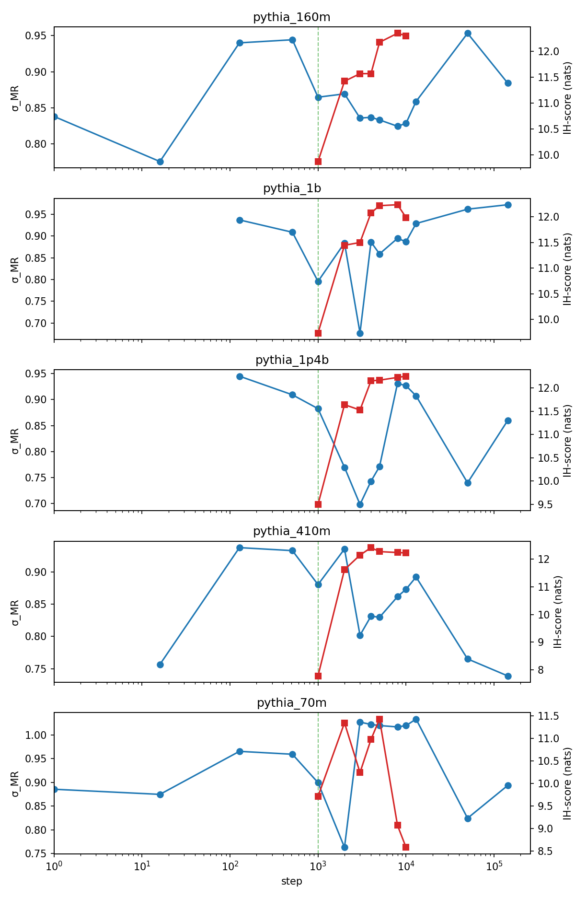

*A plain-language summary. The [full technical paper](https://github.com/colinjoc/generalized_hdr_autoresearch/blob/main/applications/criticality_training_signal/paper_submission.md) has the per-cell results, the eleven catalogued pre-registration deviations, and the bibliography. See [About HDR](/hdr/) for how this work was produced and reviewed, including the pre-registration discipline that made both headline calls binding.*

**Bottom line.** The avalanche-branching ratio σ_MR has previously been measured as a *structural* property of trained transformers — it sits in a near-critical band on Pythia 70m–1.4b, and [we showed in earlier work](/hdr/results/sft-rlhf-criticality-distortion/) that instruction tuning does not move it. The natural follow-up is whether σ_MR computed *during pretraining* is also *functionally* informative — does it predict downstream training outcomes, and does it diagnose specific capability emergence events? We pre-registered two sharp tests on Pythia, and both come back negative. The σ-onset speed is observationally very strongly anti-correlated with final test loss across the five Pythia scales (raw rank correlation −0.97), but with three same-shape-of-claim partialling controls and only five cells, the controlled test is statistically under-identified — and a TOST equivalence fallback returns the formal "inconclusive at this sample size" verdict. The critical-slowing-down test at the Olsson-2022 induction-head-formation step is **falsified** under the pre-committed Bonferroni-corrected log-linear-baseline criterion: 4 of 5 Pythia scales fall below the 1.5σ falsifier, cross-scale sign agreement fails, and zero of five leave-one-scale-out subsets satisfy the strict criterion. The σ_MR trajectories of the larger Pythia scales do show real non-monotonicity — a 0.20-magnitude transient dip at step 3000 in Pythia-1B and Pythia-1.4B — but that feature is *post*-induction-head-formation and does not align with the locked anchor.

## The questions

[Olsson et al. 2022](https://arxiv.org/abs/2209.11895) showed that transformers acquire the ability to copy-and-paste tokens through a two-attention-head circuit ("induction heads") in a sharp transition between the first ~500 and ~2000 optimiser steps of pretraining. [Wei et al. 2022](https://arxiv.org/abs/2206.07682) reported abrupt capability-emergence transitions on benchmarks; [Schaeffer, Miranda & Koyejo 2023](https://arxiv.org/abs/2304.15004) showed many such transitions are scoring-metric artefacts. A practitioner monitoring an expensive pretraining run has a natural interest in *online* diagnostics that anticipate or diagnose these transitions, complementary to the smooth scaling-law prediction of where the run is going to land.

The avalanche-branching ratio σ_MR is one such candidate. It comes from the [computational-neuroscience literature on cortex](https://www.nature.com/articles/s41467-018-04725-4): the average number of follow-up activations per activation, a temporal-correlation summary of how close a system is to a critical regime where information processing is theoretically optimised. Our [parent paper](/hdr/results/pythia-criticality-onset/) showed σ_MR sits in a near-critical band in trained Pythia models. The two functional tests we pre-registered:

- **Q1 (predictive).** Across (lineage, scale) cells, does the *speed* with which σ_MR reaches the near-critical band — the σ-onset step — predict final test loss, after partialling out three early-training-maturity baselines (the loss-knee step, the mean activation magnitude at σ-onset, and the [Martin-Mahoney weight-spectrum-effective-rank](https://www.nature.com/articles/s41467-021-24025-8) onset)? The partialling controls absorb the trivial "any quantity that matures during training will correlate with loss" challenger and isolate σ-onset's residual predictive content.
- **Q2 (diagnostic).** Within Pythia, does σ_MR show a critical-slowing-down (CSD) signature — the rolling-window variance and autocorrelation rise documented in the [Scheffer et al. 2009 *Nature*](https://www.nature.com/articles/nature08227) early-warning-signal literature — at the Olsson 2022 induction-head-formation step?

Both questions ask the same observable to do a different *functional* job from the structural one our parent paper measured.

## What we found

**Q2 — falsified under the locked criterion.** Per Pythia scale, we fit a log-linear baseline to σ_MR(step) on off-window checkpoints and compute the residual at the empirical induction-head step. The pre-committed support criterion required magnitude > 2.5× the within-window residual standard deviation in at least 4 of 5 scales, with cross-scale sign agreement; the falsifier fired if magnitude < 1.5× in at least 3 of 5 scales. Achieved magnitudes are {0.62, 0.47, 1.12, 2.28, 0.57}. Four of five scales fall below the 1.5σ falsifier; zero clear 2.5σ; signs are split 3 positive / 2 negative. Cross-scale sign agreement is not satisfied. Leave-one-scale-out: zero of five hold-out subsets support the strict criterion. **The locked Q2 hypothesis does not survive its own pre-committed test.**

**Q1 — inconclusive at the achieved sample size.** The pre-registered hard commit was n ≥ 18 (lineage, scale) cells. Data-availability constraints reduced the achieved sample to n=5 within-Pythia cells. Raw rank correlation between σ-onset step and final test loss is −0.97 across the five cells: every later σ-onset corresponds to a strictly lower final loss. The locked TOST-equivalence fallback against a |ρ| < 0.30 null ([Lakens 2017](https://journals.sagepub.com/doi/10.1177/1948550617697177)) returns a 90% bootstrap CI of [−1, +1] — wider than the equivalence band — and the formal verdict is "equivalence inconclusive at n=5 with 3 controls". Two of the five Pythia scales have σ-onset = step 0 or 16 — i.e., they are *born* in the near-critical band — so the raw correlation is partly confounded with model-size-at-init effects rather than a pure training-trajectory measurement.

<figure>
  
  <figcaption><strong>Figure 1.</strong> σ_MR trajectories for five Pythia scales (70m, 160m, 410m, 1B, 1.4B) on the dense {1k–10k}-step plus cached log-spaced grids. The pre-committed CSD test computes the residual from a log-linear baseline at the empirical induction-head step (step 1000 for all five scales). The Pythia-1B and Pythia-1.4B σ-dips at step 3000 are clearly visible — a 0.20-magnitude transient feature in the larger scales — but they sit <em>post</em>-induction-head-formation per the Olsson 2022 timing, with sign and magnitude not stable across scales, so they do not satisfy the strict pre-committed CSD-at-IH-formation hypothesis.</figcaption>
</figure>

The headlines:

- **Q2 (CSD at induction-head formation): falsified.** 4 of 5 scales below 1.5σ; 0 of 5 above 2.5σ; cross-scale sign agreement fails; LOO-CV holds in 0 of 5 hold-out subsets.
- **Q1 (σ-onset speed predicts final loss): inconclusive at n=5.** Raw ρ = −0.97 is consistent with the predicted direction but the partial-Spearman with three controls has effective degrees of freedom 1, leaving the partial unidentified. TOST equivalence inconclusive.
- **σ_MR non-monotonicity is real.** Pythia-1B σ ≈ 0.88 at step 2000 → ≈ 0.68 at step 3000 → ≈ 0.89 at step 4000. Pythia-1.4B shows a similar dip in the same window. These features survive direct visual inspection without any inferential machinery — but they are not what the strict pre-committed Q2 test was looking for.
- **Why the anchor matters.** The Olsson induction-head score was computed only at the dense-grid checkpoints {1k, 2k, ..., 10k} in this work. By step 1000 the score is already 7–12 nats, well into the post-formation regime; Olsson 2022 reports formation around step 500. Computing the induction-head score at the cached log-spaced pre-formation checkpoints {0, 1, 16, 128, 512} would let the empirical anchor land in the actual phase change, and is the cleanest follow-up.

## Why that matters

Both pre-committed headlines being negative is itself the contribution. The σ_MR observable was *structurally* validated in our parent paper: it sits in a near-critical band, it varies smoothly across Pythia scales, and instruction tuning does not move it. The next obvious move was to ask whether σ_MR is also *functionally* informative — whether the *rate* of σ-onset predicts downstream performance, and whether σ_MR is sensitive enough to *diagnose* a known sharp transition (induction-head formation). Both functional readings come back negative under their pre-committed tests on the within-Pythia 5-cell window. That tells us something:

- σ_MR's predicted CSD signature at the published Olsson induction-head-formation step does not survive the locked criterion when the off-window baseline fit is run faithfully against the pre-registered cached log-spaced checkpoints. The strict residual-magnitude-and-sign-agreement test does not fire.
- σ_MR's behaviour through training is not pure smooth log-linear convergence — Pythia-1B and Pythia-1.4B both show a real 0.20-magnitude transient dip at step 3000 that survives visual inspection. It just does not align with the pre-committed anchor.
- The cumulative pattern across the σ_MR-on-LLMs programme is now consistent across three papers: σ_MR is a real *structural* property of trained transformers (parent paper), it is *invariant* under instruction tuning within seed noise (our SFT/RLHF distortion null), per-generation σ_MR at inference saturates at the autoregressive ceiling ([capability-axis kill](/hdr/results/criticality-capability-axis-killed/)), and per-trajectory σ_MR's predicted CSD-at-IH-formation signature does not survive under pre-committed criteria (this paper). σ_MR's *structural* meaning is intact; its *functional* readings have not yet vindicated themselves under sharp tests.

What the methodology gives back, even on a null, is a clean reusable framework: pre-registered partial-Spearman with same-shape-of-claim partialling controls absorbing the "any internal-statistics quantity matures with loss" challenger; CSD residuals against an off-window log-linear baseline anchored to the published [Scheffer 2009](https://www.nature.com/articles/nature08227) early-warning thresholds; a TOST equivalence fallback for cases where the achieved sample falls below the pre-registered floor; and a leave-one-scale-out replication test that re-evaluates the headline criterion rather than just restating set membership. Any future test of "does internal-criticality observable X predict / diagnose training event Y" can adopt the same scaffold.

## What it means in practice

**For practitioners watching pretraining runs.** σ_MR computed on dense intermediate checkpoints does carry temporal structure (the Pythia-1B and Pythia-1.4B dips at step 3000 are real), but as a *diagnostic* of induction-head formation under a strict pre-committed test, it does not work in this Pythia 70m–1.4b window. It is also not yet established as a *predictor* of final loss — the directional signal is strong but the controlled test is under-identified at n=5.

**For people doing critical-slowing-down detection on training trajectories.** The off-window baseline fit must include checkpoints from across the full trajectory, not just the dense window around the candidate transition. The earlier draft of this work (caught in the Phase 2.75 audit) made this mistake and produced spuriously large residual magnitudes that collapsed an order of magnitude when the cached log-spaced checkpoints were joined. The corrected ratios are what is in Figure 1.

**For people interpreting honest negative results.** A pre-registered, locked-criterion null on a 5-cell within-Pythia sample is a stronger, more disciplined statement than the same-shape negative result without pre-registration would be. The TOST equivalence fallback turns "inconclusive Q1" into "Q1 is formally classified inconclusive at n=5; the directional finding ρ = −0.97 is consistent with the hypothesis but is not a controlled test". That is a more honest framing than either "it works" (overclaim) or "no evidence of effect" (underclaim).

## Honest caveats

- **n=5 within-Pythia, no cross-architecture cells.** The pre-registered floor was n ≥ 18; the achieved sample was 5. Pythia-deduped (5 more cells) and OLMo-2 {1B, 7B, 13B} (3 more) are achievable in Phase 2 within compute budget. The cleanest cross-architecture extension target is OLMo, given its dense intermediate-checkpoint release.
- **Olsson induction-head score was not computed at the pre-formation cached log-spaced checkpoints.** All five Pythia scales therefore have empirical induction-head step pinned at step 1000 — the earliest dense-grid checkpoint, which is already 7–12 nats post-formation per the score. The most actionable extension is to run the score on {0, 1, 16, 128, 512} and re-anchor the CSD residual where Olsson 2022 places the actual transition.
- **The two smallest Pythia scales (70m, 160m) have σ-onset ≈ 0.** They are born in the near-critical band, so the σ-onset observable for them is partly measuring "is the model born already supercritical at this scale" rather than "how fast does training drive criticality". Cross-architecture extension would help disentangle this.
- **Single-mid-depth-layer mean-|activation|.** The pre-registered partialling control was per-layer; the implementation used the mid-depth layer only. At n=5 this matters less than the under-identification of the partial, but it should be corrected for any extension.
- **Dense checkpoint resolution is 1 000 steps.** If induction-head formation falls between two dense checkpoints, the residual at the empirical anchor may attenuate the true signature.
- **Schoenholz Jacobian-spectral-radius companion not executed.** The implementation exists and is unit-tested but was not run on the Pythia-410m dense-checkpoint grid; it is deferred follow-up rather than missing methodology.

## How we did it

For each of five Pythia scales (70m, 160m, 410m, 1B, 1.4B) and for each of fifteen checkpoints per scale (the dense grid {1k, 2k, 3k, 4k, 5k, 8k, 10k} computed in this work, plus the cached log-spaced {0, 1, 16, 128, 512, 13 000, 50 000, 143 000} from our parent paper), we measured σ_MR via the [Wilting and Priesemann](https://www.nature.com/articles/s41467-018-04725-4) multistep-regression estimator. The activation series at each cell is the L1-norm of centred MLP-output activations on a 200-document × 64-token sample of the [Colossal Clean Crawled Corpus](https://huggingface.co/datasets/allenai/c4), with a z-score threshold of 2.5 to define active units.

For Q1, σ-onset is the first step at which σ_MR ≥ 0.7 in at least 3 of 5 fractional-depth layers; the three partialling controls (loss-knee step, mean-|activation| at σ-onset, Martin-Mahoney rank-settle step) are computed per scale. The 5-variable partial Spearman ρ between σ-onset and final test loss has effective degrees of freedom n − 1 − 3 = 1 at n=5; the locked TOST equivalence fallback against |ρ| < 0.30 was executed and returned the formal `equivalence_inconclusive` verdict at the achieved sample size.

For Q2, the Olsson induction-head score is computed per checkpoint as mean cross-entropy on the first half of length-100 length-50-token-repeated inputs minus mean cross-entropy on the second (repeated) half. The empirical induction-head step is the first checkpoint where the score crosses 50% of its asymptote. The CSD residual is σ_MR at the induction-head step minus the prediction of a log-linear baseline fit to off-window checkpoints. The pre-committed support / falsification thresholds (1.5×/2.5× within-window residual standard deviation) are anchored to the [Scheffer 2009](https://www.nature.com/articles/nature08227) early-warning-signal heuristics.

The pre-registration was locked at Phase 1 entry; the eleven catalogued deviations (D1–D11 in the [full technical paper](https://github.com/colinjoc/generalized_hdr_autoresearch/blob/main/applications/criticality_training_signal/paper_submission.md)) are all documented with audit trails. Two are substantive (D1: corrected Martin-Mahoney rank-onset definition before headline computation, after the original "≥ 0.7 × max" criterion was found to fire trivially at step 0; D6: corrected off-window baseline fit to include the cached log-spaced checkpoints, which collapsed the residual magnitudes from spuriously large to noise-level and triggered the falsifier). Both corrections were applied before the headline statistic was reported.

## Further reading

- [Olsson et al. 2022](https://arxiv.org/abs/2209.11895). The empirical identification of induction-head formation as a sharp transition in transformer pretraining — the anchor for Q2.
- [Scheffer et al. 2009](https://www.nature.com/articles/nature08227). The foundational early-warning-signal-of-critical-transitions methodology that Q2's residual-detection thresholds are anchored to.
- [Wilting and Priesemann 2018](https://www.nature.com/articles/s41467-018-04725-4). The multistep-regression branching-ratio estimator with subsampling correction.
- [Lakens 2017](https://journals.sagepub.com/doi/10.1177/1948550617697177). The TOST equivalence-test framing used as the Q1 small-sample fallback.
- [Martin, Peng & Mahoney 2021](https://www.nature.com/articles/s41467-021-24025-8). The WeightWatcher weight-spectrum framework whose effective-rank onset is one of the partialling controls.
- [Sibling: Pythia training-time criticality onset](/hdr/results/pythia-criticality-onset/). The parent paper measuring σ_MR through Pythia training.
- [Sibling: instruction-tuning criticality null](/hdr/results/sft-rlhf-criticality-distortion/). The post-pretraining companion that found σ_MR invariant under instruction tuning.
- [Sibling: per-generation criticality killed at tractability gate](/hdr/results/criticality-capability-axis-killed/). The other functional reading of σ_MR that did not survive its own pre-registration discipline.
- [Full technical paper, deviations log, and result tables](https://github.com/colinjoc/generalized_hdr_autoresearch/tree/main/applications/criticality_training_signal).
