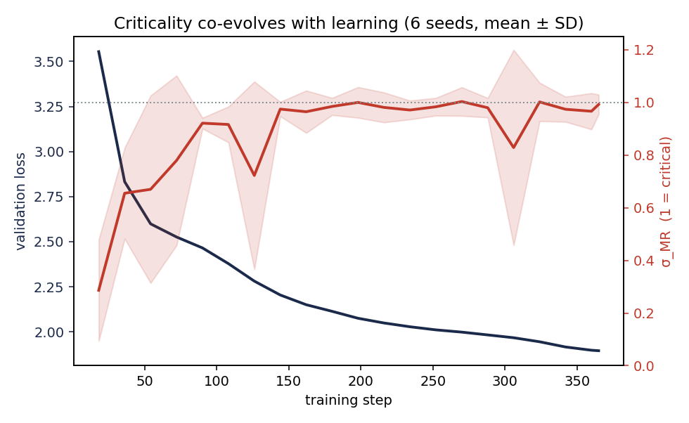
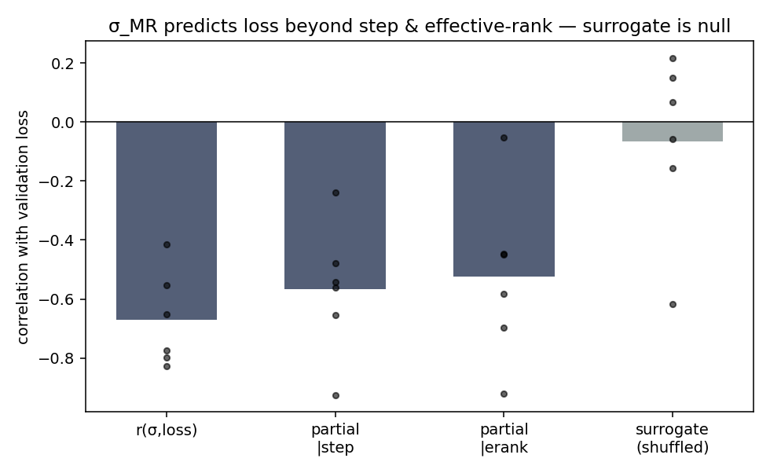
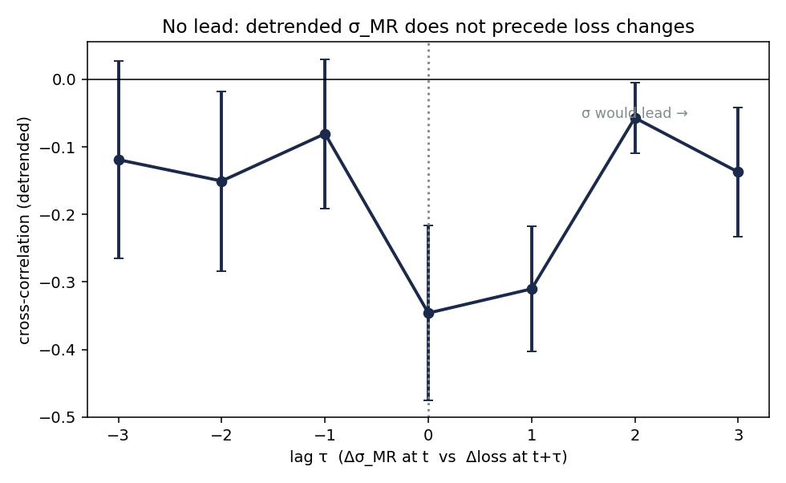
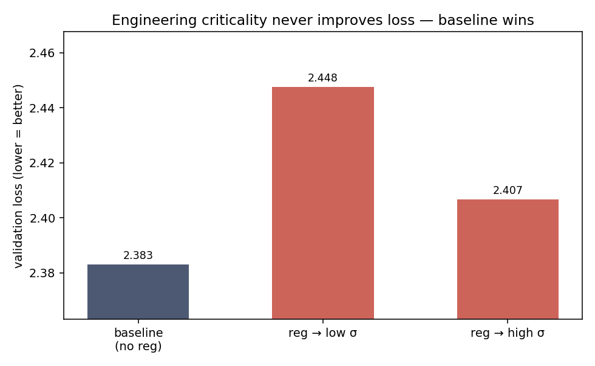

*A plain-language summary. See [About HDR](/hdr/) for how this work was produced and reviewed, and the [sibling criticality studies](/hdr/results/pythia-criticality-onset/) it builds on. All experiments ran on a single consumer GPU (RTX 3060).*

**Bottom line.** Neuroscientists describe the cortex as poised at a "critical" balance point — a branching ratio close to one, where a burst of activity is on average neither amplified nor damped. Trained neural networks show the same balance, and a tempting idea follows: maybe *driving* a network toward criticality faster would make it learn better. We measured the balance throughout training of a small language model and then tested that idea four different ways. The balance is real and reproducible — the network walks itself to the edge of chaos as it learns, and (a genuine surprise) the balance carries information about the loss that a standard rank-based diagnostic does not. But it does **not** predict where the loss is going, its *timing* does not separate good training recipes from bad ones, and when we built a knob to push the network's criticality up or down, it never improved the loss — and at a realistic training budget the network simply undid the push and returned to its own balance point. Criticality here is a **symptom** of learning, not a **lever** for it.

## The Question

Our [earlier criticality work](/hdr/results/pythia-criticality-onset/) established that small language models exhibit the same branching-ratio balance that neuroscience finds in cortex, and asked *when* it appears. This study asks the obvious follow-up that decides whether any of it is useful: **is the criticality balance an actionable signal?** Three concrete versions of that question:

1. **Is it non-redundant?** Does the branching ratio tell you something about the model's loss that simpler, cheaper diagnostics (like the effective rank of the weights, or simply "how many steps have we trained") do not?
2. **Does it lead?** Does a change in criticality *precede* a change in loss — i.e. could it be an early-warning signal?
3. **Is it a lever?** If you intervene and force the network's criticality up or down, does the loss respond?

The motivating hypothesis — the one we set out to falsify or confirm — was that *techniques which drive faster phase transitions toward criticality should drive better performance*. If true, criticality becomes a design target. If false, it is a thermometer: informative to read, useless to push on.

## What we found

We trained a small character-level transformer (around 120,000 parameters) to a fixed compute budget, six random seeds, logging the validation loss alongside the branching ratio σ_MR (measured with the same [Wilting–Priesemann](https://www.nature.com/articles/s41467-018-04725-4) estimator and z-scored avalanche raster our sibling studies use), the effective rank of the readout, and the train–validation gap, at twenty-plus checkpoints per run.

<figure>
  
  <figcaption><strong>Figure 1.</strong> The branching ratio σ_MR (red, right axis) climbs from near zero at initialisation to roughly one — the critical balance point — and parks there, while the validation loss (navy, left axis) falls. The network self-organises to the edge of chaos as it learns. Mean ± standard deviation across six seeds.</figcaption>
</figure>

**The balance is real, reproducible, and — surprisingly — non-redundant.** Across all six seeds the branching ratio rises toward one as the loss falls. The natural worry is that this is trivial: *everything* that increases during training correlates with the falling loss, so σ_MR might just be a roundabout clock. We tested that directly with partial correlations, treating each seed as one independent observation rather than pooling autocorrelated checkpoints.

<figure>
  
  <figcaption><strong>Figure 2.</strong> The branching ratio's correlation with loss <em>survives</em> controlling for both the raw training step and the effective rank of the weights (partial correlations stay near −0.55, all six seeds the same sign). A shuffled-surrogate control collapses to zero, confirming the effect is real and not an artefact of the method. Effective rank, by contrast, turned out to be mostly a training-progress proxy — most of <em>its</em> correlation with loss vanished once we controlled for the step count.</figcaption>
</figure>

This is the one genuinely positive finding: σ_MR carries information about the loss that a standard rank diagnostic and the step counter do not. We went in expecting the branching ratio to be the *redundant* measure — it is noisier — and the data said the opposite. So far, so promising.

**But it does not lead the loss.** If criticality were an early-warning signal, a change in σ_MR would *precede* a change in loss. We removed the shared training trend (by working on step-to-step differences) and looked at whether a wiggle in σ_MR predicts the *next* wiggle in loss. It does not.

<figure>
  
  <figcaption><strong>Figure 3.</strong> Detrended cross-correlation between changes in σ_MR and changes in loss, against time lag. The coupling is symmetric and peaks at lag 0 — σ_MR moves <em>with</em> the loss, not ahead of it. A leading indicator would peak at positive lag (σ_MR moves first); it does not. So the strong correlation in Figure 2 is a contemporaneous co-<em>evolution</em>, not a predictive, leading one.</figcaption>
</figure>

**And its timing does not separate good recipes from bad.** Across five training recipes (different learning rates, momentum, a grokking-style gradient filter), the recipe that reached criticality *earliest* was not the one that ended with the lowest loss, and the recipe that reached it *latest* was among the best. The correlation between "how fast you reach criticality" and "how good your final loss is" was −0.16 — no relationship. That directly falsifies the motivating hypothesis.

**Most decisively: it is not a lever.** We built a differentiable regulariser that demonstrably moves the branching ratio (a crude architectural gain knob did nothing — the network resisted it), and ran a clean three-arm experiment: a baseline, an arm pushed toward higher criticality, and an arm pushed toward lower. The two pushed arms carry an identical penalty, so they control for each other.

<figure>
  
  <figcaption><strong>Figure 4.</strong> Forcing the network's criticality — in either direction — only ever makes the loss <em>worse</em>; the untouched baseline wins outright. At a realistic training budget (not shown) the intervention washes out entirely: the network undoes the push and returns to its own balance point, so the knob does nothing at all. Median over four seeds.</figcaption>
</figure>

## Why that matters

The appeal of criticality in neural networks has always carried an unspoken promise: if networks work best at the edge of chaos, then putting them there — faster, or more precisely — should be a free lunch. This study is a clean, single-GPU test of that promise, and the promise does not hold. The balance is something the network *produces* as a by-product of good optimisation, defends against perturbation, and restores when you push it away. None of those are the behaviour of a control knob.

The one finding worth carrying forward is the non-redundancy result (Figure 2). It says the branching ratio is not merely a re-skinned loss curve — it is measuring something about the network's internal dynamics that the usual rank-based health checks miss. That makes it a legitimate *diagnostic*, even though it is a dead end as a *target*. The honest distinction the field has tended to blur — between a measure that tracks learning and a mechanism that drives it — turns out to matter here, and σ_MR lands firmly on the "tracks, doesn't drive" side.

## What it means in practice

**For people trying to design "criticality-aware" training.** The natural plan — add a criticality term to the loss and steer the network to the edge of chaos — does not pay off in this setting. Every version of the intervention we tried either did nothing or cost loss outright, and the network self-restores at realistic budgets. Before building such a method, run the cheap falsifier first: does the timing of natural criticality even correlate with your final metric? Here it did not (−0.16).

**For people using criticality as a monitoring signal.** It is a reasonable thermometer — non-redundant with rank-based diagnostics — but not a crystal ball: it co-moves with loss without leading it, so do not expect it to forecast a training collapse or a capability jump before the loss itself moves.

**For the criticality-in-neural-networks literature generally.** "Networks operate near criticality" and "criticality helps networks" are different claims, and the second does not follow from the first. The first is well-supported here; the second failed four independent tests.

## Honest caveats

- **One scale, one architecture, one task.** Everything is a ~120,000-parameter character-level transformer on Tiny Shakespeare. The non-redundancy result and all four negatives need repeating across model sizes and a second task before they generalise. A scale ladder is the obvious next step and is cheap on the same hardware.
- **The lever's within-pair contrast is confounded.** In the short-budget arm where the regulariser bites, the higher-criticality arm hurt the loss slightly less than the lower-criticality arm — a faint hint that disrupting criticality downward is mildly harmful. But the two arms' penalties may differ in magnitude, so we do not claim it. A penalty-magnitude-matched placebo would settle it. The headline — *no intervention ever net-improves loss* — does not depend on this.
- **Six seeds is enough for a sign test but not a tight effect size.** The non-redundancy partials are all the same sign across six seeds (the strongest a six-seed sign test can say), but the magnitude has real run-to-run spread.
- **The non-redundancy magnitude is sampling-dependent.** At our standard checkpoint density the partial correlations sit near −0.55; at twice the density they weaken to roughly −0.2 (more closely-spaced checkpoints are more autocorrelated and dilute the partial). The *sign* is robust and the surrogate is null either way, so we report this as a real-but-modest, qualitative non-redundancy — not a precise coefficient.
- **The branching ratio is noisy at this scale.** The "no lead" result (Figure 3) could in principle be a power problem — a noisy σ_MR estimate, differenced, loses sensitivity. But a signal too noisy to show short-term coupling is also too noisy to *be* a useful leading indicator, so the conclusion stands either way.
- **Consumer-GPU budget.** A single RTX 3060. The largest models where criticality is claimed to matter most are far out of reach here; nothing in this study speaks to that regime.

## How we did it

We trained a small modern-recipe transformer (RMSNorm, QK-normalisation, rotary-free learned positions, a Muon optimiser on the weight matrices with AdamW on embeddings and the readout, a warmup-stable-decay schedule) to a fixed token budget, six seeds. At each checkpoint we ran a long contiguous validation stream through the model, z-scored each unit's activations over the stream, thresholded at |z| > 2.5 to a spike raster (matching our [brain-homology protocol](/hdr/results/brain-llm-criticality/)), summed to a population-activity time series, and fitted the [Wilting–Priesemann](https://www.nature.com/articles/s41467-018-04725-4) multistep-regression branching-ratio estimator. The non-redundancy test used per-seed partial correlations with a shuffled-σ_MR surrogate null. The "lead" test used detrended (first-differenced) lagged cross-correlation. The cross-recipe test correlated criticality-onset step against final loss over five recipes. The lever test added a differentiable lag-1-autocorrelation penalty on the soft-spike population activity, with two distraction-matched arms pushing the branching ratio in opposite directions, and measured the achieved σ_MR and loss against an untouched baseline. The estimator and the experiment harness were unit-tested (41 tests) before any result was trusted.

## Further reading

- [Wilting and Priesemann 2018](https://www.nature.com/articles/s41467-018-04725-4). The subsampling-robust branching-ratio estimator this study uses.
- [Beggs and Plenz 2003](https://www.jneurosci.org/content/23/35/11167). The original cortical-avalanche / critical-branching result.
- [Sibling study: brains versus language models](/hdr/results/brain-llm-criticality/). The avalanche-raster protocol inherited here.
- [Sibling study: criticality before training starts](/hdr/results/pythia-criticality-onset/). When the balance appears across Pythia scales.
- [Sibling study: criticality as a training-progress signal](/hdr/results/criticality-as-training-signal/). A closely related read on what the branching ratio does and does not tell you during training.
