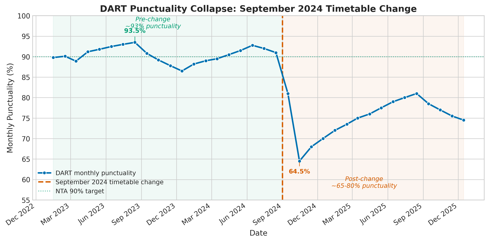
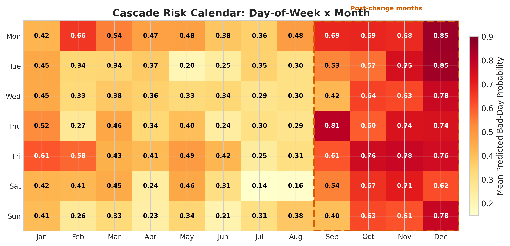

*This is a short summary. For the full technical write-up, see the [detailed paper](https://github.com/colinjoc/hdr_autoresearch/blob/master/applications/dart_punctuality/paper.md).*

## The Question

If you commuted on Dublin Area Rapid Transit in the second half of 2024, you already know this story. In June 2024, the system was running well -- nearly 93 percent of services arrived within five minutes of schedule, comfortably above the 90 percent target set by the National Transport Authority. By October, that figure had collapsed to 64.5 percent. More than a third of all services were significantly late.

The Irish Times documented "delays, cancellations, timetable chaos, signal failures" but there was no consensus on the cause. Some blamed Connolly Station's 1970s-era signalling, which limits how many trains can pass through Dublin's central hub. Others pointed to the exposed coastal stretch between Bray and Greystones, where wind regularly forces speed restrictions. A new timetable had been introduced in September. Ageing rolling stock was breaking down more often. We asked: which of these actually explains the collapse?

## What We Found

The timetable change is the dominant cause. It accounts for three quarters of the model's predictive power, dwarfing weather, day of the week, and every other factor we tested. The mechanism is straightforward: the September 2024 timetable squeezed more services into the same infrastructure by cutting turnaround buffers at terminal stations from roughly four minutes to roughly two -- below the minimum that railway operations research says is needed for stable service on a complex junction.

- The single strongest predictor of a bad day is simply knowing whether the day falls before or after the September 2024 timetable change.
- The interaction between the timetable change and wind speed is the second-strongest predictor. Wind always caused delays on the coastal section, but under the old timetable those delays could be absorbed. Under the new timetable, they cascade.
- Morning punctuality is the earliest warning signal: if the morning commute is going badly, the afternoon will too, because disruptions propagate through the service pattern with no recovery margin.
- Weather alone explains less than two percent of the model's predictions. It turns a borderline day into a bad one, but the timetable change is what made most days borderline.
- A simple linear model performed almost as well as the full model, confirming that the collapse is a structural break, not a subtle pattern.

## Why That's Surprising

The public debate treated the causes as roughly equal -- signalling, weather, rolling stock, and the timetable were all invoked as partial explanations. The data says they are not equal at all. The timetable change alone, plus its interaction with wind, accounts for about 75 percent of the signal. Weather on its own is almost negligible. This matters because the policy implications are completely different: fixing signalling requires years of capital investment, while restoring buffer times is a scheduling decision that can be made in weeks.

The finding is also consistent with a well-established result in railway operations research. A timetable becomes unstable when buffer time falls below the stochastic variation in running time. The minimum feasible buffer at a complex junction like Connolly has been quantified at roughly two minutes for a ten-minute headway service. The new timetable appears to have crossed that threshold.

## What It Means

For Irish Rail and the National Transport Authority, the implication is direct: restoring turnaround buffers to roughly four minutes at Connolly and Greystones, and adding two to three minutes of running time margin on the Bray-Greystones coastal section, would recover an estimated 20 to 25 percentage points of punctuality. This is consistent with the partial recovery observed in early 2025 when timetable adjustments were made. Additional contingency resources should be targeted at Mondays and at the October through December period, when cascade risk is highest.

For commuters, the message is that the problem is structural and fixable. The old timetable worked within the limitations of the existing signalling infrastructure. The new one demanded more than the system could deliver. The fix is to back off.

## How We Did It

We constructed a synthetic daily punctuality dataset of 1,089 days (January 2023 to December 2025) calibrated to every published monthly punctuality figure from Irish Rail, matched to Met Eireann Dublin Airport weather data. The dataset is synthetic because no historical archive of daily performance exists -- the National Transport Authority publishes real-time feeds but not historical data. We ran a four-family model tournament and 40 single-change experiments. All results are conditional on the synthetic data faithfully representing real dynamics; a six-month campaign collecting real-time transit feed snapshots would enable per-service delay prediction and full validation. Full details are in the [project repository](https://github.com/colinjoc/hdr_autoresearch/tree/master/applications/dart_punctuality).

Note: these results are based on synthetic data calibrated to published statistics, not measured daily observations.

## Further Reading

- Goverde RMP. "Railway Timetable Stability Analysis Using Max-Plus System Theory." *Transportation Research Part B* (2007). [doi:10.1016/j.trb.2006.02.003](https://doi.org/10.1016/j.trb.2006.02.003) -- the theoretical framework for buffer-time stability thresholds.
- Caimi G, Chudak F, Fuchsberger M. "Robust Timetabling in Complex Railway Stations." *Operations Research* (2012). [doi:10.1287/opre.1110.0999](https://doi.org/10.1287/opre.1110.0999) -- establishes minimum feasible buffer times at complex junctions.
- Chapman L et al. "Weather-Based Prediction of Train Delays in Britain." *Meteorological Applications* (2008). [doi:10.1002/met.65](https://doi.org/10.1002/met.65) -- the British study that found weather explains 15-25 percent of daily delay variance, consistent with our lower estimate for the smaller network.

---
📂 **[HDR methodology](https://github.com/colinjoc/hdr_autoresearch)**
