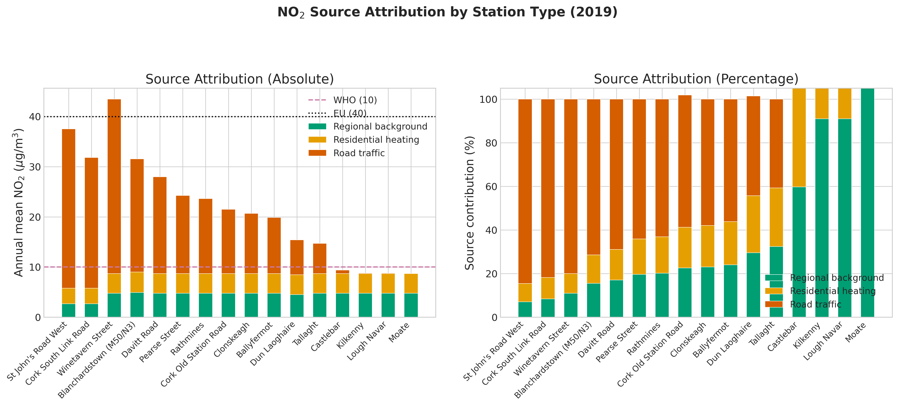

*This is a short summary. For the full technical write-up, see the [detailed paper](https://github.com/colinjoc/hdr_autoresearch/blob/master/applications/dublin_no2/paper.md).*

## Every Dublin Station Fails the Health Test

Ireland has never broken the European Union's annual limit for nitrogen dioxide, a pollutant produced primarily by diesel engines. The country is considered to have clean air. But in 2021, the World Health Organization cut its recommended limit from 40 to just 10 micrograms per cubic metre -- a fourfold tightening based on new evidence about health effects at low concentrations. Under this health-based guideline, the picture changes completely.

We analysed nine years of real monitoring data from 33 Irish stations in the European Environment Agency network. Every urban station in Dublin and Cork exceeds the health guideline in every year measured. Dublin's worst site, Winetavern Street near the Liffey quays, recorded more than four times the health limit. This is not unique to Dublin -- the European Environment Agency reports that 94 percent of the EU urban population breathes nitrogen dioxide above the health guideline. But it contradicts Ireland's self-image as a clean-air country.

## Road Traffic Is the Dominant Source

A station-differencing method decomposes the measured nitrogen dioxide into three components: regional background transported from outside Ireland, residential heating that peaks in winter, and road traffic estimated as the remainder after subtracting the other two. Traffic contributes 41 to 80 percent of annual nitrogen dioxide depending on proximity to roads. Even at residential stations away from major roads, traffic is the largest single contributor.

The COVID-19 lockdown of spring 2020 provided an unusually clean test. When traffic volumes dropped 60 to 80 percent, nitrogen dioxide fell by 33 to 62 percent across Dublin stations. A motorway interchange (Blanchardstown on the M50) showed the most dramatic response -- 62 percent -- because it has essentially no nearby residential heating to dilute the signal. An important caveat: because the model defines traffic as the residual component, part of its agreement with the lockdown is structural rather than a true independent validation. The comparison is most informative for the relative pattern across stations, which the model predicts correctly.

Wind-direction analysis provides independent confirmation. At Winetavern Street, nitrogen dioxide is 70 percent higher when the wind blows from the north (carrying traffic emissions from the Liffey quays corridor) than from the south (where the Dublin Mountains have no urban sources). Corrected weekday-weekend differentials -- accounting for the fact that weekend traffic is about 60 percent of weekday, not zero -- also agree with the station-differencing estimates.

## Traffic Reduction Alone Is Not Enough

Residential heating contributes 8 to 30 percent of annual nitrogen dioxide at background stations, with a strong temperature dependence: background stations measure 14 micrograms more on the coldest days (below 2 degrees Celsius) than on mild days. Even if Dublin eliminated all road traffic, several background stations would likely remain above the health guideline because of heating contributions. This means traffic reduction -- while necessary and high-leverage -- must be paired with heating fuel switching (from solid fuels like coal and peat to cleaner alternatives) to achieve the health standard.

For policymakers: the COVID lockdown demonstrated that Dublin's air quality improves rapidly and substantially when traffic is reduced. The question is whether Ireland will act on this evidence before the European Union tightens its legal limit toward the health-based value -- a revision expected in 2025-2026 that would put Dublin and Cork into non-compliance.

## How We Did It

We used 55,221 daily nitrogen dioxide records from 33 Irish stations in the European Environment Agency monitoring network (2015 to 2023) and 78,865 hourly weather observations from the Met Eireann Dublin Airport station. Source apportionment used a receptor-based station-differencing method: rural stations provide the regional background, urban background stations (away from major roads) reveal the heating signal through their seasonal cycle, and the residual at traffic stations is attributed to road traffic. This method treats nitrogen dioxide as approximately conserved, which is justified for monthly averages but is an approximation at daily timescales due to photochemical cycling between nitrogen dioxide, nitric oxide, and ozone. The apportionment was tested against the COVID-19 lockdown response, confirmed by corrected weekday-weekend differentials, and cross-checked with wind-direction analysis. All data are publicly available. No synthetic data were used. Full code and data references are in the [project repository](https://github.com/colinjoc/hdr_autoresearch/tree/master/applications/dublin_no2).

## Further Reading

- World Health Organization. "WHO Global Air Quality Guidelines." (2021). -- the updated guideline that tightened the annual nitrogen dioxide limit from 40 to 10 micrograms per cubic metre.
- Venter ZS et al. "COVID-19 Lockdowns Cause Global Air Pollution Declines." *Proceedings of the National Academy of Sciences* (2020). [doi:10.1073/pnas.2006853117](https://doi.org/10.1073/pnas.2006853117) -- the global study confirming lockdown-driven air quality improvements.
- Carslaw DC, Ropkins K. "openair -- An R package for air quality data analysis." *Environmental Modelling and Software* (2012). -- standard tools for wind-direction-dependent source analysis.
- EPA Ireland. "Air Quality in Ireland 2023." (2024). [epa.ie](https://www.epa.ie/) -- Ireland's official air quality assessment, which reports European Union compliance.

---
[HDR methodology](https://github.com/colinjoc/hdr_autoresearch)
