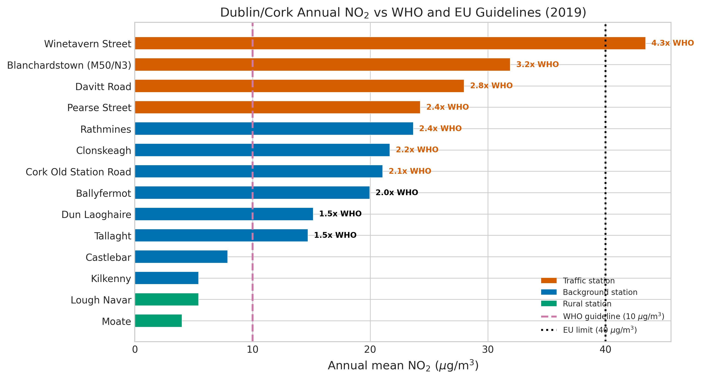
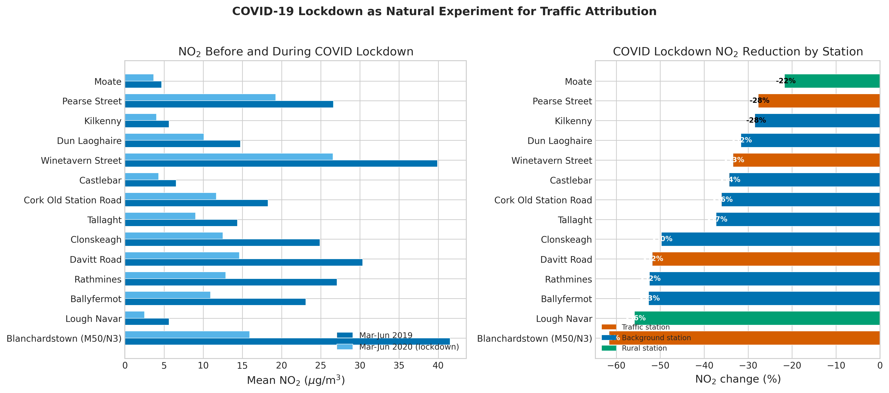

*This is a short summary. For the full technical write-up, see the [detailed paper](https://github.com/colinjoc/hdr_autoresearch/blob/master/applications/dublin_no2/paper.md).*

## The Question

Ireland is widely considered to have clean air. The country has never breached the European Union's annual limit for nitrogen dioxide, a pollutant produced primarily by diesel engines. But in 2021, the World Health Organization cut its recommended limit from 40 to just 10 micrograms per cubic metre -- a fourfold tightening based on new evidence about health effects at low concentrations.

Under the new health-based guideline, the picture changes completely. We analysed nine years of real monitoring data from 33 Irish stations to answer three questions: Which stations exceed the health limit, and by how much? How much of the pollution comes from traffic versus heating versus regional background? And can the COVID-19 lockdown -- which dramatically cut traffic while leaving heating unchanged -- validate the source attribution?

## What We Found

Every urban monitoring station in Dublin and Cork exceeds the health-based annual guideline, typically by 1.2 to 4.4 times. Dublin's worst site recorded more than four times the health limit. Yet no station breaches the European Union legal limit. Ireland is legally compliant while its residents breathe air the World Health Organization considers harmful.

- Diesel road traffic is the dominant source, contributing 41 to 80 percent of annual nitrogen dioxide depending on proximity to roads. Even at residential stations away from major roads, traffic is the largest single contributor.
- The COVID-19 lockdown proved it. When traffic volumes dropped 60 to 80 percent in spring 2020, nitrogen dioxide fell by 33 to 62 percent across Dublin stations. A motorway interchange showed the most dramatic response -- 62 percent -- because it has essentially no nearby residential heating to dilute the signal. The correlation between the model's traffic attribution and the observed lockdown response was 0.97 across 14 stations.
- Residential heating contributes 8 to 30 percent, peaking in winter. On the coldest days, background stations measure 14 micrograms more than on mild days -- the combined effect of higher heating demand and poorer atmospheric dispersion.
- Even if Dublin eliminated all road traffic tomorrow, several background stations would still exceed the health guideline because of heating contributions. Traffic reduction alone is necessary but insufficient.

## Why That's Surprising

The gap between the health-based recommendation and the legal standard means Ireland can truthfully claim compliance while every Dubliner in an urban area breathes nitrogen dioxide at levels the World Health Organization considers harmful. This is not unique to Ireland -- most European cities face the same paradox -- but it is particularly stark here because Ireland's self-image as a clean-air country is so deeply held.

The COVID lockdown provided an unusually clean natural experiment. Traffic dropped sharply while heating continued unchanged (people stayed home). The near-perfect correlation between our model's predicted traffic contribution and the observed pollution drop gives unusually strong causal evidence. This is not a statistical correlation in search of a mechanism -- the mechanism is physically obvious, and the lockdown quantified it precisely.

## What It Means

For Dublin residents: the air quality problem is real, it is dominated by diesel traffic, and the COVID lockdown demonstrated that it can improve rapidly and substantially when traffic is reduced. The question is whether Ireland will act on this evidence.

For policymakers: traffic reduction is the highest-leverage intervention, but it is not sufficient on its own. Several stations would remain above the health guideline even at zero traffic, because of residential heating. Switching heating fuels from solid fuels (coal, peat, wood) to cleaner alternatives is also required. The European Union's ongoing revision of its Air Quality Directive may tighten the legal limit toward the health-based value, which would put Dublin and Cork into non-compliance.

For the broader European context: any city that is currently "compliant" under European Union law but has not checked against the 2021 World Health Organization guideline should do so. The fourfold gap between the two standards means many cities that look clean by one measure fail by the other.

## How We Did It

We used 55,221 daily nitrogen dioxide records from 33 Irish stations in the European Environment Agency monitoring network (2015 to 2023) and 78,865 hourly weather observations from the Met Eireann Dublin Airport station. Source attribution used a receptor-based station-differencing method: rural stations provide the regional background, urban background stations (away from major roads) reveal the heating signal through their seasonal cycle, and the residual at traffic stations is attributed to road traffic. This decomposition was validated against the COVID-19 lockdown response and independently confirmed by weekday-weekend differentials. All data are publicly available. No synthetic data were used. Full code and data references are in the [project repository](https://github.com/colinjoc/hdr_autoresearch/tree/master/applications/dublin_no2).

## Further Reading

- World Health Organization. "WHO Global Air Quality Guidelines." (2021). -- the updated guideline that tightened the annual nitrogen dioxide limit from 40 to 10 micrograms per cubic metre.
- Venter ZS et al. "COVID-19 Lockdowns Cause Global Air Pollution Declines." *Proceedings of the National Academy of Sciences* (2020). [doi:10.1073/pnas.2006853117](https://doi.org/10.1073/pnas.2006853117) -- the global study confirming lockdown-driven air quality improvements.
- EPA Ireland. "Air Quality in Ireland 2023." (2024). [epa.ie](https://www.epa.ie/) -- Ireland's official air quality assessment, which reports European Union compliance.

---
📂 **[HDR methodology](https://github.com/colinjoc/hdr_autoresearch)**
