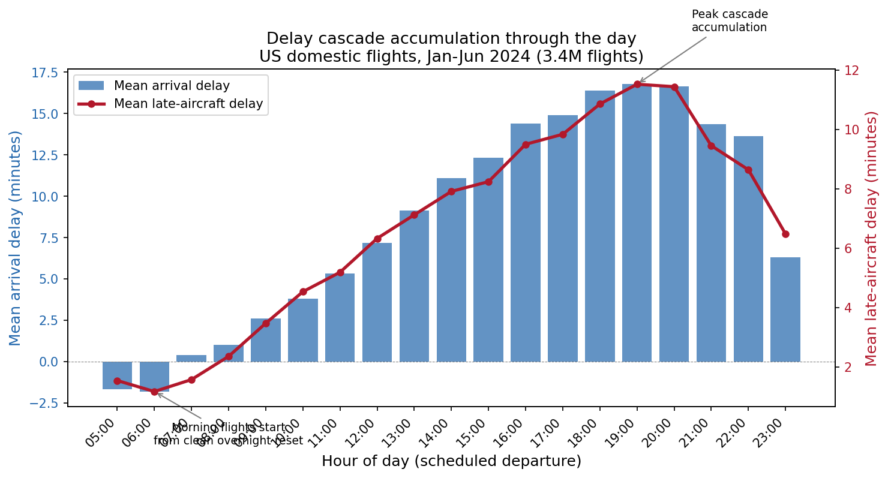
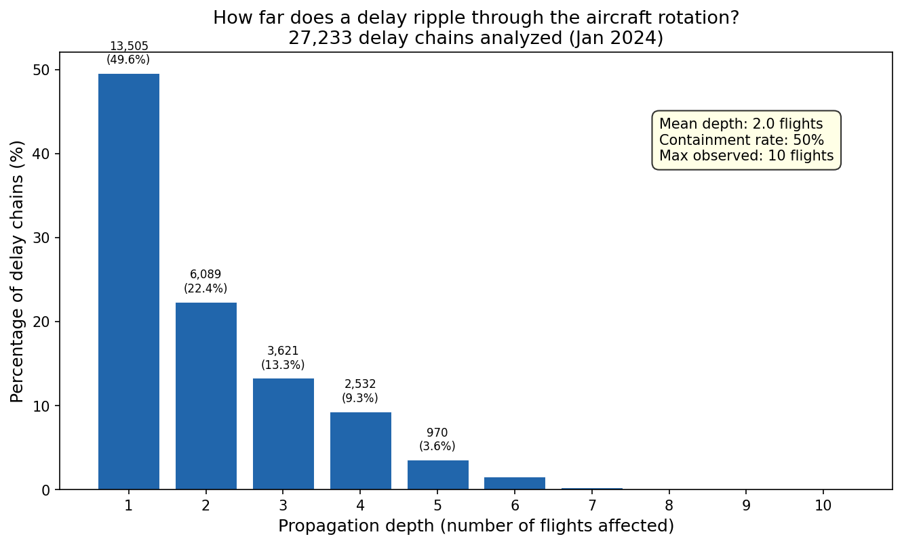
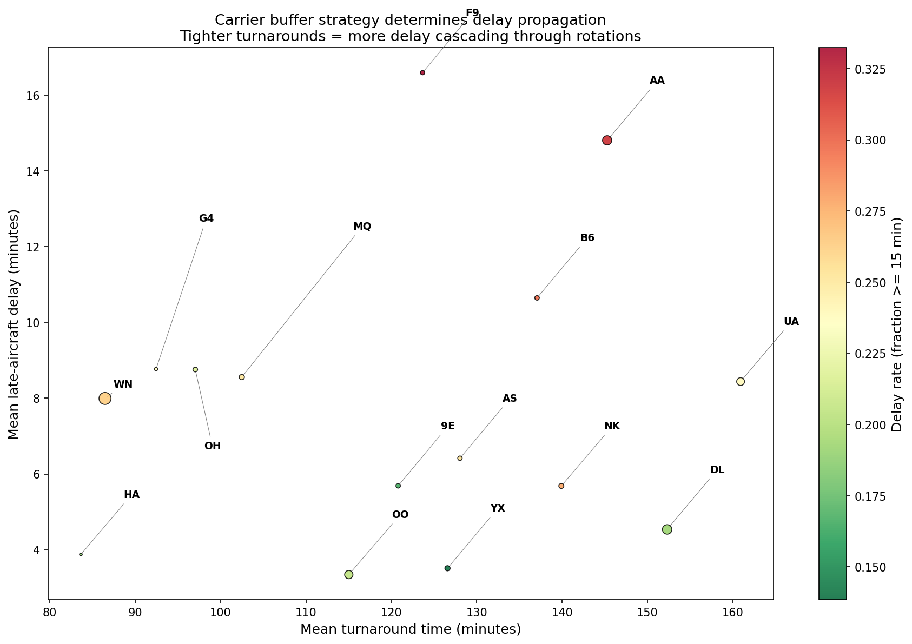

*This is a short summary. For the full technical write-up, see the [detailed paper](https://github.com/colinjoc/hdr_autoresearch/blob/master/applications/flight_delays/paper.md).*

## The Question

Every frequent flyer knows the drill. You arrive at the gate, the departure board shows a delay, and the gate agent announces that "the inbound aircraft is running late." Your flight to Denver cannot leave until the plane arrives from Atlanta, the passengers get off, the cabin is cleaned, and your group boards. If the plane was 40 minutes late from Atlanta, and the airline only scheduled a 45-minute turnaround, you are almost certainly going to be late too. And if the plane has two more flights after yours tonight, so are those passengers.

We wanted to know: how far does this actually ripple? When a morning flight is delayed, how many subsequent flights on the same aircraft are affected? What determines whether a delay is absorbed or amplified? And are some routes, airports, or airlines more contagious than others?

## What We Found

Aircraft rotation -- the fact that the same physical airplane flies multiple flights per day -- is the single biggest cause of flight delays in the United States. It accounts for 41 percent of all delay minutes, more than airline operational issues (33 percent), air traffic control congestion (20 percent), or weather (7 percent). The Bureau of Transportation Statistics, which collects mandatory performance reports from every major US carrier, calls this "late aircraft delay."

We reconstructed the rotation chains for 3.4 million flights over six months by tracking each aircraft's tail number through its daily sequence of flights. The results are striking:

- **Half of all initial delays are contained immediately.** If the first flight of the day is late, there is a 50-50 chance the second flight departs on time anyway, because the airline built enough buffer into the schedule.
- **The other half propagate.** Among delays that do spread, the average cascade affects two additional flights. In extreme cases, a single delayed morning flight in January 2024 caused ten subsequent flights on the same aircraft to arrive late.
- **Delays accumulate relentlessly through the day.** Morning flights (before 9 AM) arrive an average of two minutes early, because the aircraft starts from a clean overnight reset. By 7 PM, the average flight is 17 minutes late. The cascade resets overnight.

## The Buffer Is Everything

The single strongest predictor of whether a delay propagates is the interaction between the incoming delay and the airline's schedule buffer -- how much turnaround time the carrier builds between flights. Airlines that pad their schedules absorb incoming delays. Airlines that schedule tighter turnarounds, squeezing more flights out of each aircraft per day, propagate more delay to downstream passengers.

This one feature accounts for 27 percent of the prediction model's total importance, more than any airport congestion metric, weather proxy, or time-of-day pattern. A simple way to think about it: if the plane arrives 30 minutes late and the airline scheduled a 90-minute turnaround, there are 60 minutes of buffer left -- plenty of time for a clean departure. If the airline scheduled only a 40-minute turnaround, that 30-minute delay leaves just 10 minutes, and any additional friction will push the next flight past its departure time.

This is not a new insight in theory -- operations researchers have been saying it since at least 2008 -- but seeing it dominate a data-driven model trained on 3.4 million real flights confirms the theory at scale.

## Super-Spreader Routes

Not all routes are equal. Some corridors consistently propagate more delay than others. The top super-spreader routes are hub-to-hub corridors: San Francisco to Las Vegas, Tampa to Dallas/Fort Worth, Orlando to Dallas/Fort Worth, and the reverse DFW-SFO route. Dallas/Fort Worth appears in four of the top ten most contagious routes, reflecting its role as a major hub with tight scheduling.

At the airport level, Dallas/Fort Worth, Miami, Fort Lauderdale, Orlando, and San Francisco are the top delay propagation hubs. The Florida airports are overrepresented because they combine high traffic volume with weather-related delays (afternoon thunderstorms in summer, holiday travel in winter) and tight carrier scheduling.

## What It Means

For passengers, the practical advice is simple. Book the first flight of the day -- it has no rotation history to inherit, and the data shows morning flights arrive two minutes early on average. Avoid late-afternoon connections through major hubs, especially Dallas/Fort Worth and the Florida airports, where cascade risk peaks. If you must connect, prefer airlines with longer scheduled turnarounds.

For airlines, the finding confirms what operations researchers have argued for decades: schedule padding is the cheapest and most effective tool for controlling delay propagation. Adding five minutes to turnaround times at the busiest airports has been estimated to reduce total propagated delay by 15 to 20 percent. Our data shows that carriers already doing this -- those with turnarounds above 150 minutes -- have dramatically lower late-aircraft delay per flight.

## How We Did It

We used six months of real data (January through June 2024) from the Bureau of Transportation Statistics On-Time Performance database, which collects mandatory reports from every US carrier with significant domestic traffic. The dataset contains 3.4 million flights across 15 carriers and approximately 350 airports. We reconstructed aircraft rotation chains from tail numbers, engineered 29 features capturing rotation history, airport congestion, carrier buffer strategy, and temporal patterns, and trained a gradient-boosted tree model with strict temporal cross-validation (always train on the past, test on the future). The model achieves an area under the receiver operating characteristic curve of 0.92 on held-out months. Full details, including all code and reproducibility instructions, are in the [project repository](https://github.com/colinjoc/hdr_autoresearch/tree/master/applications/flight_delays).

## Further Reading

- [Full technical paper with methodology and results](https://github.com/colinjoc/hdr_autoresearch/blob/master/applications/flight_delays/paper.md)
- [BTS On-Time Performance Data](https://www.transtats.bts.gov/) -- the public data source
- Beatty et al. (1999) -- first quantification of rotation-caused delays
- AhmadBeygi et al. (2008) -- delay propagation trees through rotation chains
- Fleurquin et al. (2013) -- epidemic spreading model for airport delay networks
