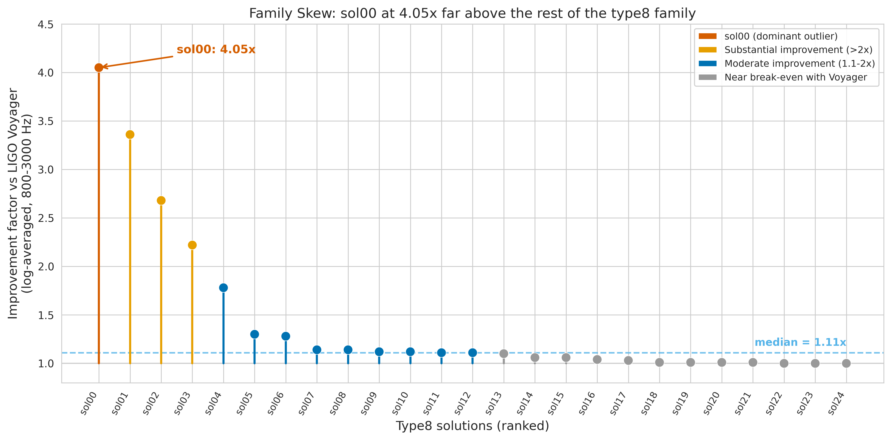
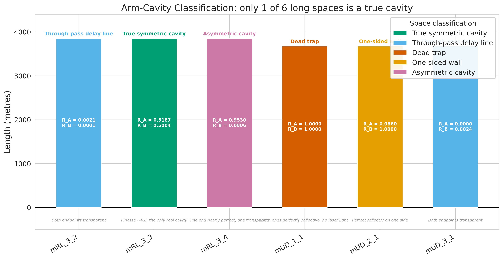
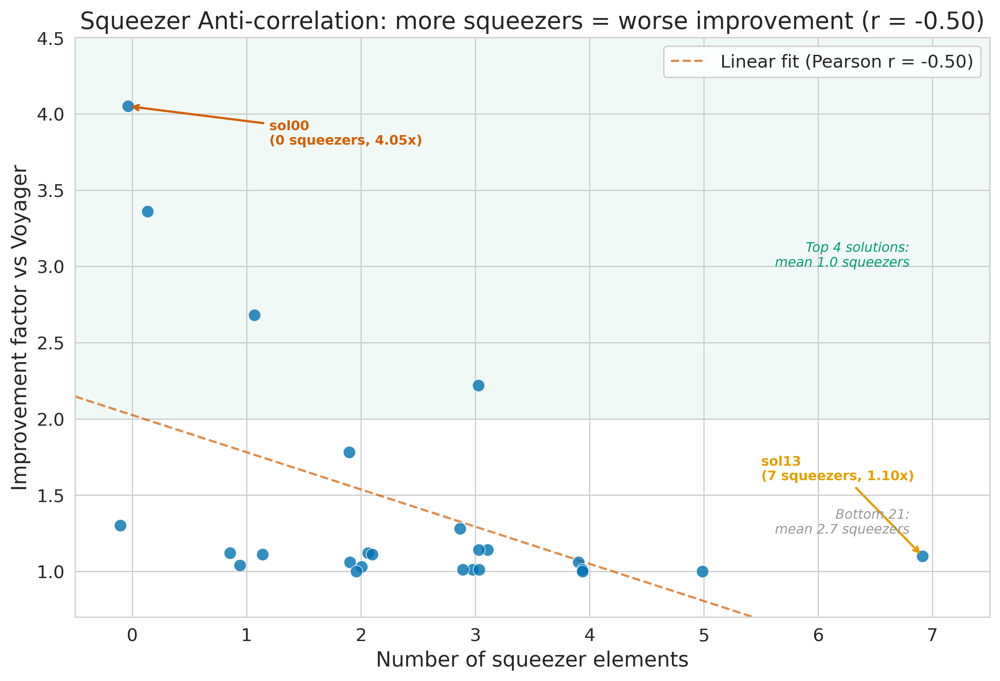

*A plain-language summary. The [full technical paper](https://github.com/colinjoc/hdr_autoresearch/blob/main/applications/gw_detectors/paper.md) has the diagnostics and experiment logs. See [About HDR](/hdr/) for how this work was produced and reviewed.*

**Bottom line.** In 2025 an AI system proposed 50 new gravitational-wave detector designs. The best of them is four times more sensitive than the planned next-generation human-designed detector, in a band that matters for probing the hot aftermath of colliding neutron stars. When we took it apart, half its components turned out to be doing nothing, its readout is half-broken by design, and the mechanism it is exploiting has never appeared in the physics literature.

## The question

Gravitational-wave detectors measure distortions in spacetime smaller than one ten-thousandth the width of a proton. Every detector built or planned — LIGO, Virgo, KAGRA, Cosmic Explorer, the Einstein Telescope — uses essentially the same architecture: a specific arrangement of mirrors, lasers, and light-squeezing technology refined over four decades of human engineering.

In 2025, an AI system called [Urania](https://doi.org/10.1103/PhysRevX.15.021012) threw that playbook out. It parameterised arbitrary detector layouts as grids of optical components and searched for designs that beat the human ones. It published 50 new proposals as an open catalogue called the [GWDetectorZoo](https://github.com/artificial-scientist-lab/GWDetectorZoo). The best design in the post-merger neutron-star detection band improves on the planned next-generation instrument ([LIGO Voyager](https://dcc.ligo.org/LIGO-T1400226/public)) by a factor of four. The researchers who built Urania said explicitly that they did not understand why. We performed the first systematic structural decomposition to find out.

## What we found

The top design family — 25 solutions optimised for the 800-3000 Hz post-merger band — is sharply skewed. The single best design achieves a genuine 4.05x improvement over the human baseline. The median of the 25 improves by only 1.11x, and the bottom half is within three percent of baseline. Of 50 designs marketed as improvements, the practical yield is two or three worth building.

The best design is not a refinement of the conventional architecture. It is something qualitatively different.

- More than half its mirrors are set to extreme values — perfectly transparent or perfectly reflective — meaning they do nothing. Only 2 of 13 declared beam-splitters actually split light. Almost two thirds of the free-space connections are set to a default placeholder length.
- The readout system is half-broken by design. It declares a balanced two-detector readout, but one detector is not connected to any light source. Four of the top five designs share this pattern. The AI learned to use a single-detector readout disguised as a balanced one.
- Of six arm-length spaces, only one functions as a true optical cavity. The others are dead ends, delay lines, and traps.
- More squeezing technology means worse performance. Across the 25-member family, the number of squeezing devices correlates negatively with improvement. The top four designs average one squeezer. The bottom 21 average nearly three.
- The candidate mechanism has no published precedent: a distributed signal-accumulation network spanning roughly 24 kilometres of differential arm length — three times the effective baseline of the human design — fed to a single readout port.

## Why that matters

Gravitational-wave detector design has followed a clear script for decades. Two long arms with highly reflective mirrors at each end form optical cavities. Squeezed light is injected to beat the quantum noise limit. A balanced pair of detectors reads out the signal and cancels classical noise. Heavy test masses hang to suppress radiation-pressure fluctuations. Every current and planned detector is a variation on this theme.

The AI's best design violates every element of that script. No high-reflectivity cavity mirrors in the standard range. No working balanced readout. No functioning heavy test masses at cavity endpoints. Zero squeezers. By the conventional playbook, it should perform terribly. Instead, it is four times more sensitive than the planned next-generation instrument in the post-merger band. The AI appears to have discovered an entirely different strategy — accumulating the gravitational-wave signal across many points in a distributed network, rather than amplifying it at a few high-quality cavities — that physicists had never considered. If the mechanism is confirmed by full numerical simulation, it would be a genuinely new class of interferometer topology, not merely a better-tuned version of the existing one.

## What it means in practice

**For the gravitational-wave community.** Focus on two or three designs from the catalogue, not fifty. The grids are grossly over-parameterised — a functionally simplified version of the best design would need roughly half the components. If the distributed signal-accumulation mechanism is confirmed numerically, it could inform next-generation detectors like Cosmic Explorer and the Einstein Telescope by offering a fundamentally different topology alongside the conventional approach.

**For AI-for-science more broadly.** The system produced designs that genuinely work, but it also produced designs full of non-functional components, phantom detectors, and parameters pinned to extreme values. Understanding what the AI actually discovered requires component-by-component structural analysis. Publishing an optimisation result is not the same as understanding it.

## How we did it

We wrote a custom parser for the configuration files distributed in the [GWDetectorZoo](https://github.com/artificial-scientist-lab/GWDetectorZoo), cross-validated it against a patched version of the standard tool, and used it to extract every component and parameter from all 25 designs in the post-merger family. We combined the structural data with the pre-computed sensitivity curves distributed alongside each design, ran 20 hypothesis-driven experiments and a topological analysis tracing light paths from each laser through the optical network, and computed robust correlation statistics including Spearman rank correlations, leave-one-out analysis, and bootstrap confidence intervals. We cross-checked the [LIGO Voyager](https://dcc.ligo.org/LIGO-T1400226/public) baseline independently using the [Differometor](https://github.com/artificial-scientist-lab/Differometor) simulator. Full code and the 16-test parser validation suite are in the [project repository](https://github.com/colinjoc/hdr_autoresearch/tree/main/applications/gw_detectors).

## Further reading

- Krenn M, Drori Y, Adhikari RX. "Digital Discovery of Interferometric Gravitational Wave Detectors." *Physical Review X* (2025). [doi:10.1103/PhysRevX.15.021012](https://doi.org/10.1103/PhysRevX.15.021012) — the Urania paper that generated the detector designs.
- Krenn M et al. [GWDetectorZoo](https://github.com/artificial-scientist-lab/GWDetectorZoo) — the open catalogue of 50 AI-discovered designs.
- Abbott BP et al. "Observation of Gravitational Waves from a Binary Black Hole Merger." *Physical Review Letters* (2016). [doi:10.1103/PhysRevLett.116.061102](https://doi.org/10.1103/PhysRevLett.116.061102) — the first direct detection of gravitational waves.
- [Full technical paper](https://github.com/colinjoc/hdr_autoresearch/blob/main/applications/gw_detectors/paper.md).
