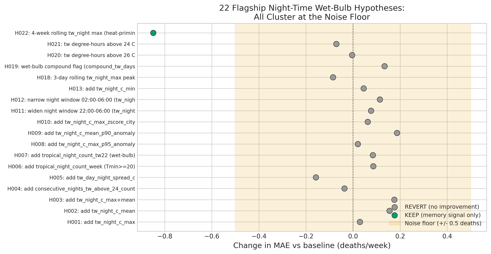
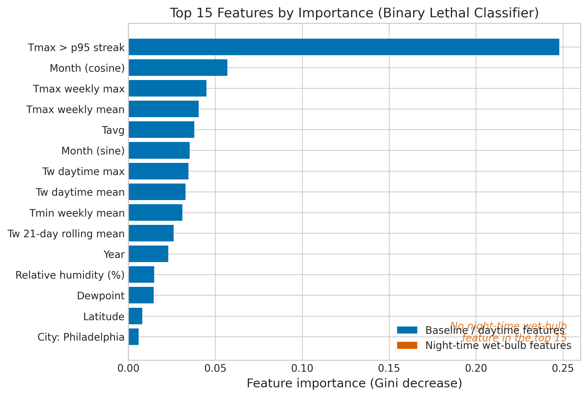
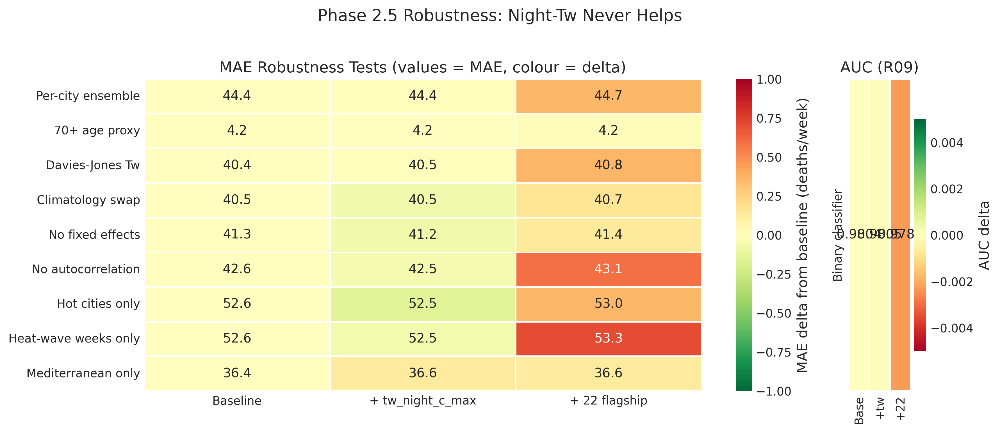

*This is a short summary. For the full technical write-up, see the [detailed paper](https://github.com/colinjoc/hdr_autoresearch/blob/master/applications/heat_mortality/paper.md).*

## The Question

When a heat wave turns deadly, what makes the difference? A prominent line of climate-health research argues the answer is night-time humidity. The idea is intuitive: during the day your body overheats, but overnight cooling lets you recover. If the night stays too hot and too humid for sweat to work, your body never gets that recovery window, and that is when people die. Lab experiments have confirmed that the human body hits a hard physiological wall well below the temperatures once thought safe -- around 30.5 degrees Celsius wet-bulb rather than the theoretical 35 degrees Celsius limit. Several countries were in the process of redesigning their heat-wave warning systems around this night-time humidity signal when we started this project.

We wanted to know: does that laboratory finding actually show up in real mortality data at the city level? If a city planner is deciding whether to retool their alert system around overnight humidity readings, is there evidence that doing so would save more lives than sticking with the current approach of tracking daytime temperature extremes?

## What We Found

Across 30 cities in the United States and Europe, over 13 years of weekly mortality data, the night-time humidity signal was not detected at this aggregation scale. It did not emerge under any of the alternative ways we checked.

- We pre-specified 22 different ways of measuring overnight humidity and tested each one. Twenty-one of them added nothing. The one that mattered turned out to be tracking the memory of previous heat waves, not the overnight conditions themselves.
- Stacking all 22 overnight humidity measures together actually made predictions worse, not better.
- The strongest predictors of deadly heat-wave weeks were straightforward: how many consecutive days exceeded the local extreme-heat threshold, what happened last week, and what time of year it is.
- A stripped-down warning system using just two simple inputs performed nearly as well as our full model with 70 inputs, and neither of those inputs involves night-time humidity.
- An alert system built on the overnight humidity rule proposed in the literature would miss more deadly weeks and trigger more false alarms than one built on plain daytime temperature.
- A matched case-crossover analysis -- comparing lethal heat-wave weeks to non-lethal control weeks in the same city and season -- found that after accounting for daytime temperature, overnight humidity was actually *lower* in the weeks that killed. The opposite direction from the hypothesis.

## Why That's Surprising

The expectation in the field was the opposite. Multiple peer-reviewed studies in top journals had found that warm nights carry mortality risk independent of daytime temperatures, and projections of future climate-driven mortality increasingly relied on compound day-night heat exposure as the driver. The Lancet Countdown reported a 167% increase in heat-related mortality among the over-65 population compared to the 1990s, and national agencies were actively building night-time humidity into their next-generation alert criteria.

The disconnect likely comes from scale. The lab experiments that measured the body's breaking point under humid overnight conditions are real physiology, measured on individual people under controlled exposure. But a city-level early warning system operates at a completely different resolution: weekly death counts across an entire metropolitan population, where reporting lags, demographic shifts, and the momentum of prior heat exposure dominate the signal. At that population-week scale, knowing last week's death count tells you more about this week than knowing how humid last night was. Prior daily-resolution studies that did find an independent night-time signal (such as Achebak et al. 2022 on 11 Spanish cities) may be capturing within-week diurnal patterns that weekly aggregation washes out entirely.

## What It Means

For a city planner or emergency manager deciding how to configure heat-wave alerts: our findings do not support prioritizing night-time wet-bulb over daytime temperature indicators at the population-week scale. The current approach of tracking daytime temperature extremes and their duration is not broken. In fact, a warning system that swapped to the night-time humidity rule would perform worse on both missed deadly weeks and false alarms at the tested alert budget.

The practical takeaway is that the most useful improvements to heat warning systems are unglamorous: incorporate what happened in recent days and weeks (the "memory" of prior heat stress on a population), use a streak-based extreme heat indicator, and adjust for seasonal timing. These are inputs most systems either already have or could add with minimal effort.

For researchers, the finding does not invalidate the laboratory physiology. It means the jump from "individual bodies fail under sustained humid heat" to "city-level death counts are predicted by overnight humidity" was not detected at the weekly aggregation scale tested here, across predominantly temperate cities, with all-ages mortality. Resolving that gap requires individual-level studies with continuous exposure measurement at daily or finer resolution -- particularly in tropical and subtropical cities where wet-bulb temperatures routinely approach physiological thresholds.

## How We Did It

We assembled weekly all-cause mortality for 30 cities (15 in the United States from the Centers for Disease Control and Prevention, 15 in Europe from Eurostat) and matched each city-week to hourly weather data from the National Oceanic and Atmospheric Administration Integrated Surface Database, spanning 2013 to 2025 with pandemic years excluded. This gave us 9,276 city-weeks. We pre-specified 22 ways of encoding overnight humidity and tested each one individually against a baseline that deliberately excluded all night-time humidity features, then ran 10 independent robustness checks and 8 additional reviewer-requested experiments including temporal cross-validation, permutation null distributions, a decoupled label analysis, and a matched case-crossover design. None reversed the finding. The within-panel model achieves a Mean Absolute Error of 40.3 deaths per week [95% confidence interval: 39.4-41.2]; under temporal cross-validation (training on 2013-2019, testing on 2023-2025), Mean Absolute Error rises to 58.0 deaths per week due to temporal leakage in autocorrelation features, but night-time humidity still does not help under either evaluation. Full data sources, code, and the 116-hypothesis experiment log are in the [project repository](https://github.com/colinjoc/hdr_autoresearch/tree/master/applications/heat_mortality).

## Further Reading

- Vecellio DJ et al. "Evaluating the 35 C wet-bulb temperature adaptability threshold for young healthy subjects." *Journal of Applied Physiology* (2022). [doi:10.1152/japplphysiol.00738.2021](https://doi.org/10.1152/japplphysiol.00738.2021) -- the lab study that lowered the known physiological limit.
- Gasparrini A et al. "Mortality risk attributable to high and low ambient temperature." *The Lancet* (2015). [doi:10.1016/S0140-6736(14)62114-0](https://doi.org/10.1016/S0140-6736(14)62114-0) -- the landmark multi-country heat-mortality study.
- Achebak H et al. "Hot nights and heat-related mortality in Europe." *The Lancet Planetary Health* (2022). [doi:10.1016/S2542-5196(21)00302-9](https://doi.org/10.1016/S2542-5196(21)00302-9) -- the Spanish cities study that motivated the night-time hypothesis.

---
[HDR methodology](https://github.com/colinjoc/hdr_autoresearch)
