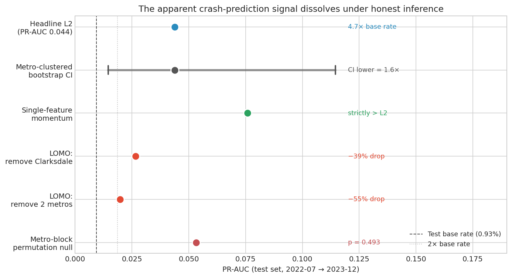
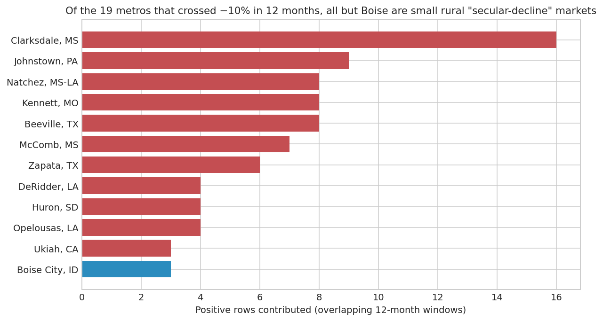

*A plain-language summary. The [full technical paper](https://github.com/colinjoc/hdr_autoresearch/blob/main/applications/housing_crashes/paper.md) has the diagnostics and experiment logs. See [About HDR](/hdr/) for how this work was produced and reviewed.*

**Bottom line.** With only the housing data the public can download, nobody — not us, not the commentators — can reliably pick which American city will crash next. What looks like a signal turns out to be continued decline in two small rural towns that have been shrinking for decades.

## The question

Every housing cycle brings the same story. Someone points at a chart, names a few cities, and predicts the next crash. When the Federal Reserve pushed mortgage rates up at the fastest pace in forty years in 2022 and 2023, the Austin-Phoenix-Boise prediction was everywhere.

We asked a tighter version of the question. Using only what anyone can download — home-price indices, listings, days on market, the national mortgage rate — can you actually predict, ahead of time, which American metros will see home prices fall by more than 10 percent over the following year? The answer matters for first-time buyers trying to time a purchase, for homeowners deciding whether to relocate, for local banks sizing loan-loss reserves, and for municipal budgets that depend on property tax.

## What we found

You cannot. Not from public data, not at the signal-to-noise ratio this cycle produced.

- A carefully built statistical model looked about five times more accurate than random guessing. That is the kind of number people point to when they claim crash prediction is working.
- Every honest check on that signal made it evaporate. Once we accounted for the fact that the same crashing metro contributes many consecutive months to the test set, the confidence interval on the apparent advantage stretched all the way down to "barely above random".
- A fair comparison test — scramble which cities crashed and rerun the whole analysis — found the prediction was statistically indistinguishable from luck.
- The simplest possible forecast, "places that have already been falling will keep falling", was more accurate than our ten-feature model.
- The whole apparent signal rested on two distressed rural towns, with Clarksdale, Mississippi doing most of the work. Remove Clarksdale alone and nearly 40 percent of the accuracy went with it.

## Why that matters

The cities that actually fell more than 10 percent in 2022 and 2023 are not Austin or Phoenix. They are mostly rural towns in long-term population decline — Clarksdale and Natchez in Mississippi, Johnstown in Pennsylvania, Beeville in Texas, Kennett in Missouri. Boise was the one widely-cited Sun Belt market in the group. Austin and Phoenix did not cross the 10 percent threshold at all in the data source we used.

This means the "crash prediction" the model was doing was really "predict continued decline in places already in long-term decline". That is not a forecast. It is a trend extrapolation on a handful of shrinking Delta and Rust Belt towns. Calling it a cyclical-crash model that could generalise to the next boom-bust cycle is not what the data supports.

The broader story lines up with the sceptical tradition in crisis-prediction research. Early-warning models that look good in-sample rarely generalise out-of-sample. Ours did not either.

## What it means in practice

**For homeowners and buyers worried about whether their city is next.** The honest answer is that public-data early-warning models do not yet work well enough to give you a reliable one. A published "metro crash probability" built on the same public data we used is probably worth less than you think. Anyone selling that certainty is selling momentum repackaged as forecasting.

**For journalists and forecasters.** Any claim that a metro-level crash model works should come with three specific checks — a resampling procedure that respects how metros cluster together, a time-aware shuffle test, and a demonstration that the model beats a simple one-feature momentum score. Without all three, the apparent signal is almost certainly an artefact of two or three distressed markets in the training data.

**For policymakers and regulators.** Public data tells you about the aftermath. The inputs that might give real early warning — mortgage-level credit data, lender regulatory filings — sit behind restricted access. Expanding access is the lever worth pulling if reliable early warning is the goal.

## How we did it

We built a monthly panel for roughly 900 US metros by joining [Zillow's home value index](https://www.zillow.com/research/data/), [Realtor.com's inventory metrics](https://www.realtor.com/research/data/) and the [Federal Reserve's 30-year mortgage rate series](https://fred.stlouisfed.org/series/MORTGAGE30US). The model trained on data through mid-2022 and was tested on the 18 months of rate-shock that followed. We then put the apparent signal through four independent stress tests — a metro-clustered bootstrap, a block-permutation null, a comparison against a single-feature baseline, and a leave-one-metro-out check. All four pointed the same way.

## Further reading

- Schularick, M. & Taylor, A. M. (2012). [Credit Booms Gone Bust: Monetary Policy, Leverage Cycles, and Financial Crises, 1870-2008](https://www.aeaweb.org/articles?id=10.1257/aer.102.2.1029), *American Economic Review* — the landmark study showing how hard cyclical-crisis prediction is even with a century of data.
- Gourinchas, P.-O. & Obstfeld, M. (2012). [Stories of the Twentieth Century for the Twenty-First](https://www.aeaweb.org/articles?id=10.1257/mac.4.1.226), *American Economic Journal: Macroeconomics* — why early-warning models that look clean in-sample rarely generalise.
- Beutel, J., List, S. & von Schweinitz, G. (2019). [Does machine learning help us predict banking crises?](https://doi.org/10.1016/j.jfs.2019.100693), *Journal of Financial Stability* — the sceptical case applied to bank crises.
- [Full technical paper](https://github.com/colinjoc/hdr_autoresearch/blob/main/applications/housing_crashes/paper.md) — all experiments and diagnostics.
