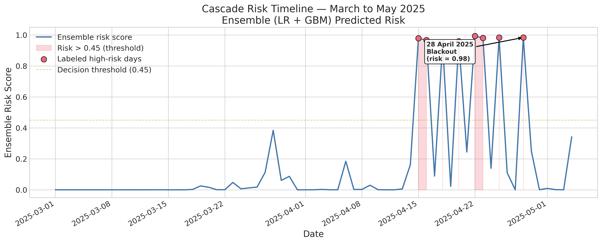
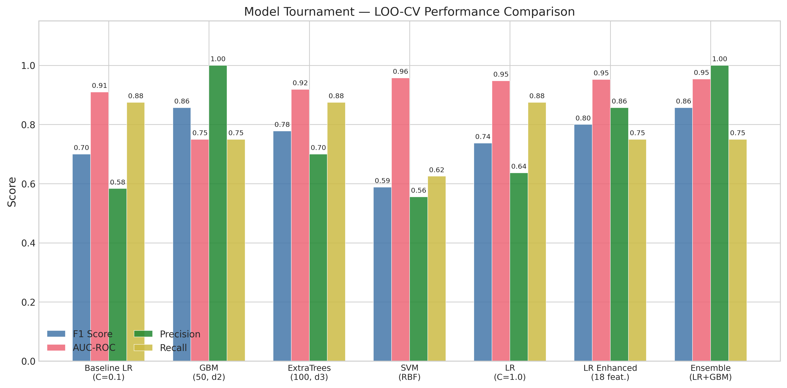

*This is a short summary. For the full technical write-up, see the [detailed paper](https://github.com/colinjoc/hdr_autoresearch/blob/master/applications/iberian_blackout/paper.md).*

## The Question

At 12:33 on Monday, April 28, 2025, the entire electrical grid of Spain and Portugal collapsed. Roughly 31 gigawatts of generation disconnected in under 24 seconds. Trains stopped in tunnels. Traffic lights went dark across Madrid, Barcelona, and Lisbon. Hospitals switched to backup generators. Approximately 47 million people lost power for up to ten hours.

The immediate assumption was intuitive: Spain had too much solar power and not enough conventional generation running. The grid lacked the physical spinning mass to absorb a disturbance. This explanation matches every previous major European blackout -- Italy in 2003, Europe in 2006, Turkey in 2015, the United Kingdom in 2019 were all cases where the grid lost generation, frequency dropped, and the system collapsed. But the Iberian blackout was different. We asked: what actually caused it, and can the dangerous days be identified in advance from publicly available data?

## What the Investigation Found

The European investigation, published after eleven months of analysis by 49 experts, revealed an unexpected mechanism. The grid died from too much voltage, not too little power. At the moment of collapse, Spain was generating far more electricity than it needed -- solar panels alone were producing 59 percent of all generation -- and was paying neighbouring countries to take the surplus. When a group of renewable plants reduced their output, they simultaneously withdrew the invisible voltage support they had been providing. Transmission voltage spiked above safe limits, protection systems tripped, and a self-reinforcing cascade brought the entire system down in 24 seconds.

The finding that inertia did not matter is particularly significant. The dominant public narrative -- "too much solar, not enough spinning mass" -- is wrong in a specific, testable way. The investigation explicitly stated: "even with significantly higher inertia values, the loss of system synchronism would not have been avoided." The problem was not insufficient generation but excessive generation, specifically non-synchronous generation that provided no dynamic voltage support.

## What We Tried

We used five months of real operational data (January through May 2025) from the Spanish grid operator's public data portal, covering daily generation by technology, hourly demand, interconnector flows, and spot electricity prices. We reverse-engineered the official root cause analysis into three domain-informed proxy features (voltage stress, reactive power gap, and inertia) and evaluated multiple classifiers using leave-one-out cross-validation on 94 daily observations.

The model appeared to work well. The gradient boosting classifier achieved F1 = 0.857, and the ensemble reached an area under the ROC curve (AUC-ROC) of 0.948. Removing the inertia proxy changed nothing, directly confirming the investigation's finding. Voltage-focused features alone matched the full model's performance.

## What Went Wrong

The eight "high-risk" days the model was trained to detect were not independently identified grid events. Seven of the eight were created by applying a threshold to a composite stress score computed from the same features the model uses for prediction. The model was being tested on its ability to recover its own labeling rule, not on its ability to predict cascading collapse.

Three experiments exposed this:

**A simple threshold rule beat the machine learning.** A direct threshold on the composite stress score, with no machine learning at all, achieved F1 = 0.933, higher than the gradient boosting classifier's cross-validated F1 = 0.857. The ML model was not learning cascade dynamics. It was learning to replicate a threshold.

**The model could not find the actual blackout.** When we held out April 28 and asked the model to predict it, it assigned near-zero probability. The blackout date's stress score (0.293) was actually lower than the 95th-percentile threshold (0.330) used to label the other high-risk days. The model detected stress-score exceedances, not cascade events.

**Temporal validation was impossible.** All eight positive labels fell in April and May 2025, because the extreme solar/low-synchronous conditions that drive the stress score are seasonal. Training on January through March produced zero positive examples. A model that cannot be validated prospectively cannot serve as an early warning system.

The bootstrap confidence intervals told the same story from a different angle: the 95 percent confidence interval for F1 was [0.571, 1.000], spanning nearly the entire range. With only eight positive examples, the metrics are too uncertain to draw strong conclusions.

## What It Actually Means

Solar energy did not cause this blackout. Insufficient voltage control infrastructure, outdated protection relay settings, fixed power factor operating modes, and manual rather than automatic reactive power management caused it. The conditions that produced the cascade -- high solar output, low demand, heavy exports, negative prices -- are not unique to Spain. Germany, Australia, California, and every other region with rapidly growing solar capacity will face the same challenge.

The domain-informed features themselves -- voltage stress proxy, reactive power gap, export fraction -- do capture the conditions that the investigation identified as contributing to the cascade. Monitoring these features in real time, even with a simple threshold, could alert operators to days where preventive measures may be warranted: shunt reactors to absorb excess voltage, switching renewable plants from fixed to active voltage regulation, dispatching synchronous condensers, and adjusting export schedules. The transition to renewable energy is necessary and irreversible, but grid operation practices must evolve alongside the generation mix.

But honest assessment requires acknowledging what we could not demonstrate. With one blackout event and no independent source of grid-event labels, we cannot validate a "cascade predictor" -- only a stress detector that identifies extreme conditions from the public data. Whether those extreme conditions are necessary, sufficient, or even correlated with actual cascade risk cannot be determined from a single event.

## How We Did It

No synthetic data were used. All features come from the Red Electrica de Espana (REE) REData API (Application Programming Interface). Full data, code, experiment log, and the detailed paper are in the [project repository](https://github.com/colinjoc/hdr_autoresearch/tree/master/applications/iberian_blackout).

Note: the reported classification metrics (F1, precision, recall, AUC-ROC) are inflated by circular labeling -- the positive labels are derived from a threshold on the same features the model uses. A simple threshold rule without machine learning achieves comparable or better performance. These metrics should be interpreted as measures of the model's ability to recover its own labeling threshold, not as measures of genuine cascade prediction capability.

## Further Reading

- ENTSO-E Expert Panel. "Iberian Peninsula Disturbance of 28 April 2025: Final Report." (March 2026). -- the official 49-expert investigation establishing the overvoltage cascade mechanism.
- Various (2026). "The overvoltage-driven blackout of the Iberian Peninsula on 28th April 2025." *Electric Power Systems Research*. -- the first peer-reviewed paper classifying this as a novel failure mode.

---
📂 **[HDR methodology](https://github.com/colinjoc/hdr_autoresearch)**
