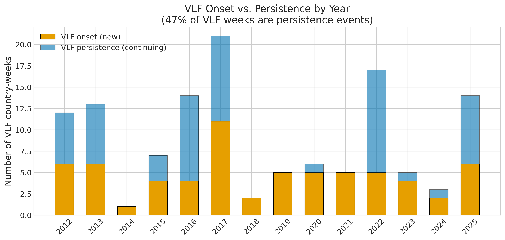
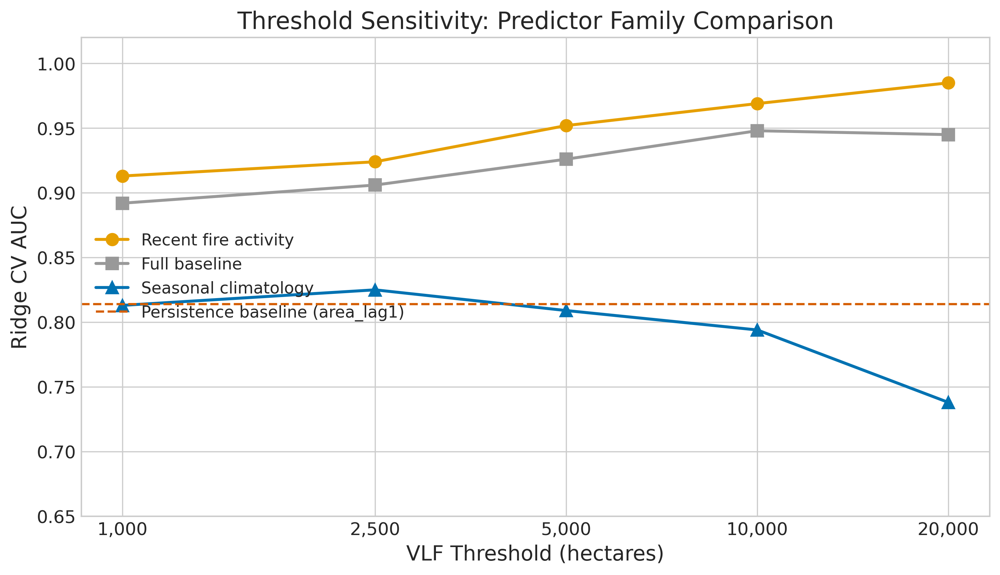

*This is a short summary. For the full technical write-up, see the [detailed paper](https://github.com/colinjoc/hdr_autoresearch/blob/master/applications/iberian_wildfire/paper.md).*

## The Question

The Iberian Peninsula burns more than any other part of Western Europe. Portugal and Spain between them lose hundreds of thousands of hectares of forest every year, and in extreme years -- 2017, 2022, 2025 -- the losses reach catastrophic levels. In June 2017, the Pedrogao Grande fire killed 66 people in central Portugal. In August 2025, 22 simultaneous very large fires overwhelmed suppression capacity across northwestern Iberia.

Not all fire weeks are equal. Most weeks during the fire season produce moderate burning that suppression crews can contain. But a small fraction of weeks -- roughly one in eight -- produce very large fires (VLFs, over 5,000 hectares burned at the country level) that account for the vast majority of total burned area and virtually all fire fatalities.

We asked: what signals from fire activity data best identify these catastrophic weeks? We constructed three predictor families from satellite-detected fire observations: seasonal climatology (what usually burns each week of the year), recent fire dynamics (how current burning compares to historical norms and what burned in recent weeks), and cumulative season stress (total fire activity year-to-date). We deliberately did not include actual meteorological data (temperature, humidity, wind, the Fire Weather Index) in this study, which limits the scope of our conclusions.

## What We Found

We used 14 years (2012-2025) of real weekly fire statistics from the European Forest Fire Information System (EFFIS), covering every detected wildfire in Portugal and Spain. We tested predictor families using strict temporal cross-validation -- always training on past years and testing on future years -- with 95% bootstrap confidence intervals.

**Recent fire activity features dominate.** The ratio of current burning to historical averages, plus lagged burned area from the previous 1-2 weeks, achieves a cross-validated area under the receiver operating characteristic curve (AUC) of 0.952 (95% confidence interval: 0.934-0.968). Seasonal climatology features alone achieve AUC 0.809 (CI: 0.768-0.848). The confidence intervals do not overlap. This advantage holds with both Ridge logistic regression and XGBoost, and across VLF thresholds from 1,000 to 20,000 hectares.

**But nearly half of VLF weeks are persistence events.** 47% of VLF weeks are immediately preceded by another VLF week -- the same fire burning across a weekly boundary. A trivial persistence baseline (predict VLF from last week's burned area alone) achieves AUC 0.814. When we restrict evaluation to VLF onset events only (excluding weeks that continue an existing VLF), the recent fire activity advantage persists (AUC 0.921 vs. 0.799) but the overall metrics are modestly lower. This means the model is partly detecting fires that are already burning, which is less useful operationally than predicting new VLF onset.

**Tree models substantially outperform linear models.** XGBoost achieves AUC 0.993 in temporal cross-validation, compared to 0.926 for Ridge logistic regression, indicating nonlinear threshold effects in VLF transitions. Per-year analysis shows XGBoost exceeds AUC 0.977 in every test year from 2015 to 2025.

## What This Does NOT Show

An earlier version of this paper claimed that "fuel moisture proxies outpredict fire weather indices." That claim was wrong, for three reasons:

1. **No actual fire weather data was used.** The seasonal climatology features (historical averages and maxima of fire activity) are not fire weather measurements. The Fire Weather Index is computed from temperature, humidity, wind, and precipitation. None of these variables were included.

2. **The "fuel moisture proxy" was not fuel moisture.** It was lagged fire activity -- an autoregressive feature, not a physical measurement of vegetation moisture content. Labelling it "LFMC" borrowed credibility from the remote-sensing fuel moisture literature.

3. **The comparison was between autoregressive features and a seasonal baseline.** Finding that "what is burning now" outpredicts "what usually burns this week" is expected because current conditions are more informative than long-term averages.

The revised paper uses honest terminology throughout: "recent fire activity" instead of "fuel moisture proxy," and "seasonal climatology" instead of "fire weather proxy." Whether actual meteorological fire weather indices are outperformed remains an open question requiring gridded reanalysis data.

## Why It Still Matters

Even with the corrected framing, the finding is operationally relevant. The recent fire activity features capture a real signal: when burning significantly exceeds seasonal expectations, conditions (weather, fuel moisture, drought, suppression capacity) are aligned for extreme fire behavior. This signal predicts *new* VLF onset (AUC 0.921), not just ongoing fires.

For fire agencies already monitoring EFFIS weekly statistics, tracking the ratio of current fire activity to the historical average for each calendar week provides a useful alert signal. When current-week burning exceeds twice the historical average during fire season, the probability of new VLFs developing is elevated.

However, this is a modest operational suggestion, not an alert system. Country-level weekly indicators lack the spatial specificity and temporal precision that operational fire management requires.

## How We Did It

We downloaded 14 years of weekly fire statistics from the European Forest Fire Information System (EFFIS) via the GWIS country profile API, supplemented by MODIS-derived burned area data (MCD64A1) and GlobFire event records. All data are real satellite observations -- no synthetic data were used. We defined a "very large fire week" as a country-week with total burned area exceeding 5,000 hectares (with sensitivity analysis at 1,000-20,000 ha).

We designed three predictor families from fire activity data: seasonal climatology (10 features), recent fire activity (10 features), and cumulative season stress (7 features). Six model families were evaluated in a tournament using temporal cross-validation, with per-year AUC breakdown and 95% bootstrap confidence intervals. New experiments addressing persistence effects, onset-only evaluation, and threshold sensitivity were added in response to adversarial peer review.

Full data sources, code, and experiment logs are in the [project repository](https://github.com/colinjoc/hdr_autoresearch/tree/master/applications/iberian_wildfire).

## Further Reading

- Tedim F et al. "Defining Extreme Wildfire Events: Difficulties, Challenges, and Impacts." *Fire* (2018). [doi:10.3390/fire1010009](https://doi.org/10.3390/fire1010009) -- typology of extreme fire events.
- Taylor SW et al. "Wildfire Prediction to Inform Fire Management: Statistical Science Challenges." *Statistical Science* (2013). -- review of time-series approaches to wildfire forecasting.
- Turco M et al. "Decreasing Fires in Mediterranean Europe." *PLOS ONE* (2016). [doi:10.1371/journal.pone.0150663](https://doi.org/10.1371/journal.pone.0150663) -- century-scale decline in fire frequency offset by increased severity.

---
Full technical paper and review response available in the [project repository](https://github.com/colinjoc/hdr_autoresearch/tree/master/applications/iberian_wildfire).
