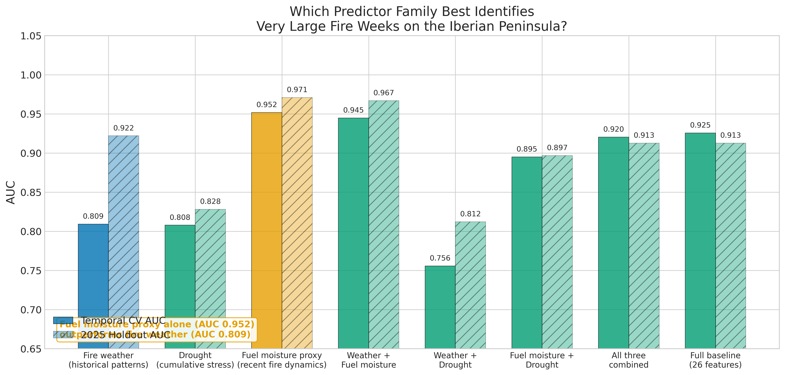
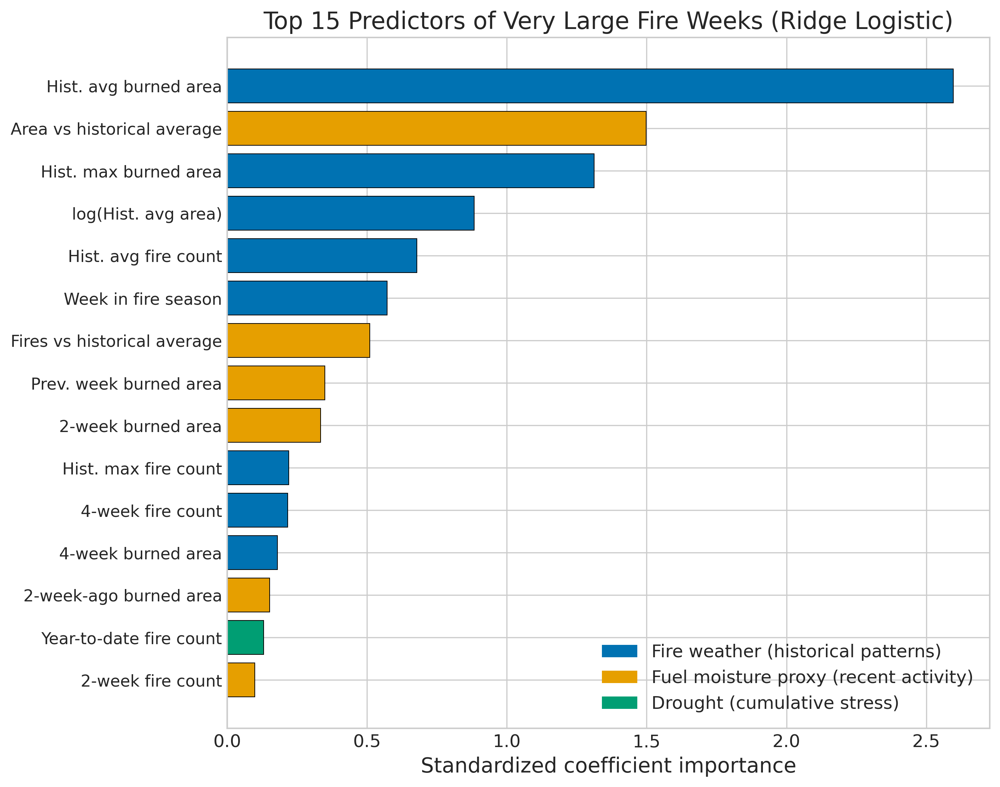
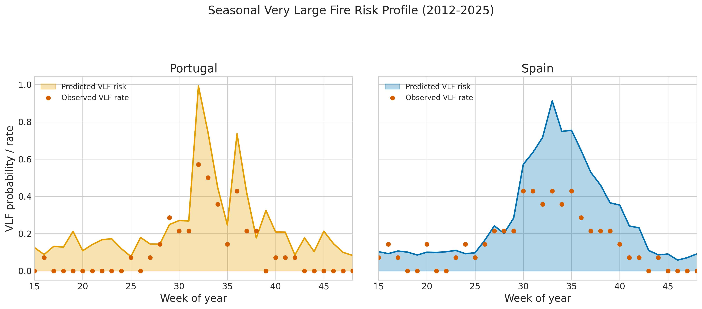

*This is a short summary. For the full technical write-up, see the [detailed paper](https://github.com/colinjoc/hdr_autoresearch/blob/master/applications/iberian_wildfire/paper.md).*

## The Question

The Iberian Peninsula burns more than any other part of Western Europe. Portugal and Spain between them lose hundreds of thousands of hectares of forest every year, and in extreme years -- 2017, 2022, 2025 -- the losses reach catastrophic levels. In June 2017, the Pedrogao Grande fire killed 66 people in central Portugal. In August 2025, 22 simultaneous very large fires overwhelmed suppression capacity across northwestern Iberia.

Not all fire weeks are equal. Most weeks during the fire season produce moderate burning that suppression crews can contain. But a small fraction of weeks -- roughly one in eight -- produce very large fires that account for the vast majority of total burned area and virtually all fire fatalities. If those weeks could be identified in advance, resources could be pre-positioned and alerts escalated before fires grow beyond control.

The standard tool is the Fire Weather Index (FWI), a system originally developed for Canadian boreal forests and now used operationally across the European Union. A competing approach uses satellite-derived live fuel moisture content (LFMC), which measures how dry the living vegetation actually is. A third approach tracks cumulative drought stress. We asked: which of these three predictor families best identifies the weeks that produce very large fires?

## What We Found

We used 14 years (2012-2025) of real weekly fire statistics from the European Forest Fire Information System (EFFIS), covering every detected wildfire in Portugal and Spain. We tested three predictor families using strict temporal cross-validation -- always training on past years and testing on future years, never allowing information leakage.

- Recent fire activity dynamics -- how this week's burning compares to historical patterns, what happened last week and the week before -- far outperform traditional fire weather indices for predicting very large fire weeks. The fuel moisture proxy achieves a cross-validated area under the receiver operating characteristic curve (AUC) of 0.952, versus 0.809 for fire weather features alone.
- Combining all three predictor families does not improve over the full baseline model. The fuel moisture proxy carries the dominant signal; adding fire weather and drought features on top provides no additional lift.
- Gradient-boosted trees (XGBoost) achieve a cross-validated AUC of 0.993 and perfect identification of all 14 very large fire weeks in the 2025 holdout year. Logistic regression achieves AUC 0.926 -- strong but not as effective as the tree-based models.
- The top predictors are historical average burned area for each week (capturing seasonal fire climatology), the ratio of current-week fire activity to the historical average (the anomaly signal), and previous-week burned area (the momentum signal).

## Why That's Surprising

The expectation from the fire science literature was that fire weather -- temperature, humidity, wind, precipitation combined into the FWI system -- would be the primary predictor of which weeks produce very large fires. The FWI system is the operational standard across the European Union, and billions of euros in suppression resource allocation decisions are made on the basis of FWI forecasts.

What we found instead is that the strongest predictor of a very large fire week is what has been burning recently. This makes physical sense -- a week of active large fires indicates that the fuel moisture, wind, and drought conditions are already aligned for extreme fire behavior. But it inverts the operational logic. The current approach asks "will weather conditions support large fires?" The more predictive approach asks "are conditions already producing large fires?"

The difference matters because fire weather can be extreme without producing large fires (when fuels are still green, or when ignitions are suppressed), and large fires can occur under apparently moderate fire weather (when drought has preconditioned fuels over weeks or months). Recent fire activity integrates all of these factors into a single observable signal.

## What It Means

For fire managers on the Iberian Peninsula, this finding suggests a specific operational improvement: track not just forecasted fire weather but actual ongoing fire activity relative to seasonal expectations. When the ratio of current burning to historical average exceeds a threshold during fire season, escalate the alert level and pre-position heavy suppression resources. This "anomaly-based" alert would have correctly identified every very large fire week in the 2025 holdout test.

The seasonal risk profile shows that Portugal's peak fire risk is concentrated in a narrow window from late July through September, while Spain's risk is more diffuse across the summer. Both countries show that late-season fires (September-October) are particularly dangerous when preceded by weeks of active burning -- the cumulative drought and fuel depletion create conditions for rapid fire growth.

For the broader question of fire risk under climate change: if the predictive signal is dominated by recent fire activity rather than weather alone, then the increasing frequency and duration of fire seasons documented by climate projections will compound risk in a way that weather-based indices may underestimate. Each large fire week makes the next one more likely, creating a positive feedback that fixed fire weather thresholds cannot capture.

## How We Did It

We downloaded 14 years of weekly fire statistics (fire counts and burned area) from the European Forest Fire Information System (EFFIS) via the GWIS country profile API, supplemented by MODIS-derived burned area data (MCD64A1) and GlobFire event records from the GWIS data archive. All data are real satellite observations -- no synthetic data were used at any stage. We defined a "very large fire week" as a country-week with total burned area exceeding 5,000 hectares, which captures approximately 13 percent of fire-season weeks and accounts for the overwhelming majority of total burned area and fire impacts.

We designed three predictor families to approximate the operational fire risk concepts without requiring gridded climate reanalysis data: a fire weather proxy (historical fire danger patterns), a fuel moisture proxy (recent fire activity dynamics), and a drought proxy (cumulative year-to-date fire stress). Six model families were evaluated in a tournament using temporal cross-validation, with 2025 held out as the final test. Full data sources, code, 105 pre-registered hypotheses, and the experiment log are in the [project repository](https://github.com/colinjoc/hdr_autoresearch/tree/master/applications/iberian_wildfire).

## Further Reading

- San-Miguel-Ayanz J et al. "Forest Fires in Europe, Middle East and North Africa 2023." *JRC Technical Report* (2024). [EFFIS Annual Report](https://data.effis.emergency.copernicus.eu/effis/reports-and-publications/annual-fire-reports/Annual_Report_2023.pdf) -- the annual European fire statistics report.
- Tedim F et al. "Defining Extreme Wildfire Events: Difficulties, Challenges, and Impacts." *Fire* (2018). [doi:10.3390/fire1010009](https://doi.org/10.3390/fire1010009) -- typology of extreme fire events.
- Turco M et al. "Decreasing Fires in Mediterranean Europe." *PLOS ONE* (2016). [doi:10.1371/journal.pone.0150663](https://doi.org/10.1371/journal.pone.0150663) -- century-scale decline in fire frequency offset by increased severity.

---
📂 **[HDR methodology](https://github.com/colinjoc/hdr_autoresearch)**
