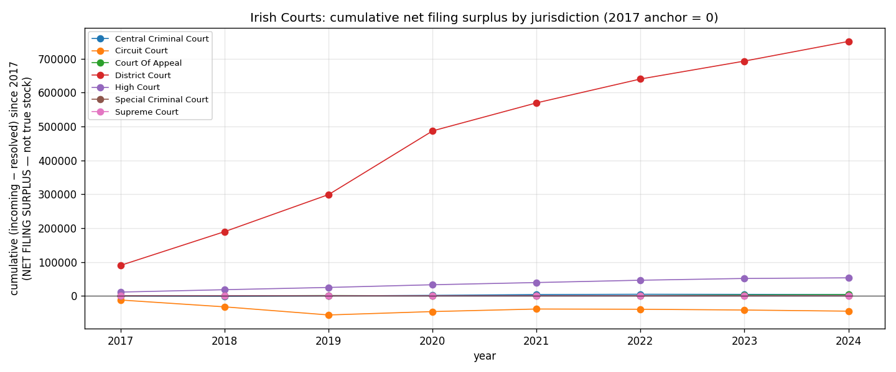

*A plain-language summary. The [full technical paper](https://github.com/colinjoc/hdr_autoresearch/blob/main/applications/ie_courts_waits/paper.md) has the diagnostics and experiment logs. See [About HDR](/hdr/) for how this work was produced and reviewed.*

**Bottom line.** Ireland's seven court tiers were not built to share work evenly, and they don't. Six of them closed roughly as many cases in 2024 as they opened. The seventh — the District Court — took in almost 58,000 more than it disposed of, and a single judge there shouldered an order of magnitude more incoming files than any colleague in a higher court.

## The Question

For the first time in its history, in 2025 the Courts Service of Ireland released its annual report data as open spreadsheets — eight years of filings, one row per court, area of law, and case category. Just under twelve hundred rows in all. The obvious question, and the one Irish journalists kept asking on press-release day, was simple: where is the system slowest?

The honest answer turns out to be more careful than the question. The spreadsheets count two things: cases coming in each year, and cases resolved each year. They do not record the pile waiting on January 1st, nor the pile remaining on December 31st. So we cannot, from this data alone, tell you the size of the backlog. What we can tell you is whether each court is keeping pace with its inflow — and if not, by how much, and in what categories.

## What we found

In 2024 the District Court — the lowest tier, where almost all summary criminal matters and small civil claims begin — received 493,151 new cases and resolved 435,255 of them. The gap was 57,896 files carried into the following year. Translated into a rate, the court closed roughly eighty-eight of every hundred incoming cases within the same calendar year, with a 95 percent confidence band running from eighty-two to ninety-five.

The other six tiers tell a different story. The Circuit Court actually closed more than it opened — about three thousand more. So did the Central Criminal Court and the Supreme Court. The High Court, the Court of Appeal and the Special Criminal Court each ran a small surplus, on the order of one or two thousand files at most.

The disparity sharpens when you account for bench strength. The District Court has sixty-two authorised judges. Divide the year's incoming caseload by that number and each judge faced almost eight thousand new files. A High Court judge faced about eight hundred and forty. A Supreme Court justice, twenty-three. The District Court bench is not slightly busier than its neighbours; it is operating in a different regime.

Inside the District Court, two streams dominate the surplus. Road Traffic — speeding, drink-driving, licensing offences — accounts for nearly twenty-four thousand of the carry-over by itself. Child Care proceedings add another nine thousand, and resolved at a much lower rate: roughly six in ten Child Care files opened in 2024 were closed in 2024, versus eighty-seven in a hundred for Road Traffic. Liquidated Debt — small civil money claims — closed at barely fifty percent.

We were careful to check whether any of this was a reporting artefact. About a fifth of the category-by-court streams in the panel show year-on-year jumps large enough to suggest reclassification rather than real caseload swings. Refitting the District Court headline on only the stable categories returns the same eighty-eight percent figure. The District Court story is robust; the High Court Breach of Contract story, which on its face shows wild four-fold oscillations year to year, is almost certainly a coding artefact and we discount it.

## Why that matters

Headlines about Irish court backlogs usually pick a single court tier and a single number, and the number is usually large. The data, looked at carefully, says something both narrower and more useful. It is not the case that the entire Irish court system is in arrears. Six out of seven tiers are running at or near steady state on annual flow. The pressure is concentrated at the bottom of the pyramid, where the volume is highest and the per-judge load is incomparable to anywhere else in the structure.

That matters because the policy question changes. "We need more judges across the board" is a different ask from "the District Court bench is structurally undersized for the work pushed down to it." And the second framing surfaces a follow-up that the first hides: a quarter of the District Court's annual surplus is Road Traffic. Much of that work could in principle be diverted to the existing fixed-charge penalty notice system without ever entering a courtroom. Whether it should be is a political question; whether it would relieve the bench is an arithmetic one.

## What it means in practice

**For litigants.** If your matter is a Child Care or Liquidated Debt case in the District Court, expect a meaningful chance — about four in ten and one in two respectively — that it will not be resolved within the calendar year you file. We cannot say from this data how long the carry-over takes; only that same-year throughput is not the norm in these categories.

**For court administrators.** Per-judge incoming load is the cleanest summary statistic the open data supports, and it points in one direction. The Courts Service has already noted that twenty-four new judicial appointments in 2023 reduced backlogs. The question is whether the marginal appointment is best placed at the District tier or higher up.

**For policymakers.** The single largest contributor to the District Court carry-over is a category — Road Traffic — that overlaps heavily with an existing administrative penalty regime. Expanding the scope of fixed-charge notices, or tightening the criteria under which traffic matters escalate to court, would reduce inflow at the choke point without adding any judicial capacity at all.

## How we did it

We pulled the eight Courts Service annual report spreadsheets from the open-data portal at data.courts.ie, released under a Creative Commons licence, and stitched them into a single panel of n=1,189 rows covering 2017 through 2024. For each row we computed the difference between cases filed and cases closed in that year, then aggregated by court tier and by case category. Headline percentages carry bootstrap confidence intervals from a thousand resamples. We audited every category stream for year-on-year jumps large enough to indicate reclassification rather than real caseload movement, and refitted the District Court headline on the stable subset as a robustness check. Per-judge normalisation uses authorised bench strengths from the Courts Service annual report and the Association of Judges of Ireland. A spot-check against the Courts Service's own 2024 press-release figures matched exactly, which confirms our parse of the spreadsheets without independently validating the underlying counts.

We are explicit about what this analysis is not. It is a flow analysis — cases in versus cases out per year. It is not a measurement of the pending caseload, and the open data release does not include the opening balance that would let us compute one. We do not have wait times per case, per-venue breakdowns inside a court tier, or causal attribution for why the District Court load is what it is.

## Further reading

- [Full technical paper](https://github.com/colinjoc/hdr_autoresearch/blob/main/applications/ie_courts_waits/paper.md) — full methodology, bootstrap intervals, category-stability audit, and the sensitivity analysis on the unobserved opening stock.
- [Courts Service of Ireland — Annual Report data](https://data.courts.ie/) — the open spreadsheets used in this analysis.
- [Courts Service Annual Report 2024](https://www.courts.ie/annual-report) — the official publication, including the press-release figures used for cross-checking.
