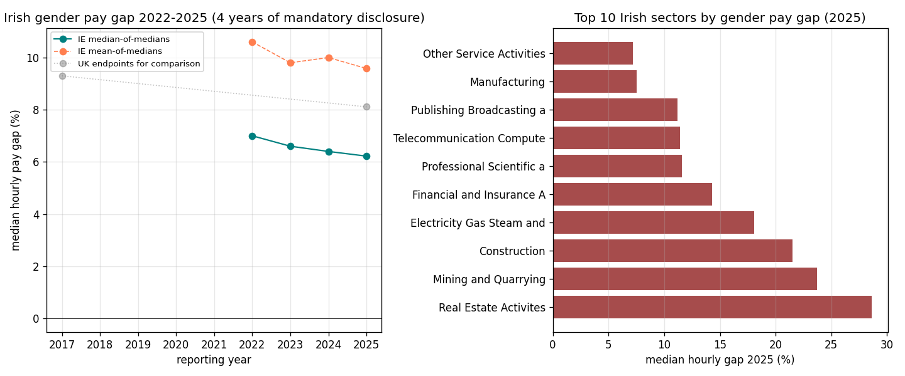

*A plain-language summary. The [full technical paper](https://github.com/colinjoc/hdr_autoresearch/blob/main/applications/ie_gender_pay_gap/paper.md) has the diagnostics and experiment logs. See [About HDR](/hdr/) for how this work was produced and reviewed.*

**Bottom line.** Three reporting cycles into Ireland's mandatory gender pay gap regime, the median hourly gap has slipped from 7.00 percent to 6.22 percent. Inside the 623 firms that filed in both 2022 and 2025, more than half narrowed their gap. But the population-wide trend is still inside the noise band — a year or two of bad data could erase it.

## The question

The Gender Pay Gap Information Act 2021 forced every Irish employer with 250 or more staff to publish a specific set of numbers every year, starting in 2022. Mean and median hourly gap. Bonus gap. Part-time gap. The gender composition of each quartile of pay. Then the threshold steps down — to 150 staff in 2024, to 50 staff in 2026 — pulling more of the labour market into public view each round.

The theory was the same one the United Kingdom tested first in 2017: publish the numbers, in every firm, every April, and the act of disclosure does part of the work. After three filing cycles, the question is whether the headline has moved, and if it has, whether that movement is real reform inside firms or an accounting artefact of new, smaller employers being dragged into the reporting pool as the threshold drops.

This study uses the public archive at paygap.ie — an independent portal that has scraped and aggregated every Irish employer filing since the regime started, while a central government portal is still pending. The dataset covers 3,991 employer-year submissions from 1,712 unique companies (n = 1,712 firms over four years).

## What we found

The gap has nudged down, but the move is fragile and the cross-country bragging rights people have claimed for Ireland do not survive a careful look.

- The median hourly pay gap across all reporting employers fell from 7.00 percent in 2022 to 6.22 percent in 2025 — a narrowing of 0.78 percentage points over three years, or about a quarter of a percentage point per year. The confidence band on that annualised rate runs from −0.60 to +0.14 percentage points per year, which means the population trend is not yet statistically distinguishable from zero. One or two off years could wipe it out.
- Among the 623 firms that filed in both 2022 and 2025, the median within-firm change was a 0.87 percentage point narrowing, and 56.5 percent of these persistent firms reduced their gap. This is the cleanest signal in the data — the same employers, four years apart, mostly moving in the right direction.
- A within-firm versus composition decomposition attributes essentially all of the population-level narrowing to within-firm reform. New smaller firms entering the reporting pool as the threshold dropped contributed almost nothing (+0.02 percentage points). Firms that exited the pool contributed a small offset in the other direction (+0.10 percentage points). The phase-down is not silently flattering the headline.
- Sector dispersion is the most policy-relevant finding and the most robust. Real Estate sat at 28.6 percent in 2025, Construction at 21.5 percent, Finance at 14.3 percent and Manufacturing at 7.6 percent. At the other end, Public Administration and Human Health are at or just below zero, and Accommodation and Food sits at 1.5 percent. That is a roughly 28-point spread across sectors of the same Irish economy in the same year.

## Why that matters

The temptation, with three data points and a downward slope, is to write the story as "Ireland's regime is working." The honest version is more cautious. The within-firm signal is real — most of the same employers are reporting smaller gaps in 2025 than they did in 2022 — but the population-level rate of change is still small enough that it cannot be cleanly separated from year-to-year noise. Three years is short for this kind of inference.

The cross-country comparison is the place where caution matters most. An earlier draft of this work claimed Ireland was narrowing nearly twice as fast as the United Kingdom. That headline does not survive a fair test. When you match windows — Ireland's first three years against the United Kingdom's first three years, and then Ireland's calendar window against the United Kingdom's same calendar window — neither comparison supports the claim. Over the matched 2022 to 2025 window, the United Kingdom narrowed slightly faster than Ireland, by a tenth of a percentage point per year. The two regimes are delivering within-firm narrowing of the same order of magnitude, with overlapping uncertainty.

What does survive is sector dispersion. The 28-point gap between Real Estate or Construction at one end and Public Administration or Health at the other is not a noise artefact, and it is not going to close itself. Roughly 575 firms across Construction, Finance, Manufacturing, and Professional services account for the bulk of the persistently high-gap reporting population.

## What it means in practice

**For workers.** If you are looking up your employer on paygap.ie, the within-firm trend matters more than the sector median. Inside the same firm year-on-year, the regime is associated with real movement — but in a high-gap sector, the starting level is what dominates your experience. Both numbers are now public for any reporting employer.

**For employers.** Composition is not silently flattering Irish headline numbers — the narrowing is happening inside firms that were already in the reporting pool. That means action plans aimed at the structural drivers, particularly senior representation and bonus participation, are doing the work that shows up in the published medians. It also means there is no place to hide behind a "the threshold is changing" argument.

**For policymakers.** The right judgement on the regime is "promising, not yet provable." The cleanest path to a defensible causal claim is a synthetic-control comparison — Ireland in 2022 as the treated unit against a Eurozone donor pool of countries without mandatory disclosure — to net out the underlying European labour-market trend. Before that, an audit of paygap.ie coverage against the Central Statistics Office business universe is needed, because firms that fall under the threshold but plausibly carry above-average gaps are by definition outside the dataset.

## How we did it

The headline is the median of medians across reporting employers, year by year. Around it sit four robustness exercises that the paper depends on.

The first restricts the analysis to the cohort of firms that already reported in 2022 — a clean proxy for the original 250-staff threshold — and tracks them through to 2025. That cohort narrows at essentially the same rate as the full population, which means the threshold phase-down is not inflating the signal.

The second is the within-firm panel: the 623 firms that filed in both 2022 and 2025, tracked as matched pairs. The third is a Blinder-Oaxaca-style decomposition that splits the total population shift into a within-firm component, an entrant component, and an exit component. They sum exactly to the observed total, and the within-firm component dominates.

The fourth is the cross-country comparison. Three matched windows against the United Kingdom — full regime to date, regime-age-matched, and calendar-year-matched — produce three different rates of narrowing, none of which support the original "nearly twice as fast" framing. Confidence intervals are cluster-bootstrapped over firms with one thousand replicates so the uncertainty respects the panel structure rather than treating each filing as independent.

Caveats. There is no pre-regime Irish counterfactual, so the within-firm narrowing cannot be cleanly attributed to the regime as opposed to the underlying secular trend. Coverage is mandatory-reporters only, which means firms below the threshold — and any firms quietly choosing not to file — are out of view. Sectors with fewer than ten reporting firms (Real Estate, Mining, Water and Waste) have wide confidence intervals and should be read as suggestive only.

## Further reading

- [paygap.ie](https://paygap.ie) — independent public archive of Irish gender pay gap filings
- [Gender Pay Gap Information Act 2021](https://www.irishstatutebook.ie/eli/2021/act/20/enacted/en/html) — the underlying legislation
- The full technical paper, with the bootstrap diagnostics, the within-firm decomposition, and the matched-window cross-country tables, is linked at the top.
