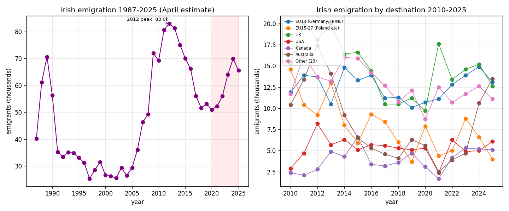

*A plain-language summary. The [full technical paper](https://github.com/colinjoc/hdr_autoresearch/blob/main/applications/ie_graduate_emigration/paper.md) has the diagnostics and experiment logs. See [About HDR](/hdr/) for how this work was produced and reviewed.*

**Bottom line.** Emigration from Ireland rose 37 percent between 2020 and 2024, peaking at 69,900 people before easing slightly in 2025. But because immigration has risen even faster, Ireland is still adding people every year — net migration in 2025 was plus 59,700.

## The question

Every few years, Irish emigration returns to the front pages. The last great wave broke around the 2008 financial crisis and crested in 2012, when 83,000 people left in a single year. By the late 2010s, the annual figure had settled back into the low fifty thousands. Then the 2020s arrived — and the numbers started climbing again. The questions are simple to ask and harder to answer: how big is this wave really, where are people going, and is the country actually shrinking?

## What we found

Emigration is up, sharply. According to the Central Statistics Office's annual Population and Migration Estimates, 50,900 people emigrated in the year to April 2020. By April 2024 the figure was 69,900 — the highest in nearly a decade and roughly 84 percent of the 2012 crisis peak. Provisional 2025 figures eased back to 65,600, still about 30 percent above 2020. A one-year dip in a provisional release is not the same thing as a wave breaking; these estimates are routinely revised.

The headline that has travelled furthest — that Australia has overtaken the United Kingdom as the top destination for Irish emigrants for the first time on record — is real but thin. In 2025, 13,500 went to Australia, 13,100 to the rest of the EU14 (Germany, France, the Netherlands and so on), and 12,600 to the UK. Australia leads. But the gap to the UK is 900 people, and the CSO itself warns that destination cells of this size carry standard errors of roughly 2,000 to 3,000. The honest reading is a statistical three-way tie at the top, with Australia nominally on top for the first time.

The trend underneath the noise is harder to dismiss. In 2021, just 2,500 emigrants chose Australia. By 2025, that figure had risen more than fivefold. Drivers cited in the policy discussion include Australia's expansion of its skilled-visa scheme, an age extension to the Irish-Australian Working Holiday programme, and a 2023 reset of Australian visa salary thresholds.

## Why that matters

Two stories are running in parallel and they point in opposite directions. Gross emigration — the raw number of people leaving — is climbing toward levels last seen in a recession. Net migration, the figure that determines whether the population is rising or falling, is strongly positive. In April 2025, immigration into Ireland was 125,300 against emigration of 65,600, leaving net migration at plus 59,700. The country is not emptying out. It is churning faster.

That distinction matters for housing, public services, and the labour market in ways that are easy to confuse. A rising emigration count does not by itself mean a smaller population. It can coexist with rapid population growth, which is what is happening now.

## What it means in practice

**For someone weighing a move abroad.** Australia, the UK, and the cluster of EU14 countries are now effectively tied as the three most-chosen destinations, each absorbing roughly 12,000 to 13,000 Irish emigrants a year. Australia's pathway has become progressively easier to walk since 2023.

**For policymakers.** The flow is serious but below crisis magnitude, and the country remains net-receiving. The destination mix is clearly diversifying away from the historical UK default. Whether the Australia-over-UK crossover is a structural shift or a single noisy year will be settled by the 2026 release, not this one.

## How we did it

The CSO's PxStat table PEA18 publishes annual April-to-April migration estimates from 1987 onwards, broken down by sex, flow direction, and destination or origin country. We pulled the JSON-stat feed, computed total emigration and net migration time series, and compared destinations year by year. The precision band cited for the Australia-versus-UK comparison comes from CSO guidance on small-cell estimates; PEA18 does not publish per-cell confidence intervals, so a tighter test would require the underlying Labour Force Survey and administrative components, which are not in the public release.

A note on scope: the project's working name refers to graduate emigration, but the dataset is all-ages and contains no graduate breakdown. A graduate-specific picture would require the Higher Education Authority's Graduate Outcomes Survey and is a separate piece of work. Everything above is total Irish emigration.

## Further reading

- CSO Population and Migration Estimates (PEA18) — the primary data source.
- Higher Education Authority Graduate Outcomes Survey — for a graduate-specific successor analysis.
