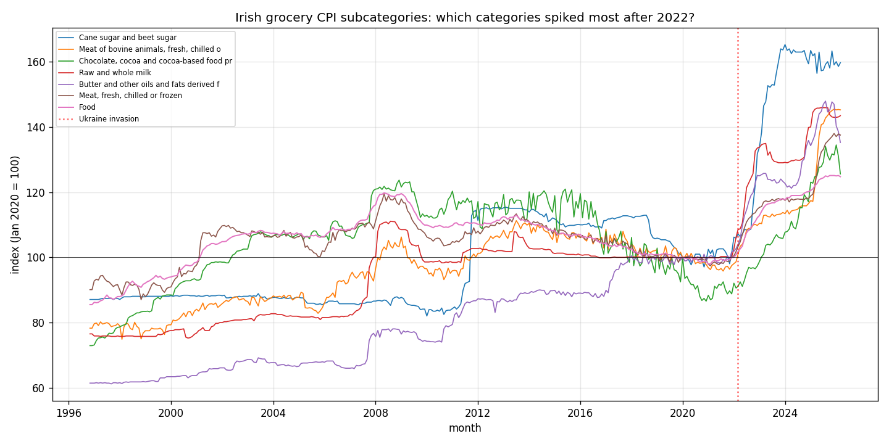

*A plain-language summary. The [full technical paper](https://github.com/colinjoc/hdr_autoresearch/blob/main/applications/ie_grocery_drift/paper.md) has the diagnostics and experiment logs. See [About HDR](/hdr/) for how this work was produced and reviewed.*

**Bottom line.** Across seventy-four food and non-alcoholic-beverage subcategories in the Central Statistics Office's price index, Irish food prices rose a median of nineteen percent in nominal terms between January 2022 and January 2026. The damage is concentrated in a handful of staples — sugar, beef, chocolate, milk, butter, bread, fresh meat, bottled water, soft drinks, and eggs — all of which rose between thirty-three and fifty-one percent, outrunning wages by fifteen to thirty-three percentage points in real terms. Crucially, several of the worst offenders are produced and bottled inside Ireland, so this is not just imported commodity inflation working its way through the till.

## The question

Most Irish households can feel that the weekly shop has become noticeably more expensive since 2022. The harder questions are the specific ones. Which items moved most? Has cumulative wage growth kept pace? And is this just the global sugar and cocoa rally arriving at Irish supermarkets, or are domestically produced staples also marching upward?

Answering those questions requires going beneath the headline inflation number to the level of individual commodities — sugar, butter, eggs — and comparing the post-2022 era against what "normal times" actually looked like in Ireland.

## What we found

Across the full grocery basket the median food category rose nineteen percent. But the top of the distribution is a different country.

- Cane and beet sugar rose fifty-one percent. Beef rose forty-eight. Chocolate and cocoa rose forty-six. Whole milk thirty-nine. Butter thirty-eight. Fresh meat, bottled water, soft drinks, and eggs all sit between thirty-three and thirty-six percent.
- Approximate Average Weekly Earnings nominal growth over the same window was about eighteen percent. Every single one of the ten worst-hit categories beat wages — by margins of fifteen to thirty-three percentage points in real terms.
- This is not a continuation of trend. In the four years to 2020, sugar had actually got fifteen percent cheaper, beef six percent cheaper, chocolate sixteen percent cheaper. Seven of the ten worst-hit categories had negative four-year growth in the pre-shock period. The 2022-2026 episode is a clean regime break, not an acceleration of normal-times inflation.
- Sliding the start and end dates by up to six months in either direction changes individual numbers by no more than three percentage points. The ranking is stable.
- A simple global-versus-local classification places sugar and chocolate in the world-commodity bucket, where price moves track sugar and cocoa futures. But milk, butter, bottled water, soft drinks, and fresh meat are produced and bottled in Ireland — and they rose roughly as much as the globally traded items.

## Why that matters

The political conversation around food inflation in Ireland has leaned heavily on external shocks: the war in Ukraine, the 2022 European energy spike, the global sugar and cocoa rallies. Those are real and they show up here, in sugar and chocolate. They cannot, however, explain a forty-percent rise in Irish whole milk or a thirty-eight percent rise in Irish butter. Those products were not subject to a global commodity squeeze.

That matters because policy levers differ depending on the source. If the shock were purely imported, the only domestic remedy would be income support — top up wages or welfare to compensate. Because the shock includes a substantial domestic component, it raises live questions about whatever combination of energy pass-through, labour costs, packaging costs, and processor margins is producing thirty-five-plus percent rises in locally made food. The data here cannot adjudicate between those candidates, but it can rule out the convenient story that everything was imported.

## What it means in practice

**For shoppers.** If your weekly basket leans on sugar, beef, chocolate, milk, butter, bread, water, soft drinks, or eggs, you are paying fifteen to thirty-three percent more for those items in real terms than wage growth has delivered. A basket that leans on fresh fruit, jams, or seafood is much closer to flat. Aggregate food inflation is roughly tracking wages — but only on average, and the spread inside the basket is enormous.

**For policymakers.** A response built only around global commodity shocks misses most of the picture. Locally produced staples — Irish dairy in particular — drove a large share of the four-year rise, and their behaviour deserves separate scrutiny. The natural next steps are factory-gate decomposition and shelf-level retail data of the kind held in commercial scanners but absent from the public price index, plus a cross-country comparison against the United Kingdom's equivalent series.

## How we did it

The analysis uses the Central Statistics Office's CPM24 series, the full three-hundred-and-forty-four-commodity Consumer Price Index broken out at the European Classification of Individual Consumption by Purpose subcategory level, monthly from late 1996 onward. Of those, n = 74 subcategories are food or non-alcoholic beverages. Each series was indexed to January 2020 = 100 and four-year growth computed from January 2022 to January 2026. Three robustness layers were added: a plus-or-minus-six-month endpoint sensitivity envelope to confirm the ranking is not an artefact of two-point arithmetic; a 2016-to-2020 baseline calculation to characterise normal-times trend; and a wage deflation step using approximate Average Weekly Earnings nominal growth of about eighteen percent over the shock window. A rule-based global-versus-local flag was applied to the top categories. No synthetic data were used; the source is the public Central Statistics Office JSON-stat application programming interface.

## Further reading

- Central Statistics Office. [CPM24 — Consumer Price Index, detailed subindices](https://data.cso.ie/table/CPM24) — the underlying monthly series at the full subcategory level.
- Central Statistics Office. [Average Weekly Earnings](https://www.cso.ie/en/statistics/earnings/earningsandlabourcostsannualdata/) — quarterly earnings series used as the wage deflator.
- Weber, I. and Wasner, E. (2023). [Sellers' inflation, profits and conflict](https://peri.umass.edu/publication/item/1644-sellers-inflation-profits-and-conflict-why-can-large-firms-hike-prices-in-an-emergency) — the "sellers' inflation" thesis, one candidate explanation for rises in locally produced categories.
