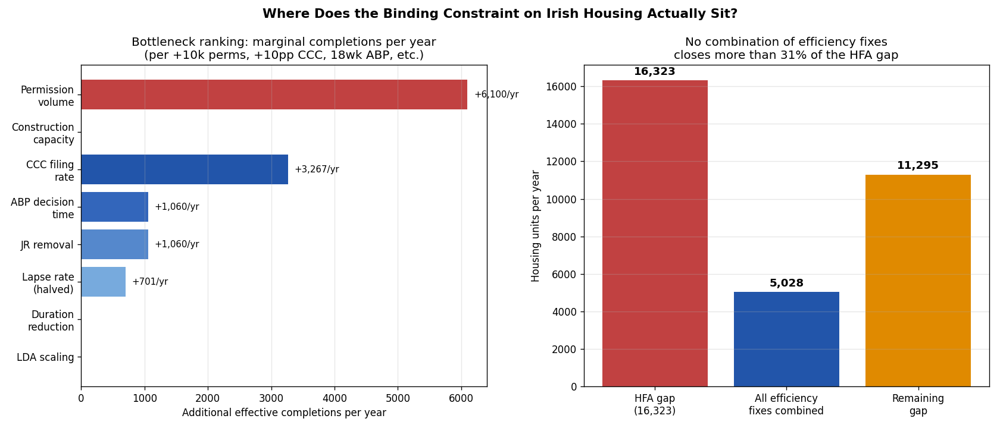

*A plain-language summary. The [full technical paper](https://github.com/colinjoc/hdr_autoresearch/blob/main/applications/ie_housing_bottleneck/paper.md) has the diagnostics and experiment logs. See [About HDR](/hdr/) for how this work was produced and reviewed.*

**Bottom line.** Ireland's housing shortfall is not caused by slow planning appeals, judicial review or anti-hoarding loopholes — those are real problems but they are downstream of the actual binding constraint. The pipeline is starved of permissions at the top. Granting roughly 38,000 permissions a year cannot deliver the 50,500-home government target at any plausible pipeline yield. Even if every efficiency lever were pulled at once, the maximum gain is around 5,000 extra certified homes a year, less than a third of the gap.

## The question

Ireland's Housing for All plan sets a target of 50,500 new homes per year. Completions reached 34,177 in 2024 — closer to target than any year since the financial crisis, but still 16,323 homes short. The public debate has been dominated by candidate explanations: planning appeal delays at An Bord Pleanala, judicial review by objectors, dormant permissions sitting on developer balance sheets, the Building Control Amendment regime, the Land Development Agency's pace of forward-purchase, and a labour shortage in the construction sector.

We pulled together thirteen prior cohort studies covering every stage of the pipeline — from the moment a permission is granted to the moment a certificate of completion is filed — and asked one question: of the candidate bottlenecks, which is actually binding, how many homes a year does it cost, and which interventions are pushing on a constraint versus pushing on something that does not move the throughput dial?

## What we found

The synthesis ranks ten candidate bottlenecks against each other on a single, comparable measure: additional homes per year delivered if that lever is pulled. Five different analytical frames — a stage-by-stage waterfall, a sensitivity ranking, the Theory of Constraints, a structural path model, and a Monte Carlo uncertainty propagation across 5,000 parameter draws — converge on the same answer.

- **Permission volume is the binding constraint.** Granting an extra ten thousand permissions per year delivers roughly six thousand additional effective completions. It is the largest single lever in the pipeline and the only one that scales linearly with policy effort.
- **Permission volume has been flat at around 38,000 a year since 2019.** No upward trend. At that ceiling, the arithmetic does not work at any measured pipeline yield: even at a theoretical perfect yield of 100 percent the system cannot deliver 50,500 completions from 38,000 permissions.
- **Construction-sector capacity is the second constraint.** Industry estimates suggest roughly 200,000 construction workers are needed at the target build rate against around 160,000 today — a 20 percent shortfall, implying an annual ceiling near 35,000 homes. Above that ceiling, more permissions would not produce more homes.
- **Pipeline-efficiency interventions are second-order.** Halving the permission lapse rate, raising certificate-of-completion filing by ten percentage points and restoring planning-appeal turnaround to its pre-crisis 18-week standard each move the needle. Combined, after correcting for double-counting between appeal speed and judicial review, they add roughly 5,000 homes a year — about 31 percent of the gap.
- **Removing judicial review entirely does not stack on top of faster planning appeals.** The two interventions share the same causal channel: the institutional caution that judicial review creates is itself a cause of the excess weeks at the appeals board. They cannot be added together.
- **Halving construction duration adds zero homes per year in steady state.** Faster transit through the pipeline brings forward the inventory of half-built homes, but in a steady-state system with constant annual inflow and outflow, transit time does not change the throughput rate.
- **A measurement artefact has been distorting the debate.** Roughly 31.6 percent of homes started in Ireland are one-off self-builds, exempt by design from filing a certificate of completion. They are built and occupied — the central statistics agency counts them via electricity-network connections — but they vanish from the certificate-based pipeline. Crediting these homes raises the effective pipeline yield from 35 percent to around 61 percent, comparable to the United Kingdom and within the international normal range. The pipeline is not unusually leaky. It is unusually starved at the top.
- **The ranking is robust.** Permission volume is the top-ranked bottleneck in 100 percent of 5,000 Monte Carlo parameter draws. The ranking does not flip under any tested assumption about how many self-build homes actually get finished, from a pessimistic 50 percent to a generous 100 percent.

## Why that matters

Most of the published Irish housing-policy commentary names a downstream bottleneck. Faster planning decisions, judicial-review reform, anti-hoarding measures for lapsed permissions, vacant-site levies and the Land Development Agency's forward-purchase programme all dominate the discourse. These address real problems. They are not the binding constraint.

In a pipeline where permissions, commencements, certifications and occupations chain through one after another, throughput is set by whichever stage has the lowest capacity. Improving a non-binding stage does nothing for total output — the system's throughput is set somewhere else. The synthesis here finds that permissions are roughly 38,000 a year, commencements around 34,000, certificates around 14,000, and observed completions around 34,000 once self-builds are included. The lowest-capacity stage that actually limits annual output, once the self-build measurement artefact is removed, is the permissions inflow.

The implication is uncomfortable for the most popular reform proposals. Even granting every pipeline-efficiency intervention in full — halved lapse, ten-point lift in certification rates, planning appeals restored to 18 weeks, judicial review reformed away — the sum is around 5,000 additional homes per year. That is meaningful. It is not 16,323.

## What it means in practice

**For homebuyers and renters.** If your local political conversation focuses on planning-appeal speed or anti-hoarding rules, those reforms address real frictions but, on this evidence, will not close the supply gap by themselves. The lever that would actually move the supply curve is the volume of new permissions granted — primarily a function of zoning, local-authority capacity to process applications, and developable-land availability.

**For developers.** The construction-capacity ceiling matters next. Around 35,000 homes per year is the observed peak of recent years. Even if permissions were doubled overnight, output would cap at the labour and materials ceiling. Workforce expansion, modular and modern methods of construction, and apprenticeship pipelines are the second-order constraints that bind once the first is relieved.

**For policymakers.** Three findings change what a credible policy package looks like. First, the pipeline-efficiency suite — appeal speed, lapse, judicial-review reform, certification rates — is worth doing on its own merits but is not a substitute for permission-volume policy. Second, the planning-appeal and judicial-review counterfactuals share the same channel and should not be added together when costing reforms. Third, the often-quoted 35 percent pipeline yield is a measurement artefact of self-build exemptions; the underlying yield is around 61 percent, comparable to international peers, and the right diagnosis is upstream, not downstream. To reach 50,500 completions, permissions need to rise to somewhere between 63,000 and 83,000 per year (depending on yield assumptions) and construction capacity needs to lift from around 35,000 to around 50,000 — both, not either.

## How we did it

This is a meta-analysis. Every parameter — annual permissions, lapse rate, commencement timing, construction duration, certificate-filing rates, planning-appeal turnaround times, judicial-review costs, Land Development Agency delivery — comes from a prior cohort study with its own confidence interval. The pipeline is modelled as a multiplicative chain from permissions to occupied homes, with a separate adjustment for self-build dwellings exempt from the certificate process. Each candidate bottleneck is perturbed by a standardised amount (ten thousand more permissions per year, ten percentage points more certifications, halved lapse, planning appeals restored to 18 weeks) and the marginal homes per year are compared on a like-for-like basis. Uncertainty is propagated through the chain by drawing 5,000 parameter sets from the published intervals; the rank ordering is recomputed in each draw to test robustness. Sample size n = 38,000 annual permissions and roughly 34,000 annual completions feed the calibration; the meta-analysis rests on thirteen predecessor studies covering 2017 to 2024.

## Further reading

- [Full technical paper](https://github.com/colinjoc/hdr_autoresearch/blob/main/applications/ie_housing_bottleneck/paper.md) — full waterfall, sensitivity ranking, Theory-of-Constraints diagnosis, structural path coefficients, Monte Carlo distribution and pairwise interaction tests.
- Government of Ireland (2021). [Housing for All](https://www.gov.ie/en/publication/ef5ec-housing-for-all-a-new-housing-plan-for-ireland/) — the 50,500-per-year target and policy framing.
- Central Statistics Office (2025). [NDA12 New Dwelling Completions](https://data.cso.ie/table/NDA12) and [BHQ15 Planning Permissions Granted](https://data.cso.ie/table/BHQ15) — the headline completion and permission series.
- Housing Commission (2024). [Final Report](https://www.gov.ie/en/publication/4b690-report-of-the-housing-commission/) — Irish housing-policy diagnostic and recommendations.
- OECD (2022). [Housing Policy Review: Ireland](https://www.oecd.org/ireland/housing-policy-review-ireland.htm) — international comparator on supply elasticity.
- Glaeser E, Gyourko J. ["The Economic Implications of Housing Supply."](https://doi.org/10.1257/jep.32.1.3) *Journal of Economic Perspectives* (2018) — supply-constraint framework that motivates the upstream-versus-downstream distinction.
- Goldratt E, Cox J. *The Goal* (1984) — the Theory-of-Constraints reasoning that organises the bottleneck ranking.
