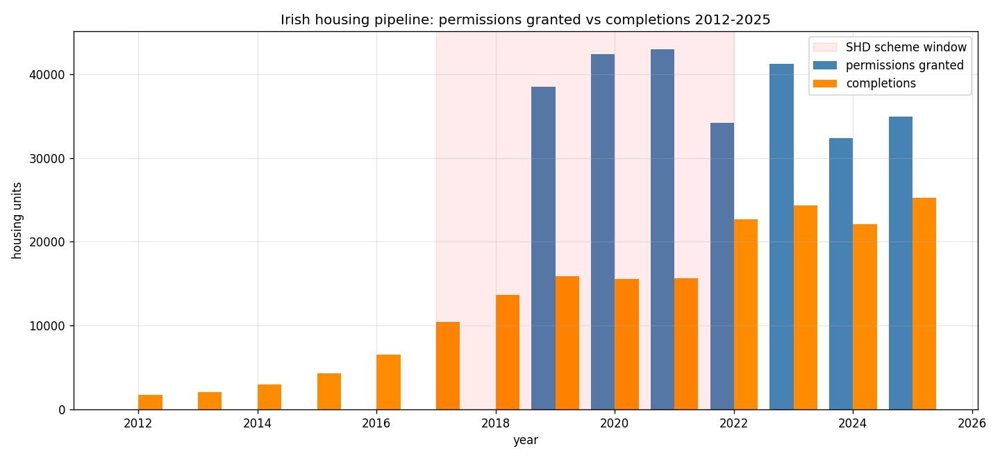

*A plain-language summary. The [full technical paper](https://github.com/colinjoc/hdr_autoresearch/blob/main/applications/ie_housing_pipeline/paper.md) has the diagnostics and experiment logs. See [About HDR](/hdr/) for how this work was produced and reviewed.*

**Bottom line.** Between 2019 and 2025, Irish planning authorities granted permission for around 267,000 housing units while builders finished about 167,000. Permission volume — not the rate at which permissions turn into finished homes — is the binding constraint on hitting the government's 50,500-home annual target.

## The question

Every month the Irish press reports a fresh planning-permissions figure and compares it to the 50,500-home-per-year target under Housing for All. But "permissions granted" and "houses completed" are very different things. A permission is a piece of paper that says a developer is allowed to build. A completion is a building someone can live in. The gap between the two is filled with objections, finance, labour, materials, design revisions, and ordinary developer delay.

The headline question: are Irish permissions actually getting built, or is the system stockpiling approvals that never produce houses? And has that changed as the housing crisis has intensified?

## What we found

Two end stages of the construction pipeline are visible in Central Statistics Office data: permissions granted, and new dwellings completed. Lining them up year by year reveals a story that cuts against the most common political framing.

**Completions have nearly doubled.** From under 16,000 finished homes in 2019 to over 25,000 in 2025. The building system is genuinely delivering more houses than it was at the start of the window.

**Permissions have been flat.** Every year between 2019 and 2025, councils and An Bord Pleanála — the national appeals body — issued somewhere between 32,000 and 43,000 unit permissions. There is no upward trend. Even if every single permission turned into a finished house, the current flow could not hit the 50,500-home target.

**The conversion ratio has improved — from a trough, not from a peak.** Comparing completions two years after permission to the original permission cohort, the aggregate ratio rises from 41 percent in 2019 to 65 percent in 2022. That sounds like a system getting healthier. But pulling the longer permissions series back into the mid-2010s shows two-year conversion ratios of 77 to 86 percent in 2016 and 2017, falling through 2018 and bottoming out in 2019. The recent rise is a recovery from a COVID-era trough toward — but still below — the pre-COVID baseline.

The Strategic Housing Development scheme, which fast-tracked large apartment schemes from late 2017 through late 2021, accounted for slightly under half of permissions during its active years. Both fast-tracked and ordinary permissions cleared in roughly equal volume over the relevant lag window, but the two streams are not directly comparable: fast-tracked permissions were dominated by large apartment developments, while ordinary permissions skew to one-off houses and small schemes.

## Why that matters

The political conversation around Irish housing has spent years arguing about whether developers are sitting on land they have permission to build on. That framing assumes the conversion side of the funnel is broken. The data say otherwise. Conversion rates in the most recent years are back near where they sat before the pandemic, and the absolute number of finished homes is the highest it has been in over a decade.

What has not moved is the upstream stage. The number of permissions issued has been flat across a window in which rents and house prices reached their highest levels on record. Whatever the planning system is responding to, it is not the price signal.

The arithmetic implication is uncomfortable. With permission volume capped between roughly 32,000 and 43,000 units per year, completions of 50,500 are unreachable under any plausible improvement in conversion. Pressing harder on the conversion lever — the favoured target of "use it or lose it" rhetoric — pushes on a mechanism already operating near its historical norms.

## What it means in practice

**For homebuyers.** Completion volume genuinely is rising year on year, and the rise looks durable rather than a one-off. But the ceiling on how many homes can be finished in any given year is set by permissions issued two to three years earlier, and that ceiling has not moved. Expect the pace of new supply to continue improving slowly, and expect it to top out well below the headline target for the foreseeable future.

**For builders.** The bottleneck is not on your end. The two-year conversion ratio is climbing back toward the levels seen before the pandemic, which suggests the cohort of permissions issued in the early 2020s is being worked through at a normal historical pace. The constraint is the size of the cohort itself.

**For policymakers.** Treating low completion numbers as a developer-discipline problem misreads the bottleneck. The data point upstream — at the planning system, the appeals process, and whatever combination of zoning, judicial-review exposure, and council capacity is keeping permission volume flat through a housing crisis. Reforms that raise the rate of permissions issued have a tractable arithmetic case for moving the completions number; reforms aimed at the conversion stage are working a lever that is already close to its pre-COVID setting.

## How we did it

The analysis pulls three Central Statistics Office tables: planning permissions granted from 2019 to 2025 with the strategic-housing-development split, new dwelling completions across 867 named urban areas from 2012 to 2025, and the longer regional permissions series back to 1975 for pre-2019 context. Permissions are aggregated to annual totals, taking care to avoid double-counting the apartment and house sub-categories. Conversion ratios are computed at one-, two-, and three-year lags between permission year and completion year. The ranking of permission years by conversion ratio is robust to the choice of lag — 2022 is the strongest and 2019 to 2020 the weakest at every lag tested — but the absolute level of the ratios is not.

The analysis stops at two end stages. The middle stage of the pipeline, commencement notices, is held by the Department of Housing rather than the public statistical office and is not included here, so this is a permissions-versus-completions comparison with a lag, not a cohort-traced pipeline. There is also no accounting for permissions that lapse — Irish planning permissions expire after five years — and no breakdown by tenure, price, or whether units are social, affordable, or market housing. Those are separate questions, and a couple of them are addressed in adjacent analyses.

## Further reading

- Central Statistics Office, table BHQ15 — planning permissions granted, quarterly, 2019 to 2025
- Central Statistics Office, table NDA12 — new dwelling completions by urban area, annual, 2012 to 2025
- Central Statistics Office, table BHQ16 — planning permissions granted by region, 1975 to 2025
- Department of Housing, Local Government and Heritage — commencement notices (the missing middle stage of the pipeline)
- Housing for All — the 50,500-home annual target the permissions flow is being measured against
