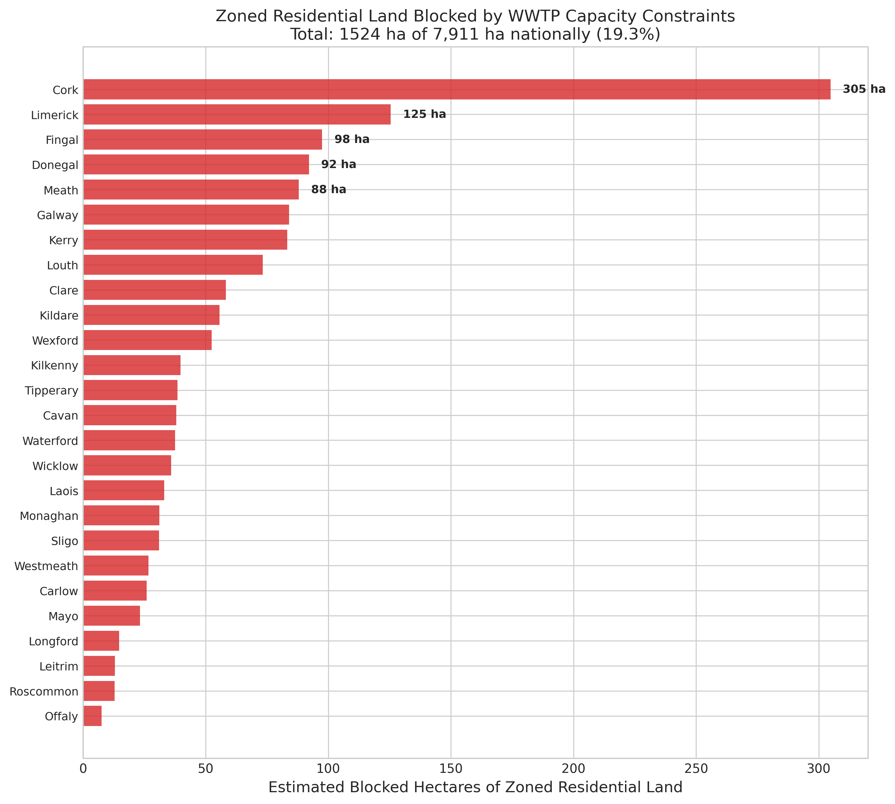

*A plain-language summary. The [full technical paper](https://github.com/colinjoc/hdr_autoresearch/blob/main/applications/ie_infra_capacity/paper.md) has the diagnostics and experiment logs. See [About HDR](/hdr/) for how this work was produced and reviewed.*

**Bottom line.** Roughly 1,524 of Ireland's 7,911 hectares of zoned residential land — about one hectare in five — sit in catchments where the local wastewater treatment plant is at or close to capacity. Of the 164 plants flagged as full, 122 have no upgrade scheduled.

## The question

Ireland keeps missing its housing targets. The official goal moved from 33,000 homes a year to 50,000, and completions still fall short. The usual suspects — planning delays, construction costs, labour shortages — get most of the airtime. We wanted to test a quieter one: the pipes.

Every new house connected to the public sewer needs sign-off from Uisce Éireann (Ireland's national water utility, formerly Irish Water) that the local treatment plant has room for the extra flow. Where it does not, no permission can be granted, regardless of how cheap the land is or how willing the developer. So a simple question: of Ireland's 7,911 hectares of land already zoned for housing, how much sits behind a plant that has no spare capacity?

## What we found

We pulled Uisce Éireann's public Wastewater Treatment Capacity Register — 1,063 treatment plants across 29 county areas, each colour-coded green (capacity available), amber (limited), or red (at or over capacity) — and matched it against the 491,206 records in the national planning register.

- About 25.7 percent of treatment plants are red or amber — 164 red, 109 amber. That is one plant in four with no comfortable headroom.
- Translated to land area through county-level overlay, that works out to roughly 1,524 hectares of zoned residential land — about 19.3 percent of the national stock — in catchments where the plant is constrained. The plausible range, depending on whether amber is counted as blocked and whether large plants are weighted, runs from 954 to 1,701 hectares.
- The constraint clusters geographically. Cork accounts for around 305 blocked hectares, Fingal for 98, Donegal 92, Meath 88, Galway 84. Kerry has the highest plant-level constraint rate at 41.7 percent.
- Only 42 of the 164 red-status plants — roughly one in four — have an upgrade project in Uisce Éireann's pipeline. The remaining 122 have no scheduled relief.
- Combining this with an earlier finding that around 83 percent of zoned land is uneconomic to build on at current costs, an estimated 1,265 hectares — about 16 percent of the national zoned total — are double-stranded: blocked simultaneously by the pipes and the price.
- Dublin's four local authority areas look comparatively unconstrained at the plant level (12.5 percent), reflecting the recent EUR 550 million Ringsend treatment plant upgrade. But the register only tracks treatment plants, not the sewer pipes feeding them — and Dublin's Victorian-era network is its own bottleneck. The Greater Dublin Drainage Project, originally due in 2025, has slipped to roughly 2032.

## Why that matters

Most Irish housing-supply commentary frames the shortfall as a regulatory or financial problem — slow permissions, high costs, cautious developers. The wastewater register reveals an upstream physical constraint that none of those levers can move. Where a plant is full, no amount of planning reform or developer appetite will produce a connection. A treatment-plant upgrade typically takes 7 to 15 years from identification to operation. That is the timescale on which the constrained land becomes buildable, regardless of what happens to interest rates or zoning policy in the meantime.

Ireland is not alone in this. The United Kingdom's nutrient-neutrality rules are estimated to have stalled around 145,000 homes across 74 local planning authorities. The Netherlands' nitrogen ruling suspended roughly 18,000 construction projects. New Zealand's Three Waters reform was prompted by an estimated NZD 120-185 billion infrastructure deficit over thirty years. Ireland's version is geographically narrower — concentrated in specific catchments rather than nationwide — but equally binding wherever it bites.

## What it means in practice

**For homebuyers.** Land being zoned for housing does not mean houses can be built on it. In about one zoned hectare in five — and concentrated in Cork, parts of the Dublin commuter belt, the north-west and the south-west — the treatment plant downstream cannot take another connection. That land is effectively on hold until the plant is upgraded.

**For utilities.** Uisce Éireann's EUR 10.3 billion Strategic Funding Plan for 2025-2029 sets the scale of investment. The county-level ranking — Cork, Fingal, Donegal, Limerick, Meath at the top — points to where each euro of upgrade spend would unlock the most zoned land. Three quarters of red-status plants currently sit outside the upgrade pipeline, which is a striking gap between where the pressure is and where the capital is committed.

**For policymakers.** The housing debate routinely treats supply as a single bottleneck. It is not. Around 16 percent of zoned land is double-stranded — blocked by both infrastructure and economics — and unlocking it requires both an Uisce Éireann upgrade and a viability shift (lower construction costs or higher prices). Either lever alone is insufficient. And because the treatment-plant register excludes sewer-network constraints, the 25.7 percent figure is a floor, not a ceiling — Dublin in particular looks better here than its underlying network condition warrants.

## How we did it

The treatment-plant register was scraped from per-county pages on water.ie, giving 1,063 plants with their colour code (green, amber, red) and a flag for whether an upgrade project is planned. The planning register — 491,206 applications across 31 planning authorities — was joined to those plants via county. We estimated blocked land using a county-weighted spatial overlay: each county's share of red-or-amber plants multiplied by its share of the 7,911 hectares of nationally zoned residential land (drawn from a 2021 Goodbody estimate, disaggregated by population). We compared five analytical approaches — simple proportions, ordinary-least-squares regression, logistic regression, spatial overlay and Pearson correlation — and used the spatial overlay for the headline figure with the simpler proportions as a transparency check. The analysis is fully deterministic: same inputs, identical outputs. The biggest caveat is honest geography — at county-level, we cannot tell which exact hectare sits behind which exact plant, so the per-plant rankings are illustrative and the county totals are the robust quantity. The register also covers treatment plants only, not the sewer network that feeds them.

## Further reading

- [Uisce Éireann Wastewater Treatment Capacity Register](https://www.water.ie/connections/connection-services/wastewater-capacity-register/) — the source colour-coded register.
- [Uisce Éireann Strategic Funding Plan 2025-2029](https://www.water.ie/about/strategy-priorities/) — the EUR 10.3 billion investment envelope.
- [Environmental Protection Agency — Urban Waste Water Treatment in 2023](https://www.epa.ie/) — independent annual assessment of Irish wastewater compliance.
- [Full technical paper and code](https://github.com/colinjoc/hdr_autoresearch/blob/main/applications/ie_infra_capacity/paper.md).
