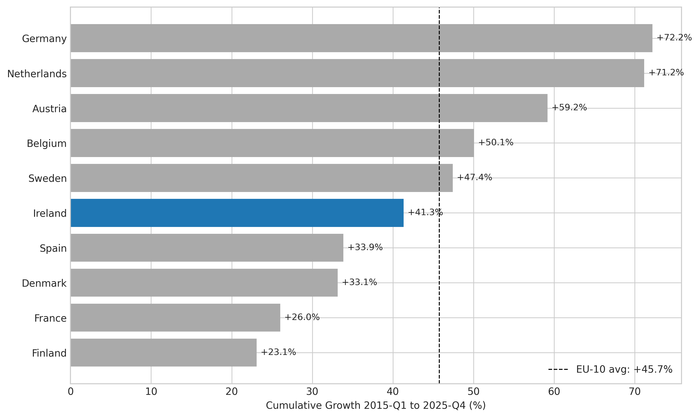

*A plain-language summary. The [full technical paper](https://github.com/colinjoc/hdr_autoresearch/blob/main/applications/ie_intl_construction_costs/paper.md) has the diagnostics and experiment logs. See [About HDR](/hdr/) for how this work was produced and reviewed.*

**Bottom line.** The widely-repeated claim that Ireland has Europe's most expensive residential construction does not survive contact with the Eurostat data. On the harmonised European price level index for residential buildings, Ireland scored 99.7 in 2024 against an EU average of 100 — practically the median. Germany, the Netherlands, Denmark and Sweden all build more expensively, and Germany's costs grew almost twice as fast as Ireland's over the past decade. The housing crisis is a supply problem dressed up as a cost problem.

## The question

Ireland completed 30,300 dwellings in 2024 against an estimated structural demand near 44,000. Public discussion almost always reaches for the same explanation: building things in Ireland costs too much. A widely-cited industry survey ranked Dublin as Europe's fourth most expensive commercial construction market — a number that quickly became shorthand for residential construction too.

That conflation is the question. Are Irish residential construction costs really structurally higher than comparable European countries, or has a Dublin-commercial-tower headline been laundered into a national-housing narrative? The honest test is to compare like with like, using the same harmonised European statistical sources for every country.

We used the Eurostat quarterly construction price index for ten EU comparator countries plus the United Kingdom, covering forty-four quarters from early 2015 to late 2025, alongside the Eurostat purchasing power parity programme's residential-construction price level index for 2024.

## What we found

- Ireland's residential construction price level in 2024 was 99.7 percent of the EU27 average. Germany was 47 percent more expensive, Sweden 28 percent, Denmark 27 percent and the Netherlands 25 percent.
- Cumulative cost growth from 2015 to 2025 ranks Ireland sixth of ten comparators. Germany grew 75 percent, the Netherlands 71 percent, Austria 59 percent. Ireland grew 41 percent — below the cross-country average of 46 percent.
- A panel regression on country-time interactions explains 93 percent of the variation across countries and quarters. Ireland's quarterly rate of cost increase is statistically below Austria, Germany and the Netherlands, with the difference significant at the strongest conventional level.
- Hierarchical clustering on the trajectory shapes places Ireland with Belgium and Sweden in a moderate-growth group, not with the fast-growth German-Dutch-Austrian trio that the public narrative implies.
- Structural breaks in the price series line up across virtually every country at early 2021 (the COVID supply chain aftermath) and mid-2022 (the Ukraine energy shock). Ireland's break pattern is unremarkable. The cost dynamics are common European shocks, not an Irish exceptionalism.
- On absolute euros per square metre — using industry anchors which are less harmonised and carry real uncertainty — Ireland's roughly EUR 1,975 base residential cost places it eighth of eleven comparators. The United Kingdom (EUR 2,800), Germany (EUR 2,500) and Denmark (EUR 2,400) sit well above.
- Construction is genuinely cheap relative to everything else in Ireland. The general consumption price level in Ireland is about 27 percent above the EU average, but the construction-specific price level is at the average. That gap of roughly 27 points is the size of the optical illusion driving the public narrative.

## Why that matters

The cost-of-construction story is the central explanation Irish public debate offers for why the country cannot build enough houses. If that diagnosis is wrong, every policy that follows from it is misdirected.

The decomposition matters because each component points to a different intervention. A genuine cost outlier would mean reining in labour rates, easing regulatory burden, or restructuring materials supply. A cost level near the European average alongside an output gap of roughly 14,000 dwellings per year points instead at the volume-of-construction problem: planning timelines, infrastructure capacity, skilled labour supply, and the price of land before a single brick is laid.

There is also a simpler point about what the famous Dublin number measures. The international commercial construction survey at EUR 3,692 per square metre is for city-centre commercial buildings — offices and similar — not residential base costs. Conflating those two is how a real but narrow finding about prime Dublin commercial real estate became a national folk theory about housing.

## What it means in practice

**For homebuyers.** The reason a new home is expensive in Ireland is mostly not the construction. Per square metre of completed building, Ireland is at or below the European median. The premium goes elsewhere — to land, planning delay, financing, developer margin, and the simple scarcity created by under-supply. Buyers paying high prices are paying for the gap between supply and demand, not for unusually expensive bricks.

**For builders.** Ireland's hourly construction labour rate of about EUR 34 against an EU-comparator average near EUR 28 does represent a real labour premium. The decomposition attributes roughly EUR 175 per square metre to it. But the offsetting factors — competitive tendering, lower land cost inside the construction-cost index, product mix — bring Ireland back toward the average. The structural story is more boring and more accurate than the narrative: Ireland is mid-table.

**For policymakers.** The binding constraint on Irish housing output is volume, not unit cost. Cost-cutting interventions aimed at construction itself — for example, watering down energy-performance regulation — face a hard upper limit, because those measured premiums are already absorbed into a price level near the EU average. Supply-side reforms — planning timelines, zoning, infrastructure capacity, skilled-labour pipelines, modular construction adoption — address the constraint that actually binds. The instructive comparators are Belgium, Sweden and Denmark, which share Ireland's small-open-economy character and moderate cost trajectory, not Germany, where costs grew fastest and absolute levels are highest.

A note of caution: the absolute euros-per-square-metre rankings are sensitive to scope. Different countries' industry figures include or exclude different things — preliminaries, contractor margins, external works. A sensitivity sweep across plausible anchor ranges shows Ireland's absolute rank can move from third to ninth depending on assumptions. The harmonised Eurostat price level index, which does not depend on those anchors, is the more robust line of evidence — and it puts Ireland at the European average.

## How we did it

We pulled the Eurostat quarterly construction price index — specifically the residential producer price indicator — for ten EU comparator countries from early 2015 to late 2025, rebased to a common starting point, and supplemented it with the Eurostat purchasing power parity programme's residential-construction price level index for 2024. The decomposition layered five complementary methods: a simple cumulative growth ranking; a panel regression with country fixed effects and country-time interactions to test whether Ireland's slope is statistically distinct; a structural-break detection algorithm to separate country-specific shocks from common European ones; a hierarchical clustering of normalised trajectories to ask which countries Ireland actually resembles; and an absolute-level comparison anchored to industry sources, with full sensitivity analysis across anchor uncertainty and the sterling-euro exchange rate. Sample size was 440 country-quarter observations on the harmonised index, plus the 2024 cross-section of price level indices. No synthetic data was used.

## Further reading

- [Full technical paper](https://github.com/colinjoc/hdr_autoresearch/blob/main/applications/ie_intl_construction_costs/paper.md) — methodology, full experiment log, scope sensitivity, and the corrected purchasing-power adjustment.
- Eurostat, [Production in construction — price index for residential buildings (sts_copi_q)](https://ec.europa.eu/eurostat/databrowser/view/sts_copi_q/) — the harmonised quarterly price index used as the primary dataset.
- Eurostat, [Purchasing power parities, price level indices and real expenditures (prc_ppp_ind)](https://ec.europa.eu/eurostat/databrowser/view/prc_ppp_ind/) — the construction-specific price level index that anchors the cross-country level comparison.
- Economic and Social Research Institute (2024). [Housing demand in Ireland](https://www.esri.ie/) — the structural demand estimate against which 2024 completions fall short.
- Central Bank of Ireland (2023). [Rising construction costs and the residential real estate market in Ireland](https://www.centralbank.ie/) — Financial Stability Note on the cost dynamics inside the Irish market.
