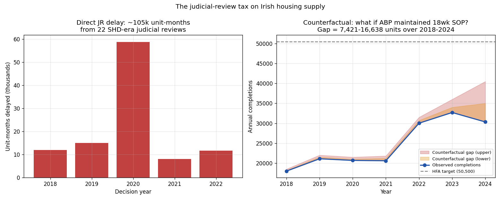

*A plain-language summary. The [full technical paper](https://github.com/colinjoc/hdr_autoresearch/blob/main/applications/ie_jr_tax_on_supply/paper.md) has the diagnostics and experiment logs. See [About HDR](/hdr/) for how this work was produced and reviewed.*

**Bottom line.** Judicial review (JR) of Ireland's fast-track housing permissions during 2018-2022 directly delayed the equivalent of roughly 7,100 to 12,500 homes by a full year — at a finance-cost burden of EUR 53 to 158 million. The delay is heavily concentrated: one city, one year, and five cases account for nearly half the total.

## The question

Between 2017 and 2021, Ireland tried to accelerate housing delivery with a special regime called Strategic Housing Development (SHD), which routed large apartment and housing schemes directly to the national appeals body, An Bord Pleanála (ABP), bypassing local councils. The fast lane was meant to speed things up. Instead, it became a magnet for legal challenges. By the time the regime was wound up at the end of 2021, the High Court had quashed or accepted concession on roughly seven of every eight SHD decisions it reviewed. ABP's annual legal bill doubled to over EUR 8 million.

The financial cost of these challenges to the State is well-documented. The cost in housing — how many homes were held up, for how long, and at what economic price — has not been. That is the gap this paper sets out to fill, by stitching together case-level judicial-review data from the Office of the Planning Regulator (OPR), aggregate ABP processing-time data, and Central Statistics Office (CSO) housing-completions data.

## What we found

A "unit-month" is one home delayed by one month — the natural currency for this question, because a small scheme held up for years and a big scheme held up for months can amount to the same thing. Across the 22 SHD judicial reviews catalogued by the OPR for 2018-2022, the direct delay totals 105,504 unit-months under a central estimate, with a defensible range of 85,400 to 150,200 depending on how missing scheme sizes are imputed. That is the equivalent of roughly 7,100 to 12,500 homes delayed by one year.

The concentration is striking. Dublin accounts for 18 of the 22 cases and 77 percent of the affected units. The year 2020 alone — when the wave of 2018 and 2019 challenges reached hearing — accounts for 56 percent of the total delay, with ten cases decided in that single twelve-month window. The five biggest cases together carry 44 percent of the total, and all five involve schemes whose unit counts are stated in the public record rather than imputed, so the headline does not rest on guesswork about scheme size.

Two cases of particular weight: a 741-apartment build-to-rent scheme that became *Dublin Cycling Campaign v ABP* (delay of about 18 months), and a 661-unit Meath scheme behind *Highland Residents v ABP* (also around 18 months). Each, by itself, contributed more than 11,000 unit-months to the total.

A second channel — the indirect tax — captures the way that judicial-review pressure can slow down all planning decisions, not just the ones being challenged, by inducing more cautious, lengthier reasoning across the entire system. ABP's mean decision time on housing cases rose from 18 weeks in 2017 to 42 weeks in 2023-2024. How much of that slowdown is judicial-review pressure rather than a board-member crisis, an information-technology transition, or growing case complexity cannot be separated from ten years of annual national data. The honest answer is that the indirect tax sits somewhere between zero and roughly 9,300 unit-months, with no principled way to pick a point inside that range.

The third number — what would have happened if ABP had kept hitting its 18-week target throughout — is the most policy-relevant and the most uncertain. The uncapped arithmetic says about 16,600 homes would have reached the market sooner over 2018-2024. But that scenario asks the construction sector to deliver above 38,000 completions a year in 2023 and 2024, well above its observed peak. Under a more realistic ceiling near recent peak output, the gap shrinks to about 7,400 homes. This is also the cost of all ABP delay, of which judicial review is one of several contributing channels.

The holding cost of the directly delayed homes — interest accruing on land and finance while permissions are stuck — runs from EUR 53 million (counting only the land share of finance) to EUR 158 million (counting full development finance).

## Why that matters

The political conversation around Ireland's housing shortage has spent years cycling through suspects: zoning, infrastructure, construction labour, planning bottlenecks, judicial review. Within the planning bottleneck specifically, the role of legal challenges has been described in superlatives but rarely in numbers a budget officer or a developer could use. Translating "the SHD regime got dragged through the courts" into "approximately 7,100 to 12,500 homes were held up by a year, costing the equivalent of a small social-housing programme in finance interest" gives the debate something concrete to work with.

It also clarifies what reform should actually target. The direct cost — the 22 cases — is overwhelmingly a Dublin phenomenon, overwhelmingly a 2020 phenomenon, and overwhelmingly driven by a small number of large schemes. The indirect cost, which radiates across the whole appeals system, may be larger or smaller than the direct cost; the data simply cannot tell. Policy that focuses only on the direct channel will under-count the benefit if the indirect channel is real and large; policy that assumes the indirect channel dominates may be aiming at the wrong target.

The counterfactual finding contains its own warning. The single biggest contributor to the "homes delivered sooner" calculation is 2023-2024, when ABP processing times peaked. But construction-sector capacity in those years was already near its ceiling. Faster permissions cannot, on their own, deliver homes the construction sector cannot build.

## What it means in practice

**For homebuyers.** A handful of legal challenges to large Dublin apartment schemes in 2020 quietly removed the equivalent of several thousand homes from the supply pipeline at the precise moment the housing shortage was tightening. The challenges did not change the legal merits of the underlying refusals or approvals — most were quashed for reason-giving deficiencies rather than substantive errors — but they imposed a real-time cost in delivered units. Faster judicial-review resolution and a "defect notice" route that lets the appeals body fix a small reasoning failure without re-running an entire hearing would directly recover homes from this channel.

**For developers.** Finance carry on a delayed permission is between EUR 500 and EUR 1,500 per unit per month, depending on cost base. Across the 22 cases, that is between EUR 53 million and EUR 158 million in pure holding cost — borne by the developer regardless of whether the challenge ultimately succeeded. The geographic and scheme-size concentration matters: the risk is overwhelmingly attached to large Dublin schemes, and within that, the very largest. Pricing legal-challenge risk into project economics is no longer optional for that segment.

**For policymakers.** Three levers exist. First, reduce the rate at which judicial reviews are filed — the costs rule that makes filing near-free for environmental challengers is the highest-leverage point, and the Planning and Development Act 2024 already attempts this. Second, reduce the consequence of a successful challenge — a faster Planning and Environment List in the High Court (now targeting 12-18 months versus the previous 18-36) and a defect-notice procedure cut the per-case delay. Third, restore appeals-body capacity — the staff increase from 202 to 290 full-time equivalents over 2023-2024 is already showing up in the on-time-decision share. The data cannot rank these three by impact; it can only show that the direct channel is concentrated enough that the first two would visibly change the totals.

## How we did it

The starting point is the OPR's Appendix-2 register of all SHD judicial reviews decided 2018-2022, hand-verified case by case in earlier work in this programme. For each case, the calculation multiplies scheme size by delay duration by an outcome weight (full weight for quashed or conceded cases, half for refused or dismissed, a quarter for upheld on appeal). Scheme sizes are stated in the public record for nine of the 22 cases and imputed from the SHD-regime minimum or scheme-specific press reporting for the remaining 13. Sensitivity to that imputation defines the lower and upper bounds quoted above.

The indirect-channel bound combines ABP's published mean weeks-to-dispose with annual housing-case volumes, then frames the JR share as a 0-to-50 percent attribution range — recognising that with ten years of annual national observations, a regression cannot separate judicial-review pressure from concurrent capacity and governance shocks. The counterfactual completions calculation translates excess processing weeks into delayed completions year by year, then applies a construction-capacity ceiling sensitivity because the uncapped arithmetic implicitly assumes the building sector could absorb output it has never previously delivered.

Five different model families were run side by side — a direct accounting, a regression-discontinuity proxy, a queueing-theory decomposition, a difference-in-differences against commercial cases, and the counterfactual simulation — with the counterfactual taken as the headline for policy relevance and the direct accounting taken as the most robust because it makes the fewest assumptions. All numbers trace to a single results file with explicit cross-checks; thirteen separate sensitivity analyses pin down where the estimates are tight and where they are not.

## Further reading

- Office of the Planning Regulator (2022). *Appendix-2: Breakdown of Determined Judicial Reviews involving An Bord Pleanála*.
- CSO Ireland. *New Dwelling Completions* — table NDQ07.
- An Bord Pleanála annual reports 2015-2024.
- Companion summary on this site: [Why Irish planning appeals slowed to a crawl, then started moving again](/hdr/results/ie-abp-decision-times/).
- Simons, G. (2019). *Planning and Development Law* (3rd ed.). Round Hall.
- Glaeser, E. & Gyourko, J. (2018). The economic implications of housing supply. *Journal of Economic Perspectives*.
