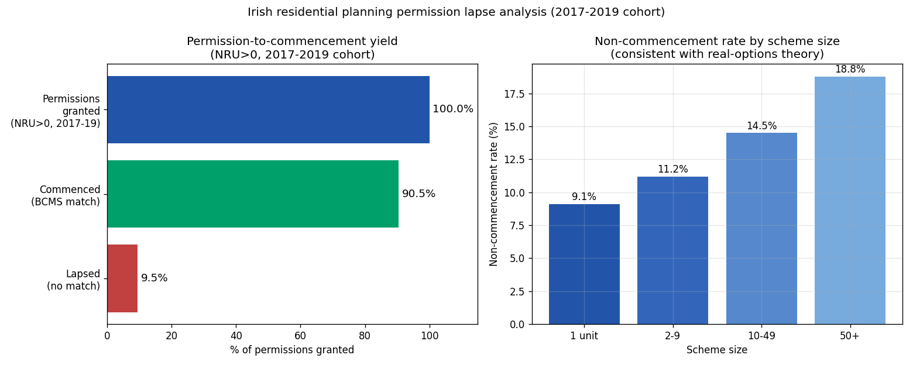

*A plain-language summary. The [full technical paper](https://github.com/colinjoc/hdr_autoresearch/blob/main/applications/ie_lapsed_permissions/paper.md) has the diagnostics and experiment logs. See [About HDR](/hdr/) for how this work was produced and reviewed.*

**Bottom line.** Ireland's residential planning permissions do lapse — but at roughly one in ten, not one in four. Most of the apparent gap between "permission granted" and "ground broken" is not a developer sitting on a permission; it is two government databases that cannot agree on how to write down the same application number.

## The Question

Every Irish housing debate runs through the same number: roughly sixty thousand "live" residential planning permissions in the system. The implication is that homes are queued up and ready to come out of the ground. The 2025 Planning and Development (Amendment) Act, Section 28, then offers up to three extra years on uncommenced permissions, on the theory that some meaningful share are being lost to the five-year clock.

But how many actually lapse? Until now, no one had linked the two registers that would let you check: the National Planning Application register (every permission ever granted) and the Building Control Management System (every commencement notice ever filed). We pulled both, joined them on application number, and tried to read off the answer.

The answer was not what we expected.

## What we found

Joined naively, 27.4 percent of granted residential permissions from 2014 to 2019 had no commencement notice — a headline that would mean nearly one in three permissions never breaks ground. That is the figure you would get reading the registers off a screen. It is also, on closer inspection, almost entirely wrong.

The first clue was that five rural local authorities — Carlow, Laois, Leitrim, Galway City, Sligo — showed a non-commencement rate of zero percent. Not low. Zero. Meanwhile Cork County and Cork City sat above 55 percent. No housing-market story can explain a gap that wide between councils in the same country.

The real explanation is in how each council writes its application numbers. Some use a simple integer — "18222". Others use a slash format — "08/693", "WEB1234/19" — with leading zeros, prefixes, and conventions that vary council to council. The Building Control system stores them in yet another format. When we audited the join formally:

- Permissions with simple-numeric application numbers matched 88.6 percent of the time (n=24,055).
- Permissions with complex application numbers matched only 53.0 percent of the time (n=22,018).
- The correlation between "fraction of simple-format numbers" and "match rate" across councils was 0.675.

Cork County alone — using a "YY/NNN" convention against a Building Control system that wants "YYNNNNN" — accounts for 37 percent of every unmatched record in the country. A manual audit recovered 40 percent of Cork's apparent non-matches just by trying alternative format normalisations.

Once we restrict to the clean subsample — permissions where the residential-units field is properly populated, and grant years 2017 to 2019 where the commencement system was running at full coverage — the headline collapses. The non-commencement rate is **9.5 percent** (n=18,403). A confidence interval that properly accounts for council-level clustering puts the true value somewhere between **4.4 and 15.6 percent**. That is roughly one in ten, not one in four.

A second cleanup matters too. To pick up residential permissions before councils started populating the units field consistently, the original filter included keyword matches in application descriptions — anything mentioning "storey", "bedroom", "domestic". A sample of two hundred such descriptions found 15 percent were clearly non-residential (schools, hotels, industrial buildings, commercial extensions) and another 38 percent were ambiguous. Non-residential applications naturally have no residential commencement notice, so leaving them in inflates the apparent lapse rate by mechanism, not by economics.

Larger schemes do lapse more often. Single-unit permissions (mostly self-builds) lapse at 9.1 percent, two-to-four-unit schemes at 12.7 percent, five-to-forty-nine units at 16.3 percent, and fifty-plus-unit schemes at 18.8 percent. That ordering matches the standard economic story — bigger schemes carry more option value from waiting, and more sensitivity to construction-cost shocks. Dublin City Council, with its institutional apartment developers, sits at 45.7 percent on the clean subsample, an outlier we cannot fully separate from format noise without a council-specific audit, but one that may carry genuine signal about post-pandemic construction-cost escalation.

We also tried to predict which permissions would lapse. A gradient-boosting model scored impressively on the full data — until we looked at what it had learned. Eighty-five percent of its predictive power came from the council identifier. It was not predicting lapse. It was predicting which councils have application-number formats that match the commencement database. On the clean subsample, with the council feature removed, the model performed barely above chance. We retracted it.

## Why that matters

The "sixty thousand live permissions" figure is the foundation under several housing-policy arguments — that there is a hidden stockpile, that developers are land-banking, that an extension act can unlock supply. If genuine lapse is one in four, that is fifteen thousand homes the policy might rescue. If it is one in ten, it is six thousand, and the binding constraint on Irish housing supply is somewhere else.

Our cluster-bootstrap interval — 4.4 to 15.6 percent — translates into roughly three thousand to nine thousand permissions that are genuinely inactive within the sixty-thousand stock. That is a real problem worth a real policy. It is not the problem the louder version of the debate is solving. The clock is not the binding constraint; the economics — construction costs, financing, market absorption — is.

The estimate also lines up with what you would expect from international comparables. The United Kingdom reports 6 to 14 percent non-commencement on residential permissions. New Zealand reports 10 to 20 percent. Ireland at 9 to 10 percent is unremarkable. The story that Ireland is uniquely failing to convert permissions into homes does not survive contact with the linked registers, once the linkage actually works.

There is a wider lesson about open-data infrastructure. Ireland publishes both registers. Both are well-maintained. The gap is not transparency — it is that the two systems were never designed to talk to each other, and nobody has been paid to reconcile their conventions. Roughly two thousand additional matches in Cork alone are recoverable with a few hours of normalisation work. Doing that nationally would resolve more housing-policy uncertainty than any econometric model trained on the unreconciled data.

## What it means in practice

**For homebuyers.** The "shadow stock" of granted-but-unbuilt permissions is real but smaller than the headlines suggest. Roughly six thousand homes nationally are sitting in permissions that genuinely will not be built — material, but not the order-of-magnitude effect that would meaningfully relieve supply pressure on its own.

**For developers.** The pattern by scheme size is consistent with real-options economics — larger schemes wait longer because they have more to lose from a bad market entry. The implication is that policy levers aimed at the clock (extensions) will move marginal cases. Levers aimed at the underlying economics (construction-cost subsidies, viability gap funding) would move more.

**For policymakers.** Two specific actions follow. First, fund a national reconciliation of application-number formats between the planning register and the Building Control system; we estimate this would recover most of the apparent join failure within a few weeks of work. Second, publish a national Section 42 / Section 28 extension dataset; without it, "lapsed" cannot be cleanly separated from "extended and waiting". Both are inexpensive disclosures whose absence currently obscures more than any model can recover.

## How we did it

We used the National Planning Application register published by the Department of Housing, Local Government and Heritage (491,206 rows, all Irish planning applications from approximately 2012 to April 2026), joined to the Building Control Management System commencement-notice dataset (231,623 rows). The cohort was all PERMISSION applications with a granting decision and a 2014-2019 grant date that flagged as residential.

The headline restricts to the clean subsample where the residential-units field is populated and the grant year is 2017 or later (n=18,403). Confidence intervals were computed with a council-level cluster bootstrap, because format-matching quality is correlated within councils — the naive interval was thirteen times too narrow. The Cork County reconciliation, the description-keyword false-positive audit, and the gradient-boosting sensitivity check are documented in the technical paper.

We cannot fully separate genuine lapse from residual join failure even within the clean subsample, so 9.5 percent remains an upper bound on true lapse. The cluster-bootstrap lower bound of 4.4 percent is the most honest floor. The 27.4 percent all-cohort headline that has appeared in commentary is not a lapse rate; it is a data-linkage artefact, and it should not be cited as one.

## Further reading

- [Full technical paper](https://github.com/colinjoc/hdr_autoresearch/blob/main/applications/ie_lapsed_permissions/paper.md) — including the join-failure audit, the Cork case study, the gradient-boosting retraction, and per-council tables.
- [Building permits study](/hdr/results/building-permits/) — the parallel finding for US permit duration: where data infrastructure beats algorithms.
- Department of Housing, Local Government and Heritage — [National Planning Application register](https://data-housinggovie.opendata.arcgis.com/).
- Housing Commission Final Report (2024) — the source of the "60,000 live permissions" figure.
- Planning and Development (Amendment) Act 2025, Section 28 — the extension provision.
