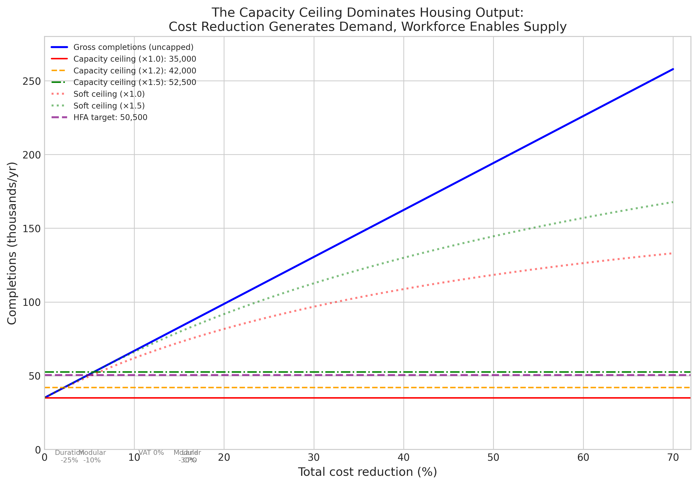

*A plain-language summary. The [full technical paper](https://github.com/colinjoc/hdr_autoresearch/blob/main/applications/ie_lever_interactions/paper.md) has the diagnostics and experiment logs. See [About HDR](/hdr/) for how this work was produced and reviewed.*

**Bottom line.** Ireland's housing-policy levers — zoning, tax, planning reform, modular construction, land purchase, finance — are almost perfectly additive in the demand they generate. The trouble is the construction industry can only build about 35,000 homes a year, and that ceiling is already binding. Stacking cost-cutting policies without expanding the workforce produces paper permissions, not finished houses.

## The question

Irish housing completions hover around 35,000 a year — roughly 15,500 short of the Government's Housing for All target of 50,500. Every few months a new policy is floated: zero the value-added tax on new homes, abolish the Part V social-housing requirement, reform Bord Pleanala, compulsorily purchase development land at agricultural prices, push modular construction, accelerate judicial review. Each is debated on its own merits. The unanswered question is what happens when you turn several knobs at once. Do the savings compound? Do they cancel? Or do they collide with some hidden constraint?

## What we found

We modelled ten policy levers across every combination of their settings — 104,976 in total — using parameters drawn from earlier empirical work on the Irish system, then propagated the uncertainty through Monte Carlo simulation. A few clean facts fell out.

- Cost-cutting levers do not interact with each other. A ten-percent saving from modular construction plus an eleven-point-nine-percent saving from zeroing value-added tax produces exactly a twenty-one-point-nine-percent saving in the demand-generation step. There is no magic bundle effect, and there is no destructive interference either.
- The dominant interaction is between every cost lever and the construction capacity ceiling. Today, Ireland's industry can finish about 35,000 homes a year, and current completions already sit at that limit. Cutting costs raises the demand for permission and the volume of starts, but the dwellings cannot be physically built faster than the workforce allows.
- The single largest synergy in the matrix is between land compulsory purchase and a fifty-percent workforce expansion — together they deliver about 7,800 extra completions beyond what either lever produces alone. The single largest apparent redundancy, between modular construction and land compulsory purchase at minus 14,500 homes, turns out to be entirely a ceiling artefact: in the uncapped model the same pair interacts at exactly zero.
- Reaching 50,500 finished homes a year requires raising construction capacity by at least forty-four percent, no matter how many cost levers are pulled. Cost cuts alone cannot get there.
- A fifty-percent workforce expansion implies recruiting roughly 80,000 additional construction workers. At the historical training rate of about 5,000 per year, that takes sixteen years. At an optimistic 10,000 per year — which would require sustained immigration policy and training infrastructure — it takes eight.
- The most efficient three-lever combination on the cost-versus-completions frontier pairs modular construction, land compulsory purchase, and workforce expansion. Under a generous linear demand model it delivers roughly 117,000 completions at about 2.4 billion euro per year. Under stronger demand-saturation assumptions the figure drops sharply.

## Why that matters

The Irish housing debate often treats cost reduction and capacity expansion as alternative strategies. The arithmetic says they are not alternatives — they are mandatory complements. Every cost lever you add without workforce expansion produces more applications, more permissions, more sites with viable margins on paper, and the same number of finished homes. The pipeline gets longer; the output stays flat. That is exactly the pattern Ireland has lived with through the past decade of policy iteration.

It also means the most striking-looking interactions in any housing-policy model are usually structural, not economic. Two big cost cuts that "cancel each other out" are not really substitutes in any meaningful sense — they are both queued behind the same bottleneck, and the model is registering the queue.

## What it means in practice

**For homebuyers and renters.** Do not expect a single tax or planning reform to move the needle on completions in the short run. The capacity ceiling means even ambitious cost-cutting packages would push permission volumes far above what the industry can actually finish, with completions creeping up only as workers and supply chains scale.

**For developers.** A linear viability response is built into the modelling, calibrated at today's negative margins. If margins improve, the unmet demand on the books grows much faster than what any developer can convert to completed dwellings. Pipeline length, not viability, becomes the binding constraint on individual projects.

**For policymakers.** Workforce expansion is not optional in any package that hopes to hit the 50,500 target. The realistic recruitment-rate scenarios put the achievable timeline at eight to sixteen years, not the steady-state numbers that a static model produces. Stacking more cost levers on top of a binding capacity ceiling does not accelerate output — it just enlarges the gap between paper supply and built supply, which has political costs of its own.

## How we did it

We built a deterministic feedback-loop model of the Irish housing pipeline: policy lever to cost reduction to viability margin to applications to permissions to completions, capped by construction capacity. Every parameter — pipeline duration, build-yield, approval rate, viability-application elasticity, capacity ceiling — comes from earlier empirical work on the Irish system rather than fresh data collection. We then ran the full factorial over all lever combinations and computed every pairwise and higher-order interaction. Uncertainty came from Monte Carlo sampling of the parameter distributions (n equal to 10,000 draws per package).

We tested two ceiling specifications — a hard cutoff and a softer congestion-cost form — and three demand-response shapes ranging from fully linear to strongly saturating. We also stress-tested the workforce side under three recruitment-rate scenarios and a diminishing-returns productivity model where marginal workers contribute less than incumbents because of training time and site congestion. The honest uncertainty range across these specifications is wide. The qualitative conclusion is robust across all of them: cost reduction without capacity expansion cannot close Ireland's housing gap.

## Further reading

- [Full technical paper](https://github.com/colinjoc/hdr_autoresearch/blob/main/applications/ie_lever_interactions/paper.md)
- [Housing for All — Government of Ireland](https://www.gov.ie/en/publication/ef5ec-housing-for-all-a-new-housing-plan-for-ireland/)
- [Central Statistics Office — New Dwelling Completions](https://www.cso.ie/en/statistics/construction/newdwellingcompletions/)
- [Society of Chartered Surveyors Ireland — Real Cost of New Housing Delivery](https://scsi.ie/the-real-cost-of-new-housing-delivery/)
- [SOLAS — Construction Skills Forecasting](https://www.solas.ie/)
- Hsieh, C.-T. and Moretti, E. (2019). Housing Constraints and Spatial Misallocation. American Economic Journal: Macroeconomics, 11(2), 1–39.
- Glaeser, E. L. and Gyourko, J. (2018). The Economic Implications of Housing Supply. Journal of Economic Perspectives, 32(1), 3–30.
