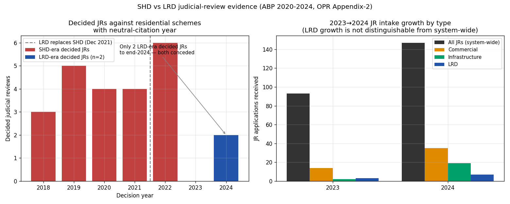

*A plain-language summary. The [full technical paper](https://github.com/colinjoc/hdr_autoresearch/blob/main/applications/ie_lrd_vs_shd_jr/paper.md) has the diagnostics and experiment logs. See [About HDR](/hdr/) for how this work was produced and reviewed.*

**Bottom line.** Ireland replaced the Strategic Housing Development (SHD) fast-track planning regime with the Large-scale Residential Development (LRD) regime in December 2021, partly to stem a wave of High Court challenges. To the end of 2024, only two LRD judicial reviews had been substantively decided — both conceded by the State. That is not enough cases to tell whether the reform did anything, and three other reforms landing at the same time pull the numbers in the same direction. A clean answer needs roughly two more years of data.

## The question

By 2021, Ireland's SHD regime — a fast-track route that let large apartment schemes go straight to the national planning appeals board (An Bord Pleanála, ABP) — had become known as a judicial-review (JR) magnet. The State lost roughly 14 of every 16 SHD challenges decided in court between 2018 and 2021. Many decisions were quashed. Sites stalled. A succession regime, LRD, was legislated in late 2021 and routed large housing applications back through local authorities first, with appeal to the Board afterwards. The political claim attached to the change was simple: fewer judicial reviews, fewer quashed permissions, faster delivery.

This study asks whether that claim is yet defensible from the public record.

## What we found

- The SHD JR rate is now well-anchored. Of 392 SHD decisions across 2018-2021, sixteen ended in a substantively decided judicial review — a rate of about four percent, with a 95 percent confidence interval running from roughly two and a half to six and a half percent. Of those sixteen, the State lost fourteen.
- The LRD numerator is tiny. By the end of 2024 only two LRD challenges had been substantively decided, both of them conceded by the Board. Two cases is not a sample from which a rate can be estimated.
- The LRD denominator is missing. Counting LRD applications cleanly requires data from the Department of Housing on how many large-scale residential applications local authorities decided. Those counts are not in any publicly released document we could find.
- Stitching the two sides together — a popular shorthand of "SHD was 6.4 percent, LRD is 8.6 percent" — is not a like-for-like comparison and is withdrawn here. The numerators count different things and the denominators are different populations.
- Using a matching denominator that is available on both sides (lodged judicial reviews per scheme that reached the appeals board), the SHD and LRD rates differ by less than one percentage point, with overlapping confidence intervals. That is not evidence the regimes are equivalent — it is evidence the data cannot yet tell them apart.
- Three other reforms landed almost simultaneously and pull in the same direction as any LRD effect. The Heather Hill Supreme Court judgment in mid-2022 expanded cost protection for environmental challenges. A dedicated High Court Planning and Environment List opened in late 2022, speeding up hearings. And in 2024 the Board adopted a notably more cautious posture, conceding 53 cases against losing 15 — a structural shift, not a regime-specific signal.
- The system-wide pattern dwarfs any LRD-specific signal. Total new judicial reviews lodged across all planning case types grew from 93 in 2023 to 147 in 2024 — a 58 percent rise. Commercial cases grew 150 percent. Infrastructure grew eight-fold. LRD's growth, three to seven, sits comfortably inside this envelope rather than standing out from it.
- More cautious statistical methods designed for very small samples — Firth-penalised logistic regression and weakly-informative Bayesian logistic — confirm the underlying problem rather than rescue an answer. With only two LRD outcomes, neither method finds a separable LRD-versus-SHD difference.

## Why that matters

The political stakes around large-scale Irish housing legislation are substantial. The argument that LRD has already reduced judicial-review exposure has been made in public; the argument that LRD is no better than SHD has also been made. The honest reading of the public data is neither. The reform's effect — if there is one — is below the floor of what the available numbers can detect at three years post-commencement, especially with three other significant reforms confounding any clean reading.

This matters because confident claims either way cannot yet survive scrutiny. Saying LRD has fixed JR exposure is unsupported. Saying LRD has failed is also unsupported. Both stories are being told. Neither is yet evidence-backed.

## What it means in practice

**For applicants.** Budget for the possibility of a High Court challenge on a large LRD scheme. The combined system-level movement — Heather Hill, the Planning and Environment List, the Board's 2024 concession posture — does mean cases are being resolved differently than a few years ago, but the regime-specific safety story is not yet evidenced.

**For local authorities.** LRD shifts first-instance decision-making back to councils. Whether that re-routes challenge exposure from the national appeals board down to local authorities is a substantive question that ABP annual reports cannot answer. Department of Housing data on local-authority LRD decisions is the missing piece.

**For policymakers.** Three concurrent reforms — the regime change, Heather Hill cost protection, and the Planning and Environment List — collectively pull JR dynamics in similar directions. Annual data at sample sizes this small cannot disentangle them. Decisions that depend on knowing which lever is doing the work should be deferred until the LRD permission cohort from 2022-2024 has fully passed through the typical two-year challenge window — roughly the 2027 reporting cycle — and until per-permission denominators are published.

## How we did it

The study draws on two real data sources. The first is the Office of the Planning Regulator's case-level schedule of decided planning judicial reviews from 2012-2022, which provides the reliable SHD-era numerator and has been parsed and validated against a unit-test suite. The second is the [An Bord Pleanála](https://www.pleanala.ie/) annual reports for 2020 through 2024, harvested from the published PDFs and cross-checked against line-numbered extracted text. Two recent OPR Learning from Litigation bulletins were structurally extracted to capture more recent High Court cases; they cover eight cases, none of them under the LRD regime as of early 2026.

The analysis applied small-sample tools recommended in the methodological literature — Wilson and Clopper-Pearson confidence intervals, Firth-penalised logistic regression, weakly-informative Bayesian logistic — and an interrupted time-series fit with placebo comparison against case types that LRD does not affect. The headline finding is what the small-sample tools did not produce: a defensible comparative rate.

No synthetic data was used. Where a quantity is unobtainable from the public record, it is reported as unanswerable rather than imputed.

## Further reading

- [An Bord Pleanála](https://www.pleanala.ie/) — the planning appeals board whose annual reports anchor the LRD-side counts.
- [Predecessor SHD judicial-review study](https://github.com/colinjoc/hdr_autoresearch/blob/main/applications/ie_shd_judicial_review/paper.md) — the per-permission SHD rate replicated here.
- [Companion synthesis on planning costs to housing supply](/hdr/results/irish-planning-and-judicial-review/) — places the JR question alongside Board decision-time slowdown and the broader pipeline.
