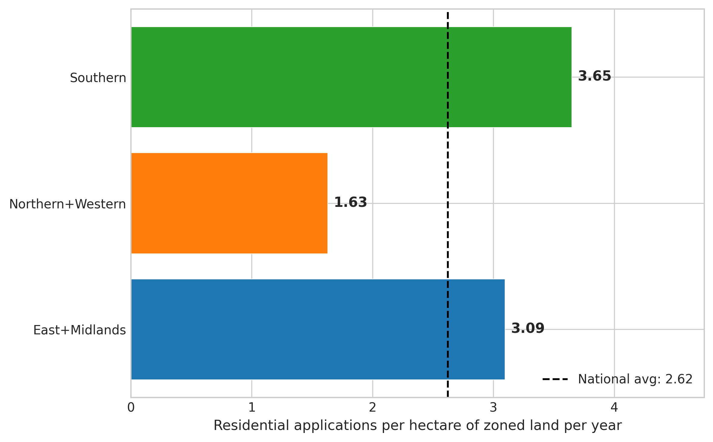

*A plain-language summary. The [full technical paper](https://github.com/colinjoc/hdr_autoresearch/blob/main/applications/ie_zoned_land_conversion/paper.md) has the diagnostics and experiment logs. See [About HDR](/hdr/) for how this work was produced and reviewed.*

**Bottom line.** Ireland has 7,911 hectares of land that is already zoned for housing and already serviced with water and roads — enough, at prevailing densities, for roughly 417,000 homes. Each year only about 21,500 residential planning applications are filed against that stock. That works out to 2.72 applications per hectare per year, or an annual capacity utilisation of just 8.6 percent. At that pace, the existing zoned stock would take nearly two decades to exhaust. The newly introduced Residential Zoned Land Tax — designed to flush idle land into the pipeline — has produced no detectable activation in its first two years.

## The question

Ireland's housing crisis is usually framed as a supply problem, and that framing usually points to a shortage of zoned land. The numbers tell a different story. The Department of Housing's own residential land availability survey (Goodbody, 2024) finds nearly 8,000 hectares of land that has cleared three hurdles — zoned for residential use, serviced or serviceable with water and transport, and not already covered by a live planning permission. That is paper-ready capacity. Yet very little of it shows up in the planning system in any given year. The question this study asks is the simplest possible one: at what rate does zoned residential land in Ireland convert into a planning application, and what slows it down? The metric — applications per hectare of zoned land per year — has been gestured at in policy documents but never computed from the underlying microdata.

## What we found

- Across Ireland, residential planning applications are filed at a rate of 2.72 per hectare of zoned land per year, with a 95 percent confidence range of 2.59 to 2.94. Only 8.6 percent of the 417,000-home capacity enters the planning pipeline each year (n = 491,206 applications, 2012-2026).
- Regional intensity varies sharply. The Southern region leads at 3.65 applications per hectare per year. The East and Midlands sits at 3.09. The North and West, which holds the largest share of the zoned stock at about 40 percent, runs at only 1.63 — less than half the Southern rate.
- Fingal County is a national outlier. It carries 3,519 hectares — 44 percent of the entire national zoned stock — yet records just 0.08 applications per hectare per year, by far the lowest in the country. Fingal alone pulls the national average down sharply.
- Once the Fingal denominator is set aside (its figure draws from a wider zoning map than the comparable national survey), the national intensity nearly doubles to 4.83 applications per hectare per year, and the relationship between zoned area and applications across local authorities becomes strong and positive — well above the threshold for being a chance result.
- The Residential Zoned Land Tax (RZLT = Residential Zoned Land Tax), announced in 2021 to penalise hoarding of idle zoned land, has so far produced no detectable lift. Mean annual residential applications were 22,182 in 2018-2021 and 20,617 in 2022-2024 — a 7 percent decline that is not statistically distinguishable from zero in this window.
- Development viability sits on a knife edge. The ratio of national median sale price to estimated construction cost is 1.26 — only just above the 1.20 threshold below which projects struggle to break even after land, fees, contributions and developer margin. A modest cost shock can push large parts of the country below the line.
- The modal application is a single dwelling: 43.8 percent of all residential applications are one-off houses; only 10 percent are apartment schemes. The median application contains one unit; the mean is 2.8.
- Approval rates, decision lags and refusal rates do not predict which local authorities have higher application intensity. The bottleneck is upstream of regulatory friction.

## Why that matters

The casual story — "we just need to zone more land" — does not survive contact with the data. Ireland already has the paper supply. What the country lacks is the conversion of that paper supply into actual applications, and from applications into actual buildings. The annual conversion rate of 8.6 percent is consistent with the Goodbody finding that only one-sixth of zoned land is activated during a six-year development plan cycle. At the current pace, the stock would take nearly twenty years to exhaust. That is a long horizon to be sitting on a housing crisis.

The Housing for All target of 50,500 homes per year, taken together with the roughly 60 percent build-yield from a predecessor pipeline study, implies the country needs roughly 85,000 residential permissions filed each year. It currently files about 21,500. Closing that gap means lifting the national application intensity from 2.72 to roughly 10.74 per hectare per year — a 295 percent increase. No realistic regional convergence story or RZLT scenario gets remotely close. Even forcing every region up to the Southern rate — the highest in the country — would lift national applications only to about 28,900 a year, still nowhere near the target.

The evidence points to three reinforcing mechanisms for why so much zoned land sits dormant. The first is a real-options problem: when the viability margin is thin and prices are rising, owners do better by waiting than by building, and the dominance of one-off applications looks exactly like a wait-and-see strategy — develop the minimum, preserve the option on the rest. The second is infrastructure: the Fingal anomaly hints that a meaningful fraction of land that appears zoned and serviced on paper is not, in practice, deliverable, because water or transport capacity has not actually been allocated. The third is viability compression: at a 1.26 ratio of price to cost, a modest move in interest rates, materials, or development contributions can flip a site from buildable to unbuildable.

## What it means in practice

**For homebuyers.** Each year only a small slice of Ireland's already-zoned, already-serviced housing capacity is even tested in the planning system. The supply of paper-ready land is not the binding constraint on what reaches the market in any given window — landowner timing, infrastructure delivery, and the price-to-cost margin are.

**For landowners.** The mathematics of waiting still favours holding. With the price-to-cost ratio sitting just above breakeven and the new tax set at three percent of land value, the holding cost has not been pushed high enough — at least not yet — to overcome the option value of waiting for a higher price or a lower cost.

**For policymakers.** Adding more zoned land is unlikely to move the dial, because the existing stock already sits idle most of the time. The real questions are about the activation of land that is already paper-ready: the speed and visibility of infrastructure rollout, the calibration of the RZLT rate, and a careful look at why one local authority — Fingal — holds 44 percent of the national zoned stock and processes the fewest applications per hectare in the country. Whether Fingal's low intensity reflects a measurement problem (mixed-use and town-centre land being counted as residential), an infrastructure-timing problem, an ownership-concentration problem, or a genuine undevelopability problem is the single largest open question in Irish housing policy.

## How we did it

The study cross-references three national datasets. The numerator — annual residential planning applications — is built from the national planning register, 491,206 rows covering every application filed with an Irish local authority since 2012. Residential applications are identified by a combination of keyword classification on the development description (dwelling, house, apartment, residential, bungalow, duplex, townhouse, semi-detached, detached, flat) and the registered residential-units field, with a robustness check excluding retention, consequent and extension permission types. The denominator — hectares of zoned, serviced residential land — comes from the Department of Housing's 2024 land availability survey, with regional totals allocated to local authorities by Census 2022 population (Fingal uses its own published figure). Land prices and property transactions are drawn from the Central Statistics Office's RZLPA02 and HPA09 series, providing the inputs to the price-to-cost viability ratio.

The metric is a stock-flow ratio: annual application flow divided by zoned-land stock. National confidence intervals come from a bootstrap over annual totals. Local authority intensity is regressed on zoned area, population, and land price; the relationship between zoned land and application volume is examined both with and without the Fingal observation. A pre/post comparison around the RZLT announcement tests for an activation effect. Spatial clustering of intensity is checked with a standard spatial autocorrelation test, and a survival model is fit to decision lag as a check on whether regulatory speed predicts application rates. The headline conversion rate is robust to all of these specifications; the cross-sectional relationships are sensitive to the Fingal denominator and are reported both ways.

## Further reading

- [Goodbody Residential Land Availability Report 2024](https://www.goodbody.ie/) — the source for the national zoned and serviced land figure of 7,911 hectares.
- [Housing for All — Government of Ireland (2021)](https://www.gov.ie/en/publication/ef5ec-housing-for-all-a-new-housing-plan-for-ireland/) — the 50,500-homes-per-year national target.
- [Residential Zoned Land Tax — Revenue Commissioners](https://www.revenue.ie/en/property/residential-zoned-land-tax/index.aspx) — official guidance on the tax announced in 2021.
- [Central Statistics Office RZLPA02 — Residentially Zoned Land Prices](https://data.cso.ie/) — county-level zoned land transaction prices.
- [Central Statistics Office HPA09 — Residential Property Prices](https://data.cso.ie/) — national and regional property transactions used in the viability ratio.
- [Report of the Housing Commission (2022)](https://www.gov.ie/en/publication/0c474-report-of-the-housing-commission/) — broader policy context for zoned-land activation.
- [End-to-end pipeline yield — predecessor study](https://github.com/colinjoc/hdr_autoresearch/blob/main/applications/ie_housing_pipeline_e2e/paper.md) — source of the 60 percent permission-to-home build-yield figure.
- [Full technical paper](https://github.com/colinjoc/hdr_autoresearch/blob/main/applications/ie_zoned_land_conversion/paper.md).
