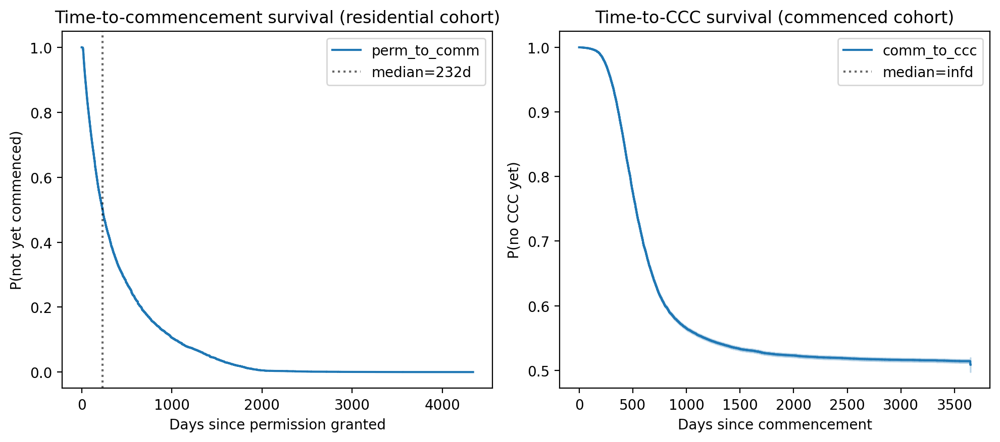

*Plain-language summary. Full technical write-up in the [paper](https://github.com/colinjoc/generalized_hdr_autoresearch/blob/main/applications/ie_commencement_notices/paper.md) and [analysis script](https://github.com/colinjoc/generalized_hdr_autoresearch/blob/main/applications/ie_commencement_notices/analysis.py).*

## The question

The companion [permission-to-completion pipeline](/hdr/results/irish-housing-pipeline/) project estimated how many Irish permissions eventually become completions by comparing two aggregate CSO series with a fixed lag. That comparison is only a convolution-implied lag between smoothed series — it does not trace any individual permission through to its completed home. The natural follow-up is: can we do this at the project level?

Yes. The Building Control Management System (BCMS), operated by the National Building Control Office since March 2014, publishes a project-level row for every building-control filing nationwide. Each row contains the planning-permission number, the grant date, the commencement-notice filing date, and (where filed) the Certificate of Completion and Compliance date. That lets us measure, for the first time publicly, the permission-to-completion cohort latency for Irish housing.

## What we found

### Median permission to commencement: 232 days

Across 183,633 residential permissions granted 2014-2025, the median time from grant to commencement-notice filing is **232 days (bootstrap 95% CI 231-234)**. One-off dwellings commence faster (median ~160 days); multi-unit and apartment schemes take substantially longer.

### Median commencement to completion certificate: 498 days

Among residential projects that both commenced and filed a completion certificate, the median construction-to-certification duration is **498 days (CI 497-500)** — roughly 16-17 months. Apartment schemes take 53 days longer than dwellings (CI 43-62).

### Total median permission to completion: 962 days (~32 months)

On the full-timeline subcohort (permission + commencement + CCC all populated), the median end-to-end latency is **962 days (CI 959-966)**, about 32 months. This is a micro-foundation number: it is not an aggregate-series lag but the actual observed time elapsed between grant and certification at the project level.

### The "dark permission" rate depends on how you define it

The share of permissions that never translate to a completion is highly sensitive to definition:

- **Narrow definition** — never commenced within 72 months: **0.67%** (CI 0.62-0.72%). This is a lower bound — nearly all permissions do commence, given enough time.
- **Wide definition** — never validated a Completion Certificate under the non-opt-out channel: up to **39%**. This is an upper bound driven by the fact that many one-off dwelling developers file "opt-out" commencement notices and never submit a CCC, so their completion is not recorded in the system.

The true dark-permission rate is somewhere between these bounds. The policy implication: headline "X% of permissions were never built" claims are not cleanly measurable from administrative data alone without choosing a specific channel definition — and the choice moves the answer by nearly two orders of magnitude.

### Apartment schemes, multi-phase schemes, and AHB projects are slower — mostly because of composition

Raw unadjusted gaps found in the data:

- Apartment vs dwelling: +53 days to complete (CI 43-62)
- Multi-phase developments: +288 days to commence (CI 281-297)
- Approved Housing Body (AHB) vs private: +46 days to commence (CI 35-70)

Once we control for scheme size and unit mix, these gaps either shrink sharply or reverse sign. The AHB "slower" finding in particular is driven by the fact that AHB projects are systematically larger (median 28 units vs 1 for private) and include more apartments — within a size stratum the Cox hazard ratio for AHB is 0.869 (CI 0.828-0.912), meaning AHB projects actually commence *faster* conditional on scheme size.

### Local-authority ranking is confounded by completion-certificate filing rates

CCC filing rates vary from 11% to 69% across Local Authorities — a coefficient of variation of 0.47. An unadjusted "which LAs deliver fastest" ranking is therefore partly measuring how diligently each LA processes CCCs, not how fast its permissions actually convert. After residualising against filing rate, the channel-adjusted top-performing LA cells are Offaly, Leitrim, Clare, Kilkenny, Cork County and Wicklow at the 50-199-unit scheme size — not the cells the raw ranking would suggest.

## What this does NOT establish

- **Not a counterfactual.** We measure durations that occurred; we do not estimate what durations would have been under alternative planning or building-control regimes.
- **Not a build-out rate.** A commencement notice is a filing, not a completed dwelling. A completion certificate is a filing that the developer chose to submit; projects without a CCC are not necessarily unbuilt.
- **Not causation.** Cross-LA differences reflect composition (size, apartment share, rural/urban mix) and filing behaviour, not only local planning productivity.
- **Not out-of-sample stable.** Our survival models (Cox, Weibull AFT, log-normal AFT) are indistinguishable on 2021-2024 holdout data (Cox concordance 0.582, log-normal 0.566). We do not claim an individual-project predictive model; the contribution is the descriptive cohort.

## What it means

For an Irish housing commentator: the right numbers to cite when talking about how long housing takes to deliver are **232 days** (permission to commencement), **498 days** (commencement to certification), and **962 days total** — all project-level medians, not cross-correlation lags between aggregate series. If a policy claim needs a "permission to dwelling" number, 32 months is the cohort estimate.

For evaluation of the companion [LDA delivery](/hdr/results/irish-lda-delivery/) and [housing pipeline](/hdr/results/irish-housing-pipeline/) projects: this cohort analysis is the micro-foundation that those aggregate-level comparisons lacked. The headline 41%→65% two-year permission-to-completion conversion finding in the housing pipeline is consistent with the 82% of permissions commencing within 24 months and 95% within 48 months found here.

For anyone benchmarking "how fast does Ireland build": 32 months from grant to CCC puts Ireland in the middle of the comparable-country range. The main contributor to the long tail is the pre-commencement phase (232-day median, but a heavy right tail driven by Section 42 extensions and multi-phase schemes), not the construction phase itself.

## How we did it

Primary data: NBCO BCMS row-level CSV (258 MB, 231,623 rows, 99 columns; 2014-present). Cross-validation: CSO HSM13 monthly aggregates. Methods: Kaplan-Meier cumulative incidence, Cox proportional hazards, Weibull and log-normal accelerated failure time models, gradient-boosting classifier for the dark-permission binary outcome. All headline numbers carry bootstrap 95% CIs. Ran through the full HDR pipeline including an independent Phase 2.75 blind reviewer (9 mandated experiments R1-R9 executed, three headline claims revised, Local-Authority ranking withdrawn and replaced with a channel-adjusted version) and an independent Phase 3.5 signoff review that verified reproducibility from disk.
