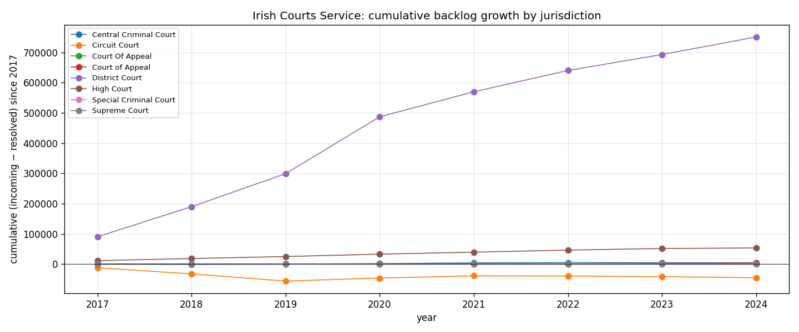

*Plain-language version. Full technical write-up in the [analysis script](https://github.com/colinjoc/generalized_hdr_autoresearch/blob/main/applications/ie_courts_waits/analysis.py).*

## The question

The Courts Service of Ireland was making its annual report data available as CSV for the first time at this point. Eight years of data, 1,189 rows, broken down by jurisdiction (District, Circuit, High, Central Criminal, Court of Appeal, Supreme, Special Criminal), area of law (civil, criminal, family, appeals), and case category (94 types including Road Traffic, Personal Injury, Child Care, Liquidated Debt, Bail, Probate). Each row reports incoming and resolved case counts for that year.

The simple question: **is the court system keeping up, and if not, where is it falling behind?**

## What we found

### The District Court is the main bottleneck

2024 was the highest-throughput year in the series, but the District Court alone absorbed 493,151 new cases and resolved only 435,255 of them — a single-year backlog growth of **57,896 cases**. That corresponds to an 88 percent resolution ratio: 12 of every 100 cases that come in, do not come out in the same year.

### Every other court is keeping pace or clearing backlog

| Jurisdiction | 2024 incoming | 2024 resolved | Net (incoming − resolved) | Resolution ratio |
|---|---|---|---|---|
| District Court | 493,151 | 435,255 | **+57,896** | **88%** |
| High Court | 36,303 | 34,446 | +1,857 | 95% |
| Court of Appeal | 3,487 | 2,376 | +1,111 | **68%** |
| Special Criminal Court | 68 | 47 | +21 | 69% |
| Supreme Court | 231 | 239 | −8 | 103% |
| Central Criminal Court | 2,810 | 3,338 | **−528** | **119%** |
| Circuit Court | 63,048 | 66,417 | **−3,369** | **105%** |

Three courts are actively clearing backlog in 2024 (Circuit, Central Criminal, Supreme). The Supreme and Central Criminal Courts resolve more cases than they receive. The High Court is almost keeping pace (95 percent). The Court of Appeal is falling behind at a 68 percent resolution rate. The District Court is by far the largest gap in absolute terms.

### Inside the District Court, Road Traffic and Child Care are the worst

| Category | 2024 incoming | 2024 resolved | Net backlog | Resolution ratio |
|---|---|---|---|---|
| Road Traffic | 185,578 | 161,995 | **+23,583** | 87% |
| Liquidated Debt | 19,401 | 9,802 | +9,599 | **51%** |
| **Child Care** | **21,797** | **12,973** | **+8,824** | **60%** |
| Public Order / Assault | 47,956 | 40,479 | +7,477 | 84% |
| Larceny / Fraud / Robbery | 39,038 | 32,827 | +6,211 | 84% |

Road Traffic is the single largest backlog contributor in absolute terms. But Child Care and Liquidated Debt are the two categories resolving at near 60 percent or below — meaning roughly four out of ten incoming Child Care cases each year are not resolved within that year.

### High Court's breach-of-contract backlog is striking

At High Court level, Breach of Contract filings grew 1,196 cases in 2024 (1,435 incoming, 239 resolved — an 17% resolution ratio). Chancery is not much better at 55%. Commercial debt and contract disputes are the slowest-moving High Court category.

## What this does not establish

- **No wait-time per case.** We have flow volumes (incoming/resolved per year), not waiting-time distributions. A case may be "incoming" in 2020 and "resolved" in 2024 — it counts as a resolution without us knowing how long it took.
- **No causal attribution.** Why the District Court is drowning — judicial capacity, garda-led prosecution volume, civil-recovery legislative changes, post-COVID pipeline — is not in the data.
- **No per-venue breakdown within a jurisdiction.** District Court has 24 venues; we don't see which.
- **No sentencing / outcome distribution** — these are flow statistics only.

## What it means

For someone with a Child Care case: the national system resolves about 60 percent of new Child Care applications within their year of filing. The other 40 percent carry over. At current rates, a new filing has a roughly 2-in-5 chance of waiting more than a year for resolution.

For someone waiting on a debt recovery through the District Court: about half of Liquidated Debt cases resolve within the year; the other half carry over.

For a policymaker: Road Traffic is the biggest single drain on District Court time. A policy question worth asking is whether the overlap with the fixed-charge penalty notice regime could be restructured to divert more Road Traffic volume out of court altogether — which is a slightly different question than "do we need more District Court judges?"

## How we did it

We downloaded the Courts Service Annual Report datasets for 2017 through 2024 as they became newly available as CSV via data.courts.ie, concatenated into a 1,189-row panel (jurisdiction × area × category × year), computed the incoming-minus-resolved difference, cumulated across years to build a backlog trajectory, and ranked 2024 by both absolute backlog growth and by resolution ratio. Data is CC BY 4.0 licensed for reuse.
