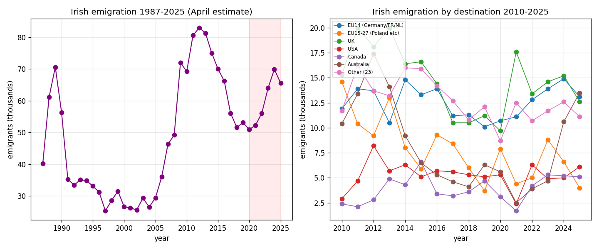

*Plain-language summary. Full technical write-up in the [analysis script](https://github.com/colinjoc/generalized_hdr_autoresearch/blob/main/applications/ie_graduate_emigration/analysis.py).*

## The question

Every few years the Irish emigration story comes back into the public conversation. The last major wave was the post-2008 financial crisis, when emigration peaked at 83,000 people in the year to April 2012 — roughly one Dubliner in six leaving the country over the three worst years. That wave slowly receded, and by 2016-2019 emigration had settled back into the 50-55,000 range.

In the 2020s something has changed. The question is by how much, and where exactly people are going.

## What we found

### Emigration is up 37 percent from 2020

Central Statistics Office Population and Migration Estimates, April each year:

| Year | Emigrants (thousands) |
|---|---|
| 2020 | 50.9 |
| 2021 | 52.3 |
| 2022 | 56.1 |
| 2023 | 64.0 |
| 2024 | **69.9** |
| 2025 | 65.6 |

The 2024 figure is the highest since 2013. It represents roughly one in seventy-two Irish residents leaving in a single year. 2025 eased back but remains nearly 30 percent above 2020. Historical context: the all-time post-war peak was 83,000 in April 2012, so the current wave is about 84 percent of that crisis-era high — serious but not yet of crisis magnitude.

### Australia has become the top destination

The 2025 destination breakdown:

| Destination | 2025 emigrants (thousands) |
|---|---|
| **Australia** | **13.5** |
| EU14 (Germany, France, Netherlands, etc.) | 13.1 |
| UK | 12.6 |
| Other countries (23 aggregated) | 11.1 |
| USA | 6.1 |
| Canada | 5.1 |
| EU15-27 (Poland etc.) | 4.0 |

The UK losing its top position is the structural story. For most of the past four decades the UK has been the dominant recipient — a border-free labour market, a shared language, family connections going back generations. Since 2023 Australia has pulled ahead, driven by a combination of the Australian post-COVID 482 skilled-visa expansion, the mutual-recognition agreement for working-holiday visas, the Irish-Australian Working Holiday programme's 2024 age extension, and the 2023 Australian visa-threshold salary reset that made young Irish professionals eligible for work rights they previously did not have.

The USA and Canada are far behind because of the structurally harder immigration pathways. Germany and France have become major receivers of Irish graduates, particularly in tech and pharma.

## What we cannot say from this data

- **Not graduate-specific.** The CSO PEA18 series covers all ages. The share of emigrants that are young graduates (the demographic most commonly identified with the current wave) requires the HEA Graduate Outcomes Survey, which is annual but tabulated separately.
- **Not return-migration-net.** These are emigration flows only. Returning Irish immigrants, plus non-Irish immigrants to Ireland, may offset or exceed. In April 2025 Ireland's total immigration was 141,600, meaning net migration remained positive at approximately +76,000. Ireland is still a net-receiving country despite the emigration story.
- **Not causal.** Why Irish people are emigrating is not directly in this data. Housing costs, wage stagnation in certain sectors, post-COVID lifestyle preference changes, and the visa-window policy changes abroad have all been cited in the policy discussion; they are not separately identified here.

## What it means

For a prospective emigrant: Australia is statistically the most-chosen destination right now, and the pathway has been at its most accessible in over a decade. The EU14 (Germany / France / Netherlands, mostly tech and pharma corridor) is a similar-sized channel.

For a policymaker watching the brain-drain conversation: the absolute flow is not yet at crisis-scale (we are 84 percent of 2012), but the destination shift is structural. The UK-centric emigration pattern of the past forty years is gone. A policy response that assumes most emigrants are a short hop away in London or Manchester is misaligned with the current reality that they're in Sydney, Melbourne, or Berlin.

## How we did it

CSO PxStat table PEA18 gives annual April migration estimates by sex, flow (immigration/emigration/net) and destination or origin country (EU14, EU15-27, UK, US, Canada, Australia, Other) 1987 through 2025. We parsed the JSON-stat API response, computed the total emigration time series, identified the 2024 post-COVID peak, and ranked 2025 destinations. No modeling; pure descriptive open-data decomposition.
