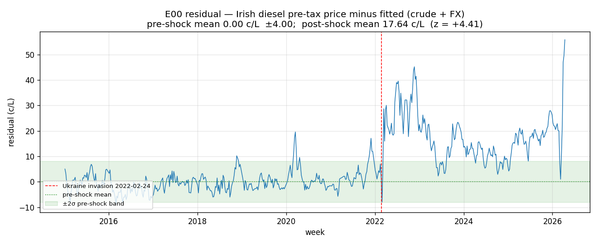
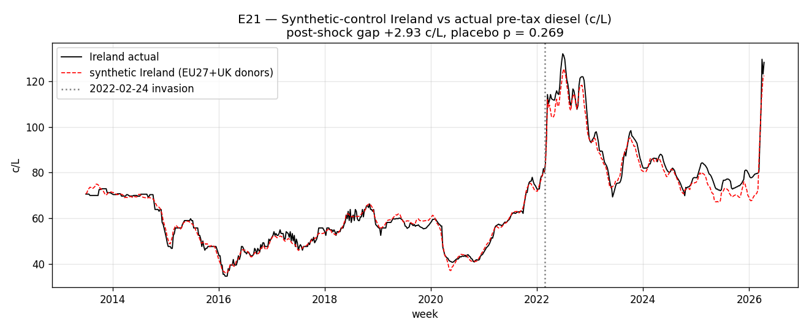
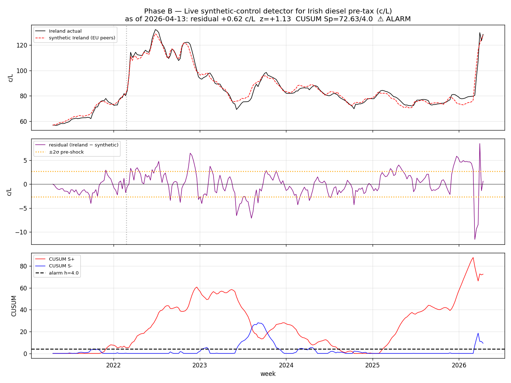

*This is the plain-language version. For the full technical write-up, see the [paper](https://github.com/colinjoc/generalized_hdr_autoresearch/blob/main/applications/irish_fuel_profiteering/paper.md).*

## The question

When Russia invaded Ukraine in February 2022, oil prices exploded and Irish pump prices followed within days. The Taoiseach hinted at "morally reprehensible" price-fixing. Politicians demanded action. The Competition and Consumer Protection Commission opened a review. The government cut excise duty -- 20 cents per litre on petrol, 15 on diesel -- the largest single-move tax cut in modern Irish history.

The question everyone wanted answered: **did Irish fuel retailers use the chaos to widen their margins?**

## What the first look suggested

If you build a simple model that predicts Irish diesel prices from just two ingredients -- the world price of crude oil, and the euro-dollar exchange rate -- and you train it on years of pre-war data, then ask it what diesel prices "should have been" after the invasion, you get a striking answer. Actual Irish diesel ran about **17 cents per litre higher** than the model predicted, on average, for years afterwards. That looked like clear, large-scale profiteering.

If we had stopped here, we would have published a damning finding. We didn't stop here.

## What the proper test showed

The trouble with the simple model is what it leaves out: every other European country was buying diesel from the same refineries Ireland buys from, and those refineries' margins widened across Europe in 2022. If you only compare Ireland to its own past, that European-wide event looks Irish.

The proper way to test is to compare Ireland to its European neighbours during the same weeks. We built a "synthetic Ireland" -- a weighted average of other European countries' diesel prices chosen to track Irish diesel as closely as possible during the calm pre-war years. Italy, Czech Republic, Slovenia, Spain, and Bulgaria did most of the matching. The fit before the war was tight to within about one and a half cents per litre.

Then we let the synthetic Ireland run forward through the war and aftermath, and compared it to the real one.

The two lines move together. The remaining gap is **about 3 cents per litre** -- and when we re-ran the same test pretending each *other* European country was the one being investigated, we got gaps of similar or larger size in roughly a quarter of cases. **Ireland is not an outlier.**

## A second sanity check

The one suspicious-looking statistic from our Irish data was that retailers passed through crude price *increases* a bit slower during the period when the excise was cut. That sounded like classic tax-cut profiteering. So we ran exactly the same test on German diesel, using the *Irish* dates. Germany never had the Irish excise cut, so this is a placebo: if the effect is real Irish profiteering, Germany should show nothing.

Germany showed the same effect, almost identical in size. Whatever was happening in Irish pump-price dynamics in 2022-2024 was happening in German pump-price dynamics too. **It wasn't an Irish thing.**

## So what was actually going on?

European refineries widened their margins after the invasion. That's a real and well-documented story -- the UK Competition and Markets Authority and the German antitrust regulator both reported it -- and it affected every country that buys from those refineries, including Ireland. **Irish retailers were not uniquely greedy. They were just along for the ride.**

The Competition and Consumer Protection Commission said exactly this in November 2022 and was criticised at the time for moving too quickly. They were right.

## A monitor for the next shock

The current Israel-Iran conflict could trigger another oil shock. We built a live monitor that compares Irish diesel against its European peers each week and raises an alarm if Ireland starts pulling away from the cohort.

As of this week, Ireland is sitting **0.6 cents per litre above its European peers** -- well within normal variation. The alarm has been quietly elevated since late 2021, but that reflects the persistent Europe-wide refining shift, not anything new or Irish-specific.

If real Irish-specific gouging started tomorrow, this monitor would spot it within weeks.

## The lesson

If you only compare a country to its own past, ordinary Europe-wide events look like local wrongdoing. You need to compare to the neighbours. That single methodological shift turned a "+17 cents per litre profiteering scandal" into a null finding -- and a national rumour into something more honest.

## What could the Irish state do to drop fuel prices?

If the Israel-Iran shock develops into a sustained crude squeeze, the government has real, immediate levers. Our cost-stack analysis lets us put numbers on each one.

### What sits on every litre today (mid-2025 rates)

For a litre of petrol at the pump for around €1.92:

| Component | Charge | At-pump effect after 23% VAT |
|---|---|---|
| Mineral Oil Tax (excise + carbon component) | 67.08 c/L | 82.51 c/L |
| NORA (strategic-reserve) levy | 2.00 c/L | 2.46 c/L |
| Pre-tax wholesale and retail margin | ~85 c/L | 104.55 c/L |
| 23% VAT on the lot | -- | (already counted above) |

Diesel is similar but with a 55.99 c/L MOT instead of 67.08.

### What EU law actually permits

Under the EU Energy Taxation Directive (2003/96/EC), the legal floor for fuel excise duty is:

- **Petrol: 35.9 c/L** (€359 per 1000 litres)
- **Diesel: 33.0 c/L** (€330 per 1000 litres)

That means **the maximum legally permitted excise cut today is**:

- **Petrol: 31.18 c/L** (from 67.08 down to the 35.9 floor)
- **Diesel: 22.99 c/L** (from 55.99 down to the 33.0 floor)

After VAT compounding, a maximum-permitted cut would reduce pump prices by:

- **Petrol: about 38 c/L at the pump**
- **Diesel: about 28 c/L at the pump**

Adding a NORA levy reduction (2 c/L pre-VAT, ~2.5 c/L at pump) brings it to roughly **40 c/L off petrol and 30 c/L off diesel** -- about a 21% reduction in the price of petrol from current levels.

### What it would cost the Exchequer

Ireland consumes roughly 2 billion litres of petrol and 4 billion litres of diesel per year on the roads. A maximum-permitted excise-and-NORA cut would surrender approximately:

- Petrol: €620 million per year
- Diesel: €920 million per year
- NORA: €120 million per year
- **Total: roughly €1.6 billion per year of foregone revenue**

For context, total Mineral Oil Tax receipts are typically €2-3 billion annually, so this is most of motor-fuel tax revenue.

### A more politically realistic cut: the 2022 template

The March 2022 emergency cut was 20 c/L on petrol and 15 c/L on diesel -- about 65% of what the EU floor would have permitted. It cost the Exchequer roughly €1 billion over its 28-month lifetime, or about €35 million per month at the cut rate. **A direct repeat is a known, executable policy.** Our analysis confirms it would mostly reach consumers rather than being captured by retailers.

### Pausing the carbon-component escalator

The carbon component of MOT rises annually by legislation (currently €63.50 per tonne CO₂, scheduled to reach €100 by 2030). Pausing the May 2026 increment saves roughly **2 c/L at the pump**. Reverting to 2021 levels (€33.50/tCO₂) saves about **6-7 c/L at the pump**. Politically harder -- it undermines climate commitments -- but technically straightforward.

### What the state cannot legally do

- **VAT cut on motor fuels**: Annex III of the VAT Directive lists categories eligible for reduced rates. Motor fuels are not on it. Ireland can cut VAT on electricity and gas (it did, 13.5% to 9% in 2022-2024) but not on petrol or diesel without an EU derogation.
- **Excise below the EU floors above**: legally constrained.
- **Price caps on retail fuel**: not formally prohibited, but France tried this in 2022 and largely abandoned it -- distortionary, expensive, and our analysis suggests it would solve a problem (retail profiteering) that does not exist in Ireland.

### The lever that targets the actual rent

If our analysis is right that the 2022 excess margin was mostly captured by **European refiners**, not Irish retailers, then the policy that targets the right beneficiary is a **windfall tax on European refining margins**, coordinated at EU level.

The EU did exactly this in October 2022 with the Council Regulation 2022/1854 "solidarity contribution" -- a 33% levy on excess fossil-fuel sector profits above 120% of their 2018-2021 average. Ireland implemented it. The mechanism exists; reviving or extending it during a fresh shock is the on-the-shelf option that aligns with what our analysis shows is actually happening.

### Bottom line

The state's choices, in order of directness:

1. **Excise cut**: works immediately, reaches consumers, costs €30-50 million per month per 5-cent cut. Up to 31 c/L on petrol and 23 c/L on diesel are legally available.
2. **Pause carbon escalator**: 2 c/L per increment, near-zero administrative cost, climate trade-off.
3. **Reduce NORA levy**: 2 c/L flat, low political cost, small impact.
4. **Push for EU refining windfall tax**: targets the right beneficiaries based on our findings; requires Council action.
5. **VAT cut**: not legally possible on motor fuel under current EU rules.
6. **Price cap**: not recommended; addresses a behaviour our data does not find.
