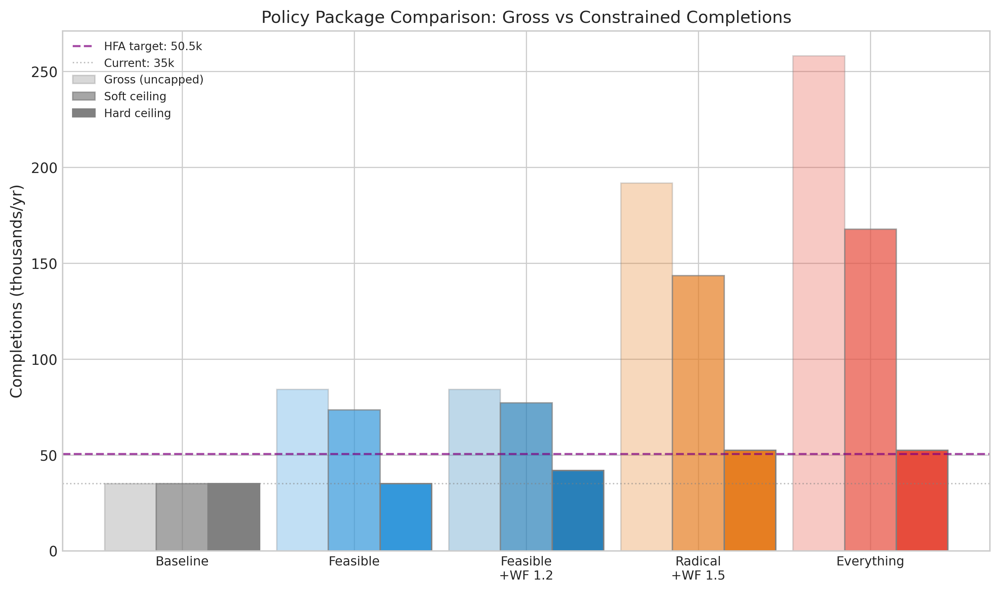

*Part 4 of 4 in the Irish Housing series. Previous: [Part 1: Economics](/hdr/results/irish-housing-economics/) | [Part 2: Pipeline](/hdr/results/irish-housing-pipeline-complete/) | [Part 3: Planning & JR](/hdr/results/irish-planning-and-judicial-review/)*

*Consolidates findings from the [bottleneck ranking](https://github.com/colinjoc/generalized_hdr_autoresearch/blob/main/applications/ie_housing_bottleneck/paper.md) and [lever interaction analysis](https://github.com/colinjoc/generalized_hdr_autoresearch/blob/main/applications/ie_lever_interactions/paper.md), drawing on 20 predecessor studies.*

## Where does the constraint sit?

We ranked every commonly-cited housing obstacle by how many extra homes it would deliver if fixed:

| Problem | Extra homes/yr if fixed | % of gap |
|:---|---:|---:|
| **Grant more permissions** (+10,000) | **+6,100** | **37%** |
| Better completion-certificate filing | +3,267 | 20% |
| Faster planning board (18 weeks) | +1,060 | 6.5% |
| Remove judicial review entirely | +1,060 | 6.5% |
| Halve permission lapse rate | +701 | 4.3% |
| Faster construction | ~0 | 0% |
| Triple the LDA | ~0 | 0% |

**All efficiency fixes combined: ~5,000 extra homes/yr = 31% of the 16,300-unit gap.** The other 69% requires more permissions and more construction capacity.

This ranking is robust: permission volume came out #1 in 100% of 5,000 Monte Carlo simulations, regardless of opt-out assumptions.


## Do the levers interact?

Yes — but not how you'd expect. We tested 104,976 combinations of 10 levers through a feedback model:

```
Cost reduction → Better viability → More applications filed → More permissions → More completions
```

**Cost-reduction levers are perfectly additive** — no synergy between them. Modular construction + VAT reduction produces exactly the sum of each alone. What looked like redundancy was actually the construction-capacity ceiling: two levers pushing demand past the same limit.

**The real interaction is between cost and capacity.** Cost levers generate demand; workforce expansion generates capacity. Neither works alone. Every combination that exceeds 50,000 completions includes workforce expansion.



## The best realistic package

| Lever | Setting | Effect through feedback |
|:---|:---|---:|
| Modular construction | -20% hard costs | +5,473/yr |
| Duration reduction | -33% (32→21 months) | +1,888/yr |
| VAT reduction | 13.5% → 9% | +1,962/yr |
| Part V reform | 20% → 10% | +878/yr |
| Workforce expansion | +30% | Lifts ceiling to ~45,500 |
| **Combined** | | **~45,000-47,000/yr** |

This gets Ireland from 35,000 to roughly 45,000-47,000 — a genuine 30-35% improvement, but probably short of the 50,500 Housing for All target. Workforce expansion faces diminishing returns (training time, site congestion), and the viability-to-application elasticity saturates at positive margins.

## What would actually hit 50,500?

Either house prices rising faster than costs (gradually making more areas viable — already happening at ~8%/yr nationally), or a fundamental shift in construction technology reducing hard costs 30%+ at scale, or workforce expansion exceeding what Ireland's training infrastructure can deliver. The honest answer: 50,500 is probably unreachable in the medium term with any politically feasible policy package.

## The 20 studies behind this

This draws on: pipeline yield, commencement cohort, lapsed permissions, ABP decision times, SHD/LRD judicial review, JR tax on supply, LDA delivery, zoned land conversion, development viability, infrastructure capacity, construction cost decomposition, policy vs market costs, international cost comparison, and seven other supporting studies. Full technical papers for each are on [GitHub](https://github.com/colinjoc/generalized_hdr_autoresearch/tree/main/applications).
