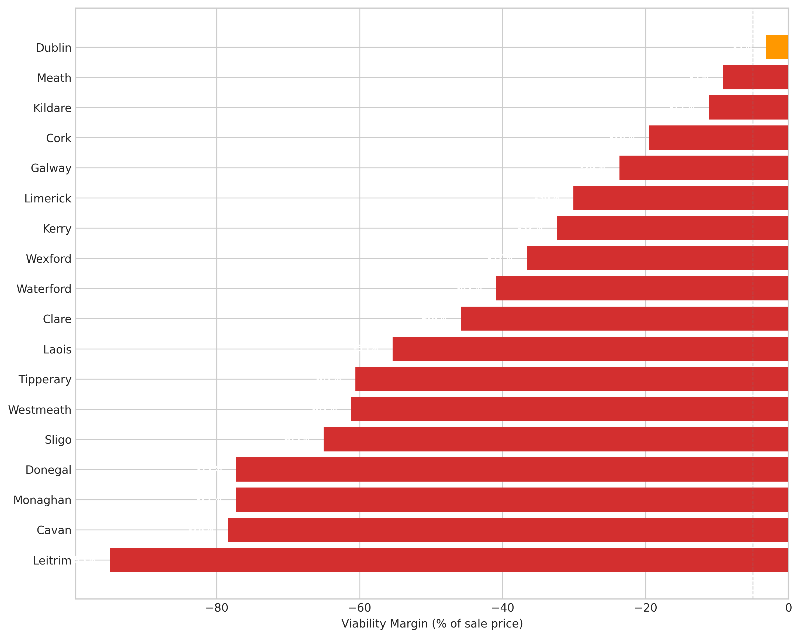
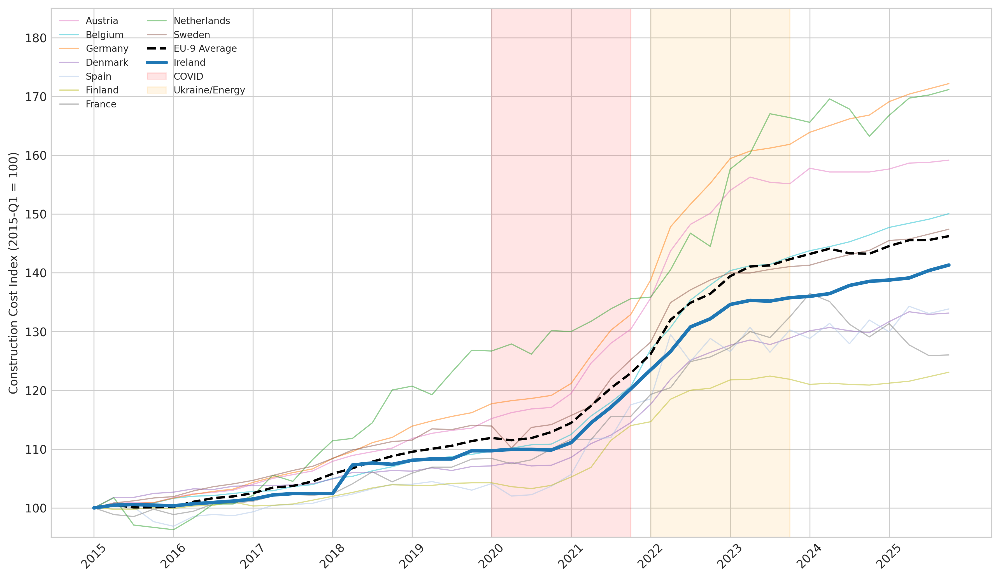
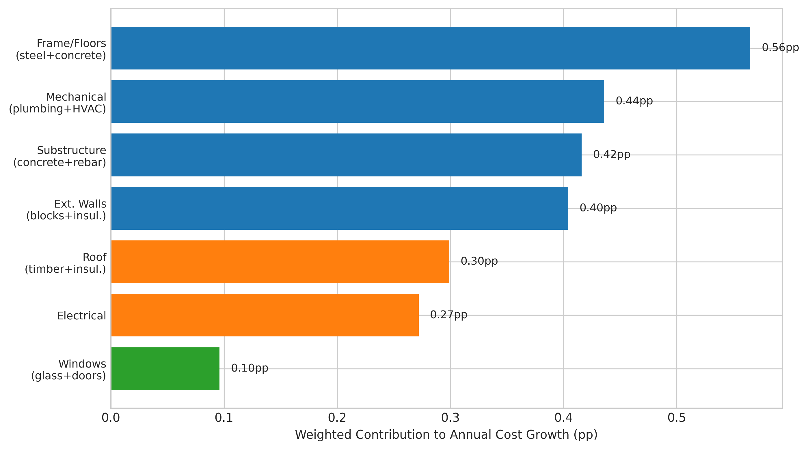
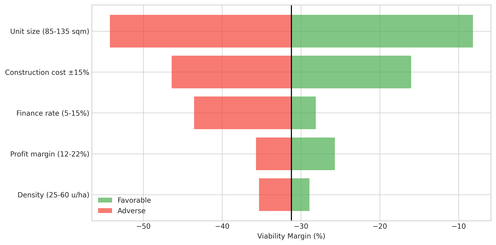
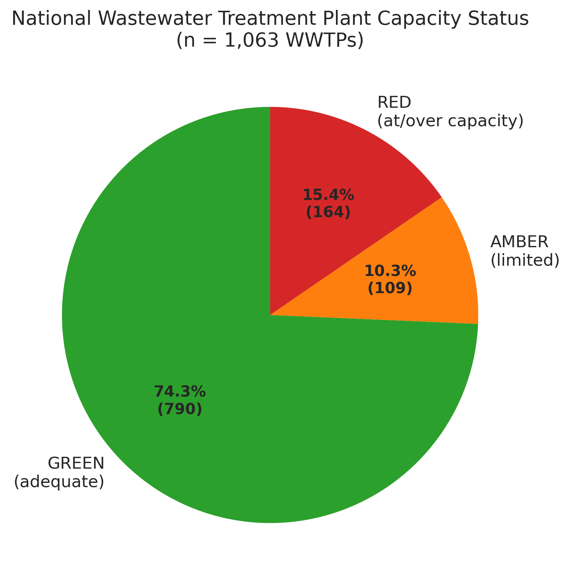

*Part 1 of 4 in the Irish Housing series. Next: [Part 2: The Pipeline](/hdr/results/irish-housing-pipeline-complete/) | [Part 3: Planning & JR](/hdr/results/irish-planning-and-judicial-review/) | [Part 4: What Would Fix It?](/hdr/results/irish-housing-bottleneck-and-levers/)*

*Consolidates findings from six studies: [zoned land conversion](https://github.com/colinjoc/generalized_hdr_autoresearch/blob/main/applications/ie_zoned_land_conversion/paper.md), [viability frontier](https://github.com/colinjoc/generalized_hdr_autoresearch/blob/main/applications/ie_viability_frontier/paper.md), [infrastructure capacity](https://github.com/colinjoc/generalized_hdr_autoresearch/blob/main/applications/ie_infra_capacity/paper.md), [cost decomposition](https://github.com/colinjoc/generalized_hdr_autoresearch/blob/main/applications/ie_construction_cost_decomp/paper.md), [policy vs market costs](https://github.com/colinjoc/generalized_hdr_autoresearch/blob/main/applications/ie_policy_vs_market_costs/paper.md), and [international comparison](https://github.com/colinjoc/generalized_hdr_autoresearch/blob/main/applications/ie_intl_construction_costs/paper.md).*

## Enough land, not enough applications

Ireland has **7,911 hectares** of zoned residential land — enough for 417,000 homes at standard densities. But only ~21,000 residential planning applications get filed each year. The application intensity is just 4.8 per hectare per year (excluding Fingal, which holds a disproportionate share of zoned stock under a broader RZLT definition).

Zoned land area DOES predict application rates (r=0.64 excluding Fingal), but the dominant predictor is **population, not land supply**. The RZLT tax (3% annual levy on undeveloped zoned land) had no detectable effect on filing rates.

## Most of Ireland is unviable for development

The viability equation — sale price minus total development cost — is negative in most of the country:

| Area | Viability margin |
|:---|---:|
| Dublin apartments (high density) | **+5.1%** |
| Dublin houses | -3.1% |
| Commuter belt (Meath, Kildare) | -9 to -11% |
| Secondary cities (Cork, Galway) | -20 to -24% |
| Rural counties | -60% or worse |

About **6,580 hectares (83%) of zoned land** sit in areas where development doesn't pay. This is why applications are low — developers don't file where the numbers don't work.

## Construction cost is the dominant factor — but it's not uniquely Irish

A tornado sensitivity analysis shows construction cost is **10x more sensitive** than land cost for viability. But Ireland's construction costs are NOT unusually high:

- Eurostat construction price level index: Ireland = **99.7** (exactly the EU-27 average of 100)
- Cumulative cost growth 2015-2025: Ireland +41% vs Germany +71%, Netherlands +71%
- Ireland ranks #6-#8 of 10 EU comparators depending on the measure

The "Irish costs are uniquely high" narrative is not supported by the data.

## What drives construction costs?

Labour and materials grew at **nearly identical rates (~4%/yr)** over 2015-2025. The common narrative that "materials are the problem" is an artifact of crisis volatility — materials spiked during COVID/Ukraine but reverted; labour rose steadily without reverting.

The biggest surprise: NZEB energy-efficiency regulations did **NOT** drive excess material inflation. A difference-in-differences analysis shows NZEB-affected materials (insulation, electrical, HVAC) actually rose LESS than control materials (DiD = -4.0pp).

Cement is the one material that never reverts (6.83%/yr, ratcheting upward through both crises).

## Policy costs are only 15% — and zeroing them barely helps

| Component | Share of total cost | Type |
|:---|---:|:---|
| Materials + labour | 43% | Market |
| Land + finance + margin + fees | 42% | Market |
| **VAT + Part V + dev contribs + BCAR** | **15%** | **Policy** |

Even eliminating ALL policy costs makes only **4 of 26 counties viable**. With 50% VAT pass-through to buyers (which is what actually happens), zeroing VAT makes **zero** additional counties viable. The median viability gap (€144k/unit) far exceeds total policy costs (€70-100k).

## Infrastructure is a secondary constraint

About 25% of Ireland's 1,063 wastewater treatment plants are at or over capacity. This blocks roughly 950-1,700 hectares of zoned land (12-22%). But 83% of zoned land is already economically unviable — fixing the sewage doesn't help if the numbers don't work.

## The bottom line

Ireland's housing problem is an **economics problem**, not a planning problem, not a regulation problem, and not a cost-uniqueness problem. Construction costs are at the EU average. The constraint is that the combination of land + labour + materials + finance + margin exceeds sale prices outside Dublin. The highest-leverage interventions are modular construction (-20% hard costs = +5,473 completions/yr through the feedback loop) and workforce expansion (lifts the capacity ceiling). See the [bottleneck and levers analysis](/hdr/results/irish-housing-bottleneck-and-levers/) for the full interaction model.
