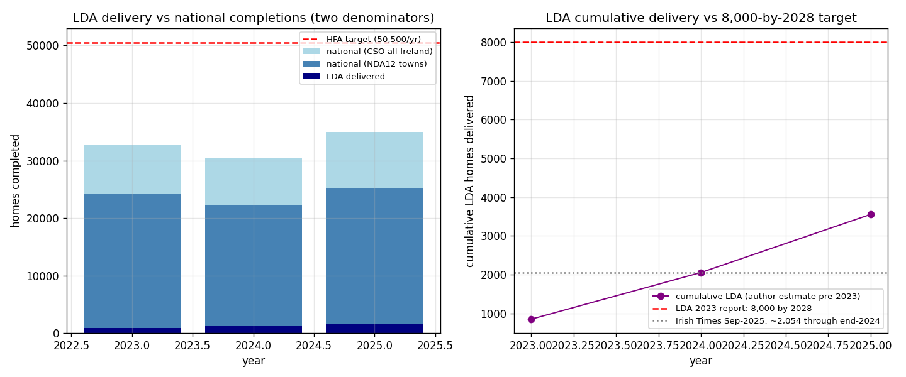

*This page consolidates findings from five studies: [commencement cohort](https://github.com/colinjoc/generalized_hdr_autoresearch/blob/main/applications/ie_commencement_notices/paper.md), [lapsed permissions](https://github.com/colinjoc/generalized_hdr_autoresearch/blob/main/applications/ie_lapsed_permissions/paper.md), [pipeline yield](https://github.com/colinjoc/generalized_hdr_autoresearch/blob/main/applications/ie_housing_pipeline_e2e/paper.md), [aggregate pipeline](https://github.com/colinjoc/generalized_hdr_autoresearch/blob/main/applications/ie_housing_pipeline/paper.md), and [LDA delivery](https://github.com/colinjoc/generalized_hdr_autoresearch/blob/main/applications/ie_lda_delivery/paper.md).*

## The pipeline at a glance

For every 100 residential planning permissions granted (2014-2019 cohort):

| Stage | Surviving | Lost | Why |
|:---|---:|---:|:---|
| Permission granted | 100 | — | — |
| Commenced | 90.5 | 9.5 | Permission lapse — never started |
| Completion cert filed | 35.1 | 55.4 | CCC non-filing (mostly opt-out self-builds) |
| **Actually built** | **~60** | **~40** | Opt-out homes ARE built, just not certified |
| Occupied | ~57 | ~3 | Vacancy/unsold |

The gap between 35.1% (CCC-yield) and ~60% (build-yield) is almost entirely the BCAR 2014 opt-out: one-off self-builds are legally exempt from filing a completion certificate.

## How long does it take?

Using 183,633 row-level BCMS records (the first publicly reproduced cohort dataset for Ireland):

| Stage | Median | 95% CI |
|:---|---:|:---|
| Permission to commencement | **232 days** | 231-234 |
| Commencement to completion cert | **498 days** | 497-500 |
| Total permission to completion | **962 days (~32 months)** | 959-966 |

Apartment schemes take 53 days longer than dwellings. Multi-phase developments add 288 days. Dublin is 45 days faster than average — mostly because Dublin has more one-off dwellings (which commence quickly).

## How many permissions lapse?

About **9.5%** of residential permissions with known unit counts (2017-2019) show no commencement in the BCMS register (cluster-bootstrap CI: 4.4-15.6%). Larger schemes lapse more: 9.1% for single units, 18.8% for 50+ units — consistent with real-options theory (bigger schemes have more market-cycle exposure).

An earlier estimate of 27.4% was dominated by application-number format mismatches between two databases — not genuine lapse. The Phase 2.75 reviewer caught this.

## How many permissions does Ireland need?

At the build-yield of ~60%, hitting 50,500 completions/yr requires roughly **85,000 residential permissions per year**. Ireland currently grants ~38,000 — less than half what's needed. This makes permission volume the binding constraint.

## The LDA's share

The Land Development Agency delivered ca. 850 homes in 2023 (its only audited year) — about **3% of the Housing for All target**. 100% of 2023 delivery was via Project Tosaigh forward-purchase of privately-built homes, which are already counted in the national completions denominator. The LDA's additionality (extra homes that would not have been built otherwise) is a separate, harder question.

