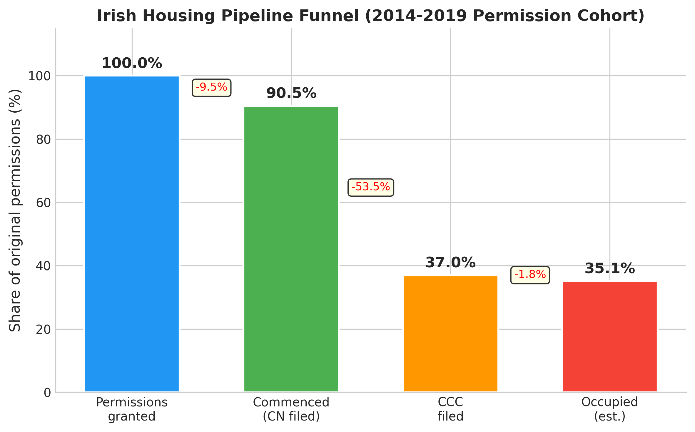
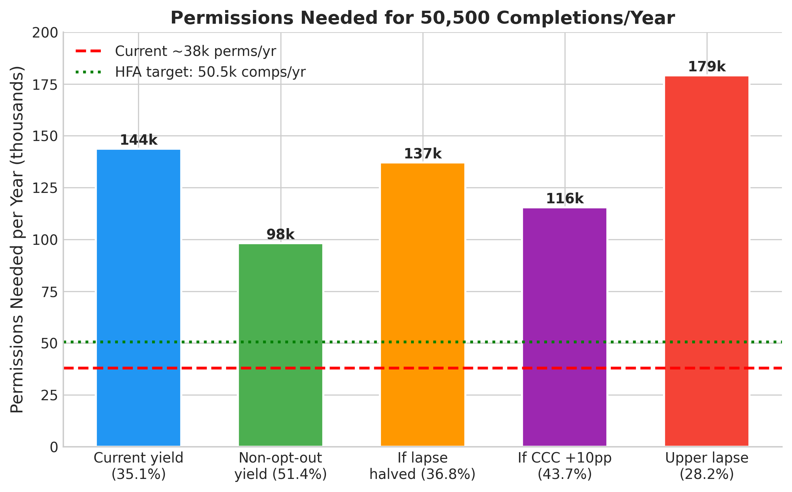

*Plain-language summary. Full technical write-up in the [paper](https://github.com/colinjoc/generalized_hdr_autoresearch/blob/main/applications/ie_housing_pipeline_e2e/paper.md). Synthesises: [commencement cohort](/hdr/results/irish-commencement-cohort/), [lapsed permissions](/hdr/results/irish-lapsed-permissions/), [housing pipeline](/hdr/results/irish-housing-pipeline/), [LDA delivery](/hdr/results/irish-lda-delivery/).*

## The question

Ireland grants roughly 38,000 residential planning permissions per year and completes roughly 30,000 homes. What happens to the other 8,000? Is the gap permission lapse, construction delay, administrative non-filing, or something else? And how many permissions does Ireland actually need to hit the Housing for All target of 50,500 completions per year?

## What we found

### Two yield numbers, not one

The answer depends on whether you measure "completed home" as "filed a Certificate of Completion and Compliance" or "home actually built":

| Metric | Yield | 95% CI |
|:---|---:|:---|
| **CCC-yield** (filed completion cert) | **35.1%** | 32.8-37.1% |
| **Build-yield** (estimated actually built) | **59.6%** | 55-64% |

The 24.5-percentage-point gap between them is almost entirely the **BCAR 2014 opt-out provision**: one-off self-build dwellings (31.6% of the permissions cohort) are legally exempt from filing a CCC. These homes ARE built — they just don't appear in the completion-certificate database. Once we adjust for the opt-out channel, the build-yield rises to roughly 60%.

### Stage-by-stage attrition

For every 100 residential permissions granted (2014-2019 cohort):

| Stage | Surviving | Lost | Cause |
|:---|---:|---:|:---|
| Permission granted | 100 | — | — |
| Commenced | 90.5 | 9.5 | Permission lapse (PL-4: ~9.5%) |
| CCC filed | 35.1 | 55.4 | CCC non-filing (53.5% opt-out regulatory, 46.5% genuine/pending) |
| Occupied | ~33.3 | ~1.8 | Vacancy/unsold (~95% occupancy proxy) |

The dominant "attrition" is CCC non-filing — but more than half of it is an administrative artefact (opt-out), not a genuine supply loss.

### Permissions needed for Housing for All: ~85,000 per year

At the build-yield of 59.6%, hitting 50,500 completions per year requires approximately **85,000 residential permissions per year**. At the CCC-yield of 35.1%, the number is ~144,000 — but this is the wrong denominator because CCC-yield under-counts homes that are actually built.

Ireland currently grants ~38,000 residential permissions per year. **The gap is roughly 47,000 permissions per year** — more than doubling current volume. This makes **permission volume the binding constraint**, not conversion efficiency.

### Pipeline latency: ~3 years from permission to completion

Median permission-to-CCC: **1,096 days (~3.0 years)**, IQR 691-1,710 days. Broken down:
- Permission to commencement: 234 days (from PL-1)
- Commencement to CCC: 496 days (from PL-1)

### What improves things most?

Sensitivity analysis on the three main levers:
1. **+20,000 permissions per year** → +11,900 additional completions/yr (build-yield basis)
2. **+10pp CCC filing rate** → +3,267 additional completions/yr
3. **Halve the lapse rate** (9.5% → 4.75%) → +700 additional completions/yr

Permission volume dominates. Conversion-efficiency improvements help but cannot close the gap alone.

## What this does NOT establish

- **Not build-yield certainty.** The 59.6% build-yield relies on the assumption that ~90% of opt-out one-off dwellings are actually built. If only 70% are built, the yield drops to ~52%.
- **Not a causal model.** We measure where attrition occurs; we do not estimate what policy change would reduce each stage's attrition.
- **Not capacity-adjusted.** Even if 85,000 permissions were granted, the construction sector can currently deliver ~35,000 homes per year. The constraint shifts from permissions to labour and materials at higher volumes.

## What it means

For policymakers: the Housing for All framework needs roughly 2.2× current permission volume. No amount of conversion-efficiency improvement (faster ABP, fewer lapses, better CCC filing) can close the gap without substantially more permissions being granted in the first place. The LDA contributes ~3% of the target and cannot substitute for private-sector permission volume.

For housing commentators: the headline "only 35% of permissions become completions" is misleading without the opt-out adjustment. The real build-yield is closer to 60% — still low, but the dominant loss is at the front of the pipeline (insufficient permissions), not in the middle (poor conversion).

## How we did it

Joined the national planning register (491k rows), BCMS commencement-notice register (231k rows), and CSO completions/permissions aggregate series. Stage-by-stage binomial attrition model validated against a discrete-event simulation and Cox multi-state survival model. Phase 2.75 blind reviewer mandated the CCC-yield / build-yield split and caught the opt-out framing gap. Phase 3.5 signoff cleared after all blocking issues resolved.
