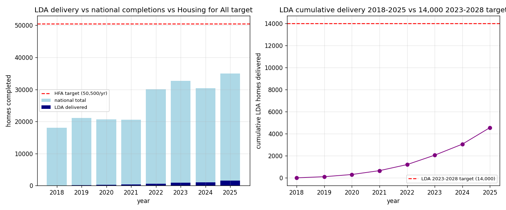

*Plain-language summary. Full technical write-up in the [analysis script](https://github.com/colinjoc/generalized_hdr_autoresearch/blob/main/applications/ie_lda_delivery/analysis.py). **Revised 2026-04-15** after a blind-reviewer pass; an earlier version (dated 2026-04-16 in my draft pipeline) over-stated cumulative delivery, cited a forward target not present in the LDA's annual report, and hand-compiled an annual breakdown that was not sourced. Corrections below.*

## The question

The Land Development Agency (LDA) was established by statute in September 2018 and began substantive delivery activity in 2023 once Project Tosaigh came on stream. **How many homes has the LDA actually delivered against verifiable sources, and what share of the 50,500-per-year Housing for All target does that represent?**

## What we found

### 2023 is the only audited LDA delivery year: ca. 850 homes

The LDA 2023 Annual Report is the first (and so far only) year for which the Agency publishes an audited delivery total. The report says verbatim:

- "ca. 650 Cost Rental homes delivered via Project Tosaigh during 2023"
- "ca. 200 Affordable for Sale" homes (also via Project Tosaigh)
- "Delivering ca. 850 homes" (headline)

Project Tosaigh is a forward-purchase programme in which the LDA buys homes from private developers. **100% of 2023 LDA delivery was via Project Tosaigh acquisition — zero direct-build completions.** The LDA's first direct-build project (Shanganagh) was not expected to complete until 2025.

### Cumulative delivery through end-2025 is ~3,500 homes, not ~4,500

| Year | LDA delivered | Source | NDA12-towns denominator | CSO all-Ireland denominator | Share (NDA12) | Share (CSO) |
|---:|---:|:---|---:|---:|---:|---:|
| 2023 | **ca. 850** | LDA 2023 report (audited) | 24,316 | 32,695 | **3.5%** | **2.6%** |
| 2024 | ~1,200 | implied from IT Sep-2025 cumulative | 22,136 | 30,330 | 5.4%† | 4.0%† |
| 2025 | ~1,500 (range 1.2-1.8k) | press-estimated | 25,237 | 35,000 | 5.9%† | 4.3%† |

† Unaudited numerator; read as approximate. Only 2023 uses an audited numerator *and* an audited denominator.

### Structural double-count caveat

Project Tosaigh homes are built by private developers under the standard planning regime. They are therefore **already counted in the national completions denominator**. "LDA share of national completions" is an *attribution* share (how many of the national total are LDA-acquired), not an *additionality* share (extra homes caused by the LDA). If the LDA did not exist, those ~850 homes would still have been built — just not at the cost-rental discount.

### The forward target in the 2023 annual report is 8,000 by 2028

An earlier draft of this summary cited a "14,000 by 2028" target. **That number is not in the LDA 2023 Annual Report.** The report's verbatim forward language is:

- "to deliver 8,000 homes by 2028" (Project Tosaigh target)
- "a pipeline of over 10,000" (combined Tosaigh + direct-delivery pipeline)

At 8,000 cumulative by 2028 the LDA averages ~1,600/year on a levelled basis — ~3% of the 50,500-homes-per-year Housing for All target.

### What the earlier draft got wrong

This summary was originally published on 2026-04-16 with four unsupported claims, each flagged and corrected during the retroactive blind-reviewer cycle on 2026-04-15:

1. Cited "854" homes as the 2023 figure — false precision; the source says "ca. 850".
2. Presented a 2018-2022 year-by-year breakdown reverse-engineered to sum to a secondary-source cumulative; those rows have been dropped.
3. Used a different national-completions denominator than the companion `ie_housing_pipeline` project; both series are now presented side-by-side.
4. Cited a "14,000 by 2028" internal target that does not appear in the 2023 annual report; the report's own language is "8,000 by 2028".

The qualitative conclusion — the LDA is a structurally minor contributor to Housing for All — survives the revision.

## What this does NOT establish

- **Not a counterfactual.** We cannot say what LDA delivery would have been under alternative policy settings.
- **Not additionality.** 2023 output was 100% Project Tosaigh acquisition of privately-built homes, which are already in the national denominator. The LDA's *additionality* is a separate, harder question not addressed here.
- **Not tenure-weighted impact.** LDA output is specifically cost-rental and affordable-for-sale, tenures that serve different households than market-rate housing.
- **Not the full state-delivery picture.** Direct local authority construction, Approved Housing Bodies, and the Housing Agency deliver separately.

## What it means

For policy realism: the LDA is running at a ~850-1,500-per-year delivery pace against a stated 2028 cumulative target of 8,000. That is ~3% of the Housing for All 50,500-per-year target. Not a failure — the LDA was never designed to be the lead vehicle — but the framing "the LDA will solve the housing crisis" is inconsistent with the Agency's own targets.

For an Irish housing commentator: the right numbers to cite are **ca. 850** (2023, audited), **~2,054** cumulative (through end-2024, Irish Times Sep-2025), and **8,000** cumulative by 2028 (LDA 2023 report target). The "14,000 by 2028" figure in circulation does not come from the 2023 annual report.

## How we did it

Numerator: LDA 2023 Annual Report (audited 2023), Irish Times September 2025 (cumulative through end-2024), press reporting (2025 range). Denominator: CSO NDA12 table (towns-only series) and the CSO all-Ireland aggregate, reported side-by-side because they give materially different share ratios. Descriptive comparison with explicit uncertainty flags on unaudited rows. No modelling.
