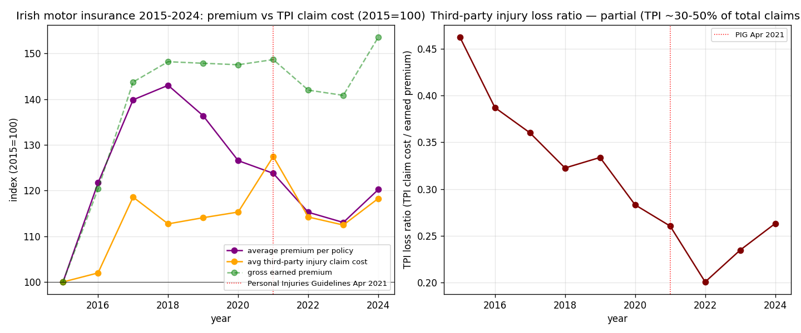

*A plain-language summary. The [full technical paper](https://github.com/colinjoc/generalized_hdr_autoresearch/blob/main/applications/ie_motor_insurance/paper.md) has the diagnostics and experiment logs. See [About HDR](/hdr/) for how this work was produced and reviewed.*

**Bottom line.** In April 2021 Ireland introduced the Personal Injuries Guidelines, promising to cut settlement awards by 30 to 50 percent and pass the savings to drivers. The average settlement did not fall. But the number of people making claims fell by 39 percent. Premiums dropped 15 percent — about 100 euros a policy. Insurers kept the rest of the savings. The reform worked, but not through the mechanism that was advertised.

## The question

Irish drivers have spent most of the last decade watching motor insurance premiums rise, then fall, then start rising again. The average premium went from about 493 euros per policy in 2015 to a peak of 672 in 2019, fell back to 557 by 2023, and began climbing again in 2024. The government's flagship intervention in this story was the Personal Injuries Guidelines, effective 24 April 2021. They replaced the old Book of Quantum with a new schedule of recommended settlement awards, and the promise at the time was that awards would fall by 30 to 50 percent and the savings would flow through to consumers. We asked: did the savings materialise, and who actually got them?

## What we found

- Per-claim settlements barely moved. Comparing the average injury settlement before the Guidelines (2017-2020) with after (2022-2024), the numbers are essentially identical — about 38,350 euros pre, 38,290 post. The advertised 30-to-50-percent cut in settlement sizes did not happen.
- What did happen was that 39 percent fewer people claimed. Per 1,000 policyholders, the number of third-party-injury claims fell from 5.71 a year pre-Guidelines to 3.48 a year post-Guidelines. When we normalised by driving exposure instead of policies, to rule out a pandemic-driving effect, the drop barely changed. It is real and it is post-pandemic.
- The shape of the shift is visible in the cost bands. Pre-Guidelines, about a third of claimants settled in the 15,000-to-30,000-euro band. Post-Guidelines, that share fell to 22 percent. Meanwhile the share settling under 10,000 euros rose from 18 percent to 32 percent. Mid-sized settlements moved down into the low band, or out of the system entirely.
- The official theory of change — claimants shifting from courts to the Personal Injuries Assessment Board — did not happen. The share of cases settled directly, at the board, or in litigation moved by less than a percentage point in each channel. The intended mechanism was not how the savings were delivered.
- Consumers received 40 percent of the total claim-cost reduction as a premium cut. Insurers kept the other 60 percent as margin.

## Why that matters

The Personal Injuries Guidelines were sold to the public as a structural fix: lower awards, passed through to lower premiums. The per-claim average award did not fall. Consumers did still get about 100 euros a year knocked off their premiums — but the mechanism was that roughly four in ten people who would have made a claim under the old regime simply did not make one under the new one. That can be read two ways, and the data does not let us pick between them. It could mean the old regime was absorbing a lot of speculative claims that the Guidelines now deter. Or it could mean that legitimate claimants are worse off under the new regime and have stopped filing. Both stories are consistent with the evidence.

The practical upshot is that the intervention's real lever was not the award schedule. It was the signal that the schedule sent to the claims-filing pipeline. That matters if you are designing the next generation of similar reforms — in housing deposits, banking-fee disputes, small claims, consumer complaints. You can sometimes get the same structural shift without changing the headline numbers at all, just by changing the incentives to file.

## What it means in practice

**For drivers.** The 15 percent premium decline from the 2019 peak is real and it is primarily due to the Guidelines. Expect more modest further gains — the drop in claim numbers has largely played out by 2024, and premiums are already starting to drift upward again as injury costs creep back up.

**For policymakers.** The official story of why the Guidelines worked does not match the data. The instrument that actually moved outcomes was claim deterrence, not award reduction. The next generation of reforms in similar consumer-complaint domains should be designed around that mechanism.

**For voters.** Roughly 40 percent of the government's claim-cost reduction flowed through to consumers as lower premiums. Sixty percent stayed with insurers as improved margin. Whether that is the right split is a political question, not a statistical one — but it is now answerable with numbers.

## How we did it

We used the three publicly available [National Claims Information Database](https://www.centralbank.ie/statistics/data-and-analysis/national-claims-information-database) files from the Central Bank of Ireland — premiums, settlements by channel, and settlements by cost band — and computed pre-Guidelines (2017-2020) and post-Guidelines (2022-2024) aggregates. We bootstrapped confidence intervals on every pre-post difference with 2,000 resamples, normalised exposure by earned vehicle years to rule out a COVID driving effect, and decomposed the total cost reduction into frequency, severity, channel and cost-band contributions. The open dataset covers third-party-injury claims only; property-damage claims are not included.

## Further reading

- [Central Bank National Claims Information Database](https://www.centralbank.ie/statistics/data-and-analysis/national-claims-information-database) — the source data.
- [Personal Injuries Guidelines](https://www.judicialcouncil.ie/personal-injuries-guidelines/) — the schedule of recommended awards introduced in April 2021.
- [Full technical paper](https://github.com/colinjoc/generalized_hdr_autoresearch/blob/main/applications/ie_motor_insurance/paper.md).
