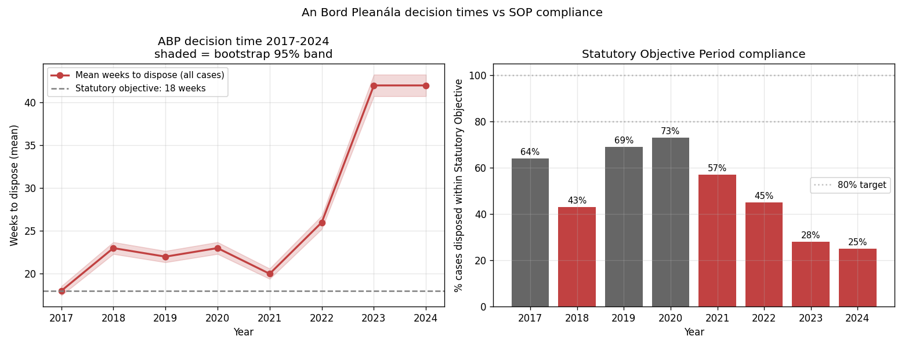
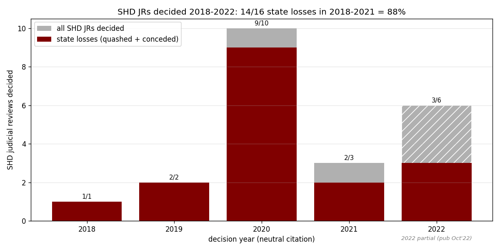

*This page consolidates findings from four studies: [ABP decision times](https://github.com/colinjoc/generalized_hdr_autoresearch/blob/main/applications/ie_abp_decision_times/paper.md), [SHD judicial review](https://github.com/colinjoc/generalized_hdr_autoresearch/blob/main/applications/ie_shd_judicial_review/paper.md), [LRD vs SHD](https://github.com/colinjoc/generalized_hdr_autoresearch/blob/main/applications/ie_lrd_vs_shd_jr/paper.md), and [JR tax on supply](https://github.com/colinjoc/generalized_hdr_autoresearch/blob/main/applications/ie_jr_tax_on_supply/paper.md).*

## ABP decision times doubled

Mean time to dispose a planning case went from **23 weeks in 2018 to 42 weeks in 2023-2024** (CI 40.6-43.4). Only 25% of cases met the 18-week statutory objective in 2024, down from 69% in 2019.

The queue utilisation ratio (intake ÷ throughput) peaked at **1.45 in 2022** — ABP was taking in cases 45% faster than it could clear them. This is an accounting relationship, not a causal explanation: board-member resignations, COVID disruption, case-mix shifts, and JR pressure all contributed but cannot be separated from annual data.

2025 quarterly data show partial recovery to 25-30 weeks with ~60% compliance.

## The SHD judicial-review record

Under the Strategic Housing Development regime (2017-2021), 16 judicial reviews were decided in 2018-2021. The state lost **14 of 16 — an 87.5% loss rate** (Clopper-Pearson CI 61.7-98.5%). Most were quashed for material contravention of the development plan.

## Did LRD reduce JR exposure?

The 2021 switch from SHD to Large-scale Residential Development was partly intended to reduce JR rates. Three years on: **we can't tell yet.** Only 2 LRD-era JRs have been decided (both conceded by the State). The 2023-2024 rise in LRD JR intake (3→7) is indistinguishable from a system-wide surge (+58%, with Commercial +150% and Infrastructure +850%).

A clean comparison requires ~2027, when the 2022-2024 LRD permission cohort will have fully passed the JR decision window.

## The total JR tax on housing supply

Twenty-two SHD-era JRs directly delayed approximately **7,000 housing units for a combined 105,000 unit-months** (sensitivity range 85-150k). That's equivalent to ~8,800 units delayed for one year.

If ABP had maintained 18-week statutory compliance throughout 2018-2024, a counterfactual simulation estimates **7,400-16,600 additional completions** over the period — but a construction-capacity ceiling of ~35,000/yr halves the upper bound.

The indirect channel (JR pressure → defensive ABP behaviour → slower all-case processing) cannot be point-identified from aggregate data. We report it as a 0-50% attribution range — a midpoint of ignorance, not a finding.

## What it all means for housing supply

In the [bottleneck ranking](/hdr/results/irish-housing-bottleneck-and-levers/), restoring ABP to 18 weeks and removing JR entirely are each worth **~1,060 completions/yr** — real but modest against the 16,300-unit HFA gap. The planning system is not the primary constraint; it's permission volume and construction economics. But faster ABP decisions DO reduce finance costs (shorter pipeline = less holding cost), which feeds back into viability through the [interaction model](/hdr/results/irish-housing-bottleneck-and-levers/).
