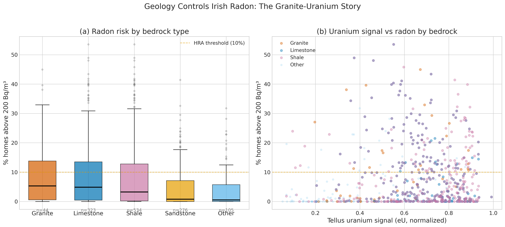
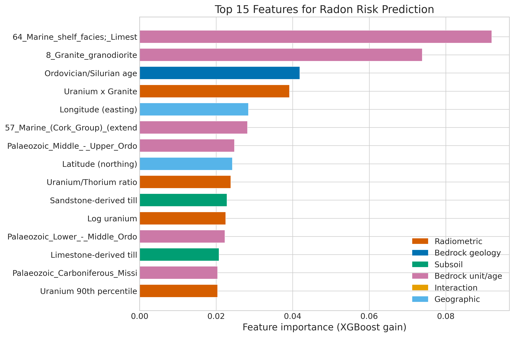

*This is a short summary. For the full technical write-up, see the [detailed paper](https://github.com/colinjoc/hdr_autoresearch/blob/master/applications/irish_radon/paper.md).*

## The Question

Radon is an invisible, odourless radioactive gas that seeps from the ground into buildings. It causes about 250 lung cancer deaths in Ireland every year, making it the second leading cause after smoking. The government designates "High Radon Areas" on a 10-kilometre grid, but that grid is too coarse to tell individual homeowners whether they are at risk. Worse, only about 3 percent of Irish homes have ever been tested.

We asked a simpler question first: can the geological data that the government already collects -- airborne surveys of radioactivity, maps of bedrock and glacial soils -- predict which areas are dangerous without needing to test every house?

## What We Found

Geology alone can identify High Radon Areas with reasonable accuracy, but the most powerful signal is not the one you would expect.

- The airborne uranium survey (where a plane flies over Ireland measuring radioactivity from 56 metres up) is only the tenth most important predictor. Knowing the specific type of rock underneath matters far more than knowing how much uranium the plane detected.
- The single most important predictor is whether the bedrock is a particular type of Carboniferous limestone -- a marine shelf facies with high permeability from ancient cave systems. These karst features act as underground highways for radon gas.
- The third most important predictor is a combination feature we engineered: granite bedrock overlain by granite-derived glacial till. This is the "double source" -- the granite below produces radon, and the glacial soil above it (ground up from the same granite by ice sheets) produces more radon and is permeable enough to let it through.
- The model reduces prediction error by 12 percent compared to a simple statistical baseline, tested under strict conditions that ensure no county's data leaks into another county's prediction.

## Why That's Surprising

Conventional wisdom in radon science says that airborne uranium measurements are the single best predictor of indoor radon. That is true at finer scales, where a high uranium reading over your specific plot of land means you probably have high radon. But at the 10-kilometre scale used by the Irish radon map, knowing the rock type is more informative than knowing the average uranium reading across the whole grid square.

This makes physical sense once you think about it. A grid square might have high average uranium because half of it is granite and half is sandstone. But the radon risk depends on where the houses are, not on the average. The rock type tells you about the mechanisms -- limestone with caves funnels radon through preferential pathways; granite with granitic till provides a double source -- while the average uranium reading washes out the detail.

The granite-till interaction is the most novel finding. Glacial till is the rubble left behind by ice sheets. When ice scraped across granite and deposited the debris, it created a layer of uranium-rich soil on top of uranium-rich rock. Both produce radon, and the till is permeable enough to let it reach the surface. This combination is found in parts of Wicklow, Carlow, and Galway, where the Leinster and Galway granite batholiths are covered by their own glacial debris.

## What It Means

For homeowners: if your house sits on granite bedrock with granitic till subsoil, you should test for radon even if the government map does not flag your specific grid square as high risk. The combination is more dangerous than either factor alone would suggest.

For the government's retrofit programme: Ireland plans to retrofit 500,000 homes for energy efficiency by 2030. Making a house more airtight is good for energy bills but can double the indoor radon concentration by reducing ventilation. Homes on the granite-till combination that undergo deep retrofits should be tested for radon before and after the work.

For measurement campaigns: the counties where the model is least certain (Sligo, Carlow, and Louth, all at geological boundary zones) are exactly where targeted measurement would be most valuable. These are areas where the 10-kilometre grid resolution is too coarse to capture rapid changes in rock type.

## How We Did It

We used five publicly available datasets: the EPA radon grid map (820 grid squares based on 63,914 home measurements), the Geological Survey Ireland Tellus airborne radiometric survey (uranium, thorium, and potassium measured at 50-metre resolution from aircraft), the all-island bedrock geology map at 1:500,000 scale, the national subsoils map with glacial deposit classifications, and county boundaries. We engineered 53 features capturing bedrock type, subsoil composition, radiometric intensity, and geology-subsoil interactions.

Models were evaluated under spatial cross-validation grouped by county, meaning that when predicting radon in County Galway, the model has never seen any data from Galway during training. This is a deliberately strict test that gives honest performance estimates. No synthetic data were used at any stage. Full code and data references are in the [project repository](https://github.com/colinjoc/hdr_autoresearch/tree/master/applications/irish_radon).

## Further Reading

- EPA Ireland. "Radon Map of Ireland." (2025). [epa.ie](https://www.epa.ie/environment-and-you/radon/radon-map/) -- the official radon risk map for Ireland, based on the National Radon Survey.
- Elio J et al. "Estimation of residential radon in Ireland using geology, TELLUS radiometric data and indoor radon measurements." *Journal of Environmental Radioactivity* 249:106903 (2022). [doi:10.1016/j.jenvrad.2022.106903](https://doi.org/10.1016/j.jenvrad.2022.106903) -- the current state of the art for Irish radon prediction.
- Roberts DR et al. "Cross-validation strategies for data with temporal, spatial, hierarchical, or phylogenetic structure." *Ecography* 40(8):913-929 (2017). [doi:10.1111/ecog.02881](https://doi.org/10.1111/ecog.02881) -- why standard cross-validation gives misleading results for spatial data.

---
**[HDR methodology](https://github.com/colinjoc/hdr_autoresearch)**
