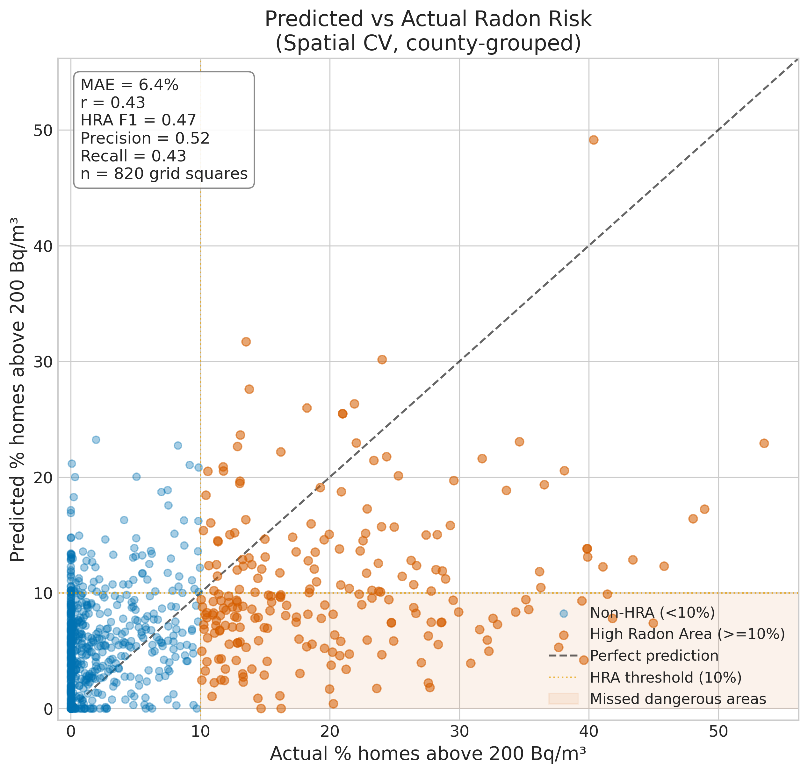
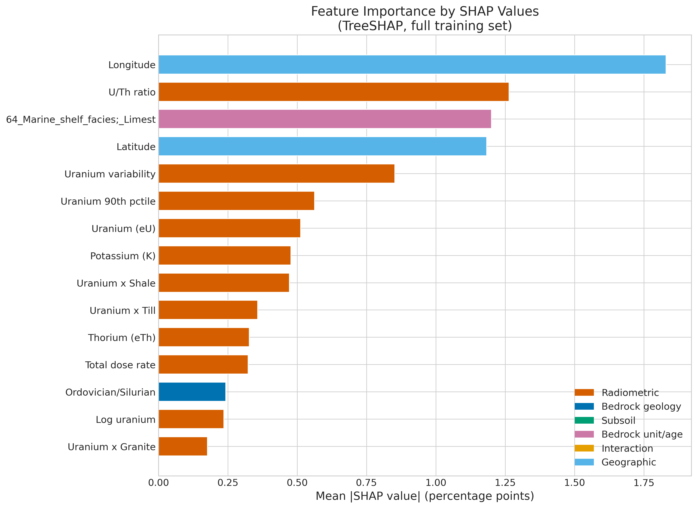
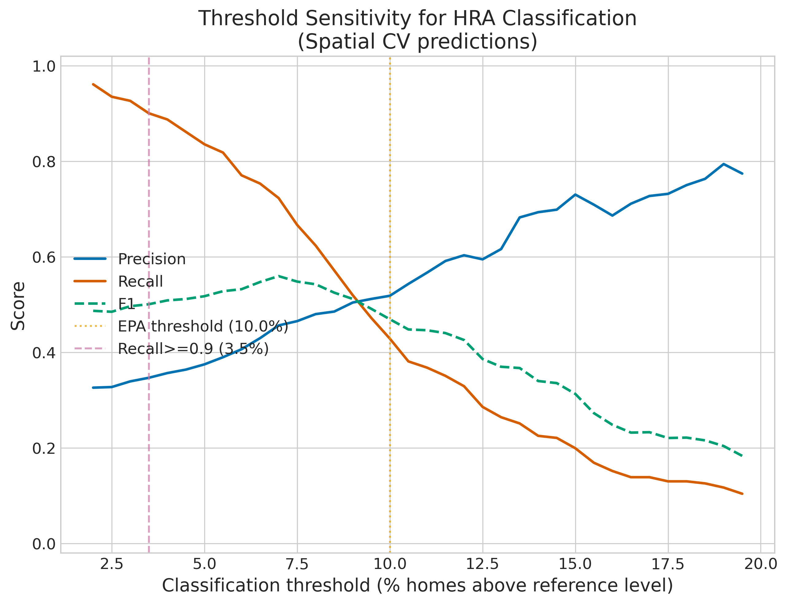

*This is a short summary. For the full technical write-up, see the [detailed paper](https://github.com/colinjoc/hdr_autoresearch/blob/master/applications/irish_radon/paper.md).*

## The Question

Radon is an invisible, odourless radioactive gas that seeps from the ground into buildings. It causes about 250 lung cancer deaths in Ireland every year -- the second leading cause after smoking. The government designates "High Radon Areas" on a 10-kilometre grid, but only about 3 percent of Irish homes have ever been tested.

We asked: can publicly available geological data -- airborne radioactivity surveys, bedrock maps, glacial soil maps -- predict which grid squares are dangerous without testing every house?

## What We Found

The model identifies real geological signals, but it is not accurate enough to screen for radon risk on its own.

The headline number: F1 = 0.47 for classifying High Radon Areas, with precision of 0.52 and recall of 0.43. In plain terms, the model misses 57 percent of actual High Radon Areas. It finds barely half the dangerous zones and flags a fair number of safe ones as dangerous.

The failure is worst where it matters most. For the 32 grid squares where more than 30 percent of homes exceed the reference level -- the most dangerous areas in Ireland -- the model predicts a mean of only 13 percent. It underpredicts by 25 percentage points in exactly the places where accurate warnings are most needed.

## What the Geology Tells Us

Despite the model's limitations as a screening tool, the feature analysis reveals which geological factors correlate most strongly with radon risk. We used SHAP values (a method that assigns each feature a contribution to each prediction) rather than the cruder gain-based importance that tree models report by default. The two methods give different answers, and the difference is instructive.

The strongest predictors by SHAP are geographic coordinates (east-west position is the single strongest feature), the uranium-to-thorium ratio from the airborne survey, and specific bedrock formations -- particularly Carboniferous marine shelf limestone, which has moderate uranium but high permeability from ancient cave systems that act as underground highways for the gas.

The granite-till combination is genuinely associated with elevated radon: the 17 grid squares where granite bedrock sits under granite-derived glacial soil have mean radon rates double the national average. The physical mechanism is sound -- the granite below produces radon, and the glacial soil above (ground from the same granite by ice sheets) produces more radon and is permeable enough to let it through. But 17 observations out of 820 is too few to build a reliable prediction on, and removing this feature from the model barely changes its accuracy.

An important caveat: the airborne radioactivity data we used was extracted from colour-rendered map images rather than raw measurements. This is like trying to read a thermometer from a photograph -- you get the general direction but lose the precision. The apparent finding that rock type matters more than the radioactivity signal may partly be an artifact of this degraded data. With access to the raw measurements, the radioactivity features might perform better.

## How It Compares to Previous Work

Previous Irish radon prediction studies by Elio and colleagues reported higher accuracy numbers (AUC 0.78-0.82). When we run our model under the same evaluation method they used (standard random cross-validation), we get AUC 0.83 -- comparable. The difference is that random cross-validation allows the model to train on one grid square and test on its neighbour in the same county, which inflates the score by about 10 percent because neighbouring squares share the same geology. Our county-grouped spatial cross-validation is deliberately stricter: when predicting radon in Galway, the model has never seen any data from Galway.

## What It Means

This model is not ready to guide public health decisions. But the geological patterns it finds point toward productive next steps:

First, the counties where the model is most uncertain -- Sligo, Carlow, and Louth, all at geological boundary zones -- are exactly where targeted radon measurement campaigns would be most valuable. These are areas where the 10-kilometre grid cannot capture rapid changes in rock type.

Second, the degraded airborne survey data is a solvable problem. The Geological Survey of Ireland holds the raw measurements; obtaining them would let us test whether a direct uranium measurement genuinely adds less than knowing the rock type, or whether that finding was an artifact of working with images instead of data.

Third, for Ireland's energy retrofit programme (500,000 homes by 2030), the geological features could contribute to a risk-screening checklist -- is the home on granite, is there granitic glacial soil, is the rock karstified limestone -- even if the model itself is not accurate enough to replace measurement.

## How We Did It

We used five publicly available datasets: the Environmental Protection Agency radon grid map (820 grid squares based on 63,914 home measurements), the Geological Survey Ireland Tellus airborne radiometric survey (uranium, thorium, and potassium), the all-island bedrock geology map, the national subsoils map, and county boundaries. We engineered 53 features and evaluated models under spatial cross-validation grouped by county. No synthetic data were used at any stage. Full code and data references are in the [project repository](https://github.com/colinjoc/hdr_autoresearch/tree/master/applications/irish_radon).

## Further Reading

- EPA Ireland. "Radon Map of Ireland." (2025). [epa.ie](https://www.epa.ie/environment-and-you/radon/radon-map/) -- the official radon risk map for Ireland.
- Elio J et al. "Estimation of residential radon in Ireland using geology, TELLUS radiometric data and indoor radon measurements." *Journal of Environmental Radioactivity* 249:106903 (2022). [doi:10.1016/j.jenvrad.2022.106903](https://doi.org/10.1016/j.jenvrad.2022.106903) -- the current state of the art for Irish radon prediction.
- Roberts DR et al. "Cross-validation strategies for data with temporal, spatial, hierarchical, or phylogenetic structure." *Ecography* 40(8):913-929 (2017). [doi:10.1111/ecog.02881](https://doi.org/10.1111/ecog.02881) -- why standard cross-validation gives misleading results for spatial data.
- Bossew P et al. "Development of a geogenic radon hazard index." *Int J Environ Res Public Health* 17(11):4134 (2020). -- European radon mapping methodology.

---
**[HDR methodology](https://github.com/colinjoc/hdr_autoresearch)**
