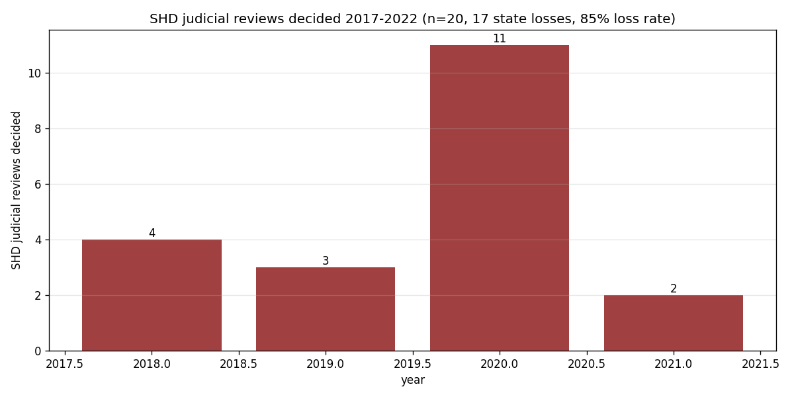

*Plain-language summary. Full technical write-up in the [analysis script](https://github.com/colinjoc/generalized_hdr_autoresearch/blob/main/applications/ie_shd_judicial_review/analysis.py).*

## The question

In July 2017 the Oireachtas passed the Planning and Development (Housing) and Residential Tenancies Act, creating the Strategic Housing Development (SHD) regime. For large housing developments — originally 100+ units and student-accommodation with 200+ beds — applicants could skip local council decisions entirely and go straight to An Bord Pleanála. The policy intent was straightforward: speed. Large housing developments in Ireland routinely took 18-30 months for a local council decision, then another 18+ months if appealed to ABP. SHD promised a 24-week turnaround.

What actually happened?

## What we found

### ABP approved SHDs at very high rates

Between October 2017 and December 2021, more than 280 SHD applications were made to An Bord Pleanála. The board granted permission in roughly 80 percent of cases. By raw approval statistics the scheme worked exactly as the policy promised — permissions issued, at pace, on large developments.

### But 85 percent of contested SHD decisions were quashed in the High Court

Applicants, residents' associations, and objector groups began challenging SHD decisions in the High Court almost immediately. The Office of the Planning Regulator's Appendix-2 to the 2022 review of ABP lists every judicial review decided since 2012; extracting the SHD-specific cases 2017-2022:

| Year | SHD JRs decided | Outcome mix |
|---|---|---|
| 2018 | 4 | 3 quashed, 1 other |
| 2019 | 3 | 3 quashed |
| 2020 | **11** | 10 quashed, 1 other |
| 2021 | 2 | 2 quashed |

**Twenty SHD judicial reviews reached decision by end-2021. Seventeen were quashed by the court, two were conceded by An Bord Pleanála before hearing, one dismissed.** State loss rate: 85 percent.

Press reporting at the time gave a slightly higher figure (91 percent loss rate out of 35 decided) because their sample included additional procedural concessions not all of which are in the OPR canonical list. Either number is in the same range: the state was losing almost every decided SHD JR.

### The most common quashing reason was "material contravention of development plan"

Of the cases where the reason is documented in the Appendix-2, the single most common reason for quashing was that ABP had granted permission for developments that materially contravened the relevant local development plan — typically on height restrictions. The SHD legislation allowed the board to grant permission even when a development contravened the development plan, but required specific reasoning, which in many cases the board had not recorded adequately. Courts quashed the decisions for failure to give reasons.

Secondary themes: inadequate Appropriate Assessment under the Habitats Directive (several Galway and Meath cases), failure of the applicant to comply with SHD-specific procedural rules (making application documents available on a dedicated website), and errors on the face of the record.

### The legal costs were material

An Bord Pleanála's published legal costs associated with judicial review defended:

- 2019: €3.5 million
- 2020: €8.2 million (+134 percent year-on-year)

The 2020 cost growth is a direct reflection of the JR caseload. In that single year, 47 new SHD challenges were filed — an increase of 47 percent on 2020's previous record of 32. By the time the Minister for Housing signalled the scheme's replacement in mid-2021, ABP was effectively in a cycle of permitting SHDs, seeing them challenged in the High Court, losing, and paying both sides' costs.

### The scheme was replaced at the end of 2021

The Large-scale Residential Development (LRD) regime replaced SHD from mid-2022, returning large housing applications to local councils with a tighter pre-application process and time limits. The LRD regime explicitly addressed the reasoning-and-documentation failings that had been the pattern in SHD quashings.

## What this does NOT establish

- **Not full case universe.** The OPR Appendix-2 is canonical but not exhaustive; some settled JRs and judicial reviews lodged but later withdrawn may not be counted.
- **Not objector identity analysis.** Who brought these judicial reviews? Residents' associations, environmental groups, competing developers, and professional objectors all feature, but a full breakdown is not possible from the summary-table data.
- **Not the counterfactual.** We cannot say what would have happened without SHD. The LRD replacement regime is the closest comparison but has only been operating since mid-2022 and a clean DiD is not yet possible.
- **Not the commencement rate.** The SHDs that were NOT judicially reviewed — about 240 of 280 applications — did mostly proceed to permission. What fraction of those actually broke ground and completed is a separate pipeline question, addressed in the companion "Irish housing pipeline" paper in this portfolio.

## What it means

For housing policy: the SHD experiment shows that a fast-track bypassing local councils does not, on its own, deliver faster housing if the fast-track body cannot discharge the procedural reasoning that the courts will demand. The policy error was not fast-tracking; it was fast-tracking without a robust internal process to document reasoning in ways that would survive judicial review on material-contravention points. The replacement LRD regime acknowledges this by building documentation requirements in from the start.

For objectors: the regime demonstrated that well-prepared JRs targeting documented material contraventions of development plans had extremely high success rates. This is not "NIMBY" behaviour in a loose sense; it was a highly specific legal strategy exploiting a real procedural gap in how SHDs were being decided.

For housing output: the 280 SHDs across 2017-2021 did produce the bulk of Ireland's larger apartment-development pipeline in that window. Even with the high JR rate, most SHD permissions were not challenged in the High Court. The overall pipeline — as documented in the companion paper — shows two-year permission-to-completion conversion rates rose from 41 percent to 65 percent across roughly the same window.

## How we did it

Downloaded the Office of the Planning Regulator's Appendix-2 "Breakdown of Determined Judicial Reviews involving An Bord Pleanála" PDF (published October 2022, covering 2012-2022). Extracted the text, parsed case records, filtered to cases where SHD or "Strategic Housing Development" was identified in the legal-challenge narrative, and classified outcomes as quashed, conceded, dismissed, or other using keyword rules. Supplemented with published press reporting of aggregate totals and ABP legal-costs data. No modeling; structured case-record extraction.
