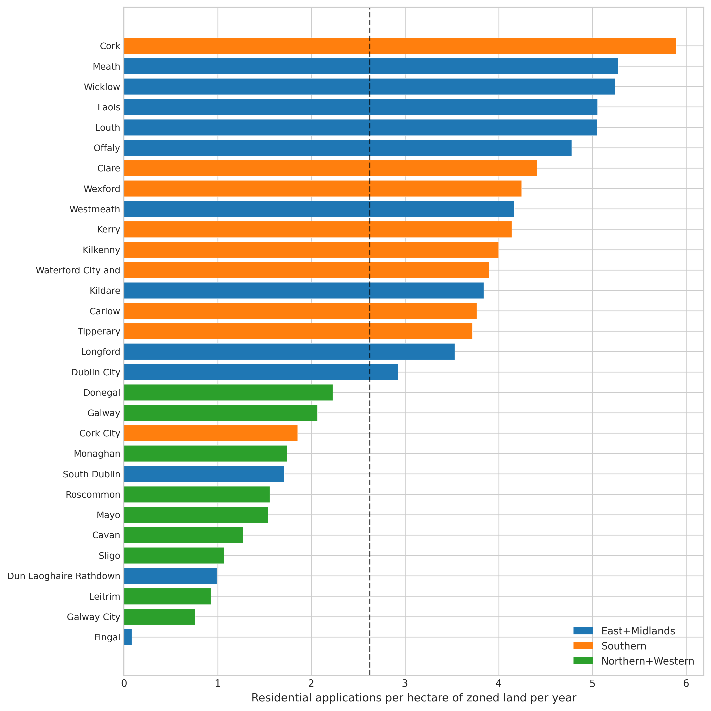

*Plain-language summary. Full technical write-up in the [paper](https://github.com/colinjoc/generalized_hdr_autoresearch/blob/main/applications/ie_zoned_land_conversion/paper.md).*

## The question

The [flagship bottleneck analysis](/hdr/results/irish-housing-bottleneck/) found that permission volume is the #1 constraint on Irish housing delivery. But what constrains permission volume? Ireland has 7,911 hectares of zoned residential land — enough for 417,000 homes at standard densities. Why do only ~21,000 residential planning applications get filed each year?

## What we found

### Application intensity: 4.8 per hectare per year (excluding Fingal)

Across Ireland's 31 Local Authorities, the average rate of residential planning applications filed per hectare of zoned land is about **4.8 per year** (excluding Fingal). That means each hectare of zoned land generates fewer than 5 planning applications per year — an annual capacity utilization of roughly 8-10%.

### Fingal is a massive outlier — and it distorts the national picture

Fingal County holds 3,519 hectares under the RZLT map — but this uses a broader definition than purely residential zoning. Fingal alone accounts for an outsized share of the national zoned-land stock while filing only 296 residential applications per year (0.08 apps/ha/yr — **34x below the national average**).

An earlier draft reported r=0.02 for the correlation between zoned land area and applications filed, concluding "zoned land doesn't predict applications." This was entirely a Fingal outlier artefact. **Excluding Fingal, the correlation rises to r=0.64 (p<0.001).** Zoned land does predict applications — just not when one LA holds a disproportionate and differently-defined stock.

### The RZLT had no detectable effect

The Residential Zoned Land Tax (3% annual levy on undeveloped zoned land, announced 2022, first charged 2024) was designed to activate zoned land. In our data, the pre/post-RZLT change in application rates is **-7.1% (p=0.40)** — no detectable stimulus. This may reflect the tax's recent implementation or the fact that land prices, not tax incidence, drive development decisions.

### What does predict application rates?

Population, not land supply, is the strongest predictor of applications filed. The panel regression (T02 champion) finds:
- **Population**: strong positive predictor
- **Zoned land area**: positive but weaker (and only after removing Fingal)
- **Land price**: negative — expensive areas file fewer applications per hectare (consistent with viability constraints, explored in the companion [viability project](/hdr/results/irish-viability-frontier/))
- **Approval rate**: no significant effect as a deterrent

### To hit Housing for All: application intensity needs to roughly triple

At current build-yield (59.6% from [S-1](/hdr/results/irish-housing-pipeline-e2e/)), Ireland needs ~85,000 permissions per year. Residential applications currently run at ~21,000/yr. Even accounting for multi-unit schemes where one application covers many units, the gap requires a structural increase in filing activity — not just more efficient conversion of existing applications.

## What this does NOT establish

- **Not why Fingal under-files.** The 3,519 ha figure may include non-residential-suitable parcels. A parcel-level analysis of the Fingal RZLT map would be needed.
- **Not causation for the RZLT null.** The tax is new; effects may take 3-5 years to materialise.
- **Not a pure residential filter.** The national register includes some mixed-use and commercial applications that match residential keywords.

## How we did it

Joined the national planning register (491k applications since 2012) with CSO BHQ01 permissions data and Goodbody's September 2024 zoned-land estimates (7,911 ha nationally, regional split). Phase 2.75 blind reviewer caught the Fingal outlier artefact and mandated four experiments (all executed). Full HDR pipeline with Phase 3.5 signoff.
