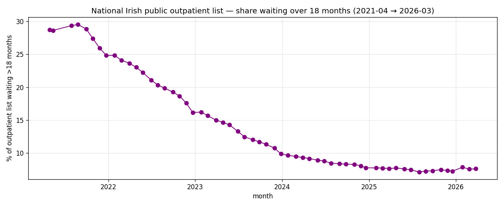

*Plain-language version. Full technical write-up in the [paper](https://github.com/colinjoc/generalized_hdr_autoresearch/blob/main/applications/ntpf_outpatient_waits/paper.md).*

## The question

Every month the National Treatment Purchase Fund publishes open data on the Irish public hospital waiting lists. As of December 2025, 611,987 people were waiting for a first outpatient appointment. Of those, about 40,000 had been waiting more than 18 months — the threshold beyond which access effectively becomes foreclosed: you are on a list, but no one has scheduled you, and no one is telling you when they will.

The political backdrop is a decade of government investment aimed at shrinking that number. Sláintecare (2018, €500m+ per year committed) is the supply-side plan: more beds, more consultants, structural reform. The NTPF itself spends about €230m per year buying private capacity to pull individual patients off public queues. The question a voter can ask at any given moment is direct: **is my local hospital's backlog growing or shrinking? And do we have any way of knowing what is about to happen next month?**

We trained a model on five years of public NTPF data to answer the second version of the question.

## What we found

At the monthly hospital level, whether the over-18-month share of a hospital's outpatient list will grow next month is partially predictable. A gradient-boosted machine-learning model reaches ROC-AUC 0.70 (bootstrap 95 percent confidence interval 0.67 to 0.74). A permutation test rejects the null that this is chance at p less than 0.001. The model's probability outputs are well-calibrated — the expected calibration error is about 5.5 percent across quantile bins, meaning a predicted "60 percent chance the backlog will grow" corresponds to roughly a 60 percent observed growth frequency.

Several specific findings survived the standard robustness battery:

- **The model is stronger at predicting material growth than tiny jitter.** At the knife-edge "any growth at all" threshold, AUC is 0.70. At "grew by at least 2 percentage points" it is 0.79. At "grew by at least 10 extra patients", 0.81. These are the thresholds a policymaker would care about.

- **A hospital's identity contributes essentially nothing to the forecast.** Dropping all 20 hospital-specific indicator variables changed AUC by 0.001. The model is not learning "Beaumont's quirks" or "CUH's specific pattern"; it is learning generic dynamics that apply across hospitals. A hospital's own recent trajectory is all the model needs.

- **Children's waiting lists are more predictable than adults'.** A model trained and tested within the child subset reaches AUC 0.74. In the adult subset, 0.65. When we held each children's hospital out of training and predicted it from the rest, AUC was still 0.74 — so this is not driven by CHI Temple Street or Crumlin being easier than average. Either paediatric queues have more regular dynamics (school-term-tied scheduling?) or fewer substitution options make the trajectory more mechanical.

- **Most of the signal is autocorrelation.** A bare-bones model that uses only the current over-18-month fraction and two lags of it reaches AUC 0.68. The full 30+ feature set only adds 0.02. This is a queue with slow physical dynamics — limited consultant-hours, limited bed days, steady referral flow — and the best prediction of next month's state is an extrapolation of this month's trend.

## The forecast for next month

Running the model on the most recent available data (end of March 2026) gives a ranked list of the hospital-month combinations most likely to see their over-18-month share grow. The top ten:

| Rank | Hospital | Adult/Child | Current total waiting | Over 18 months | Predicted growth probability |
|---|---|---|---:|---:|---:|
| 1 | Midland Regional Hospital Mullingar | Child | 993 | 29 | 62% |
| 2 | Letterkenny University Hospital | Child | 1,320 | 2 | 60% |
| 3 | Mallow General Hospital | Adult | 3,799 | 209 | 59% |
| 4 | Mayo University Hospital | Child | 1,065 | 64 | 56% |
| 5 | University Hospital Limerick | Child | 4,202 | 236 | 56% |
| 6 | Midland Regional Hospital Tullamore | Adult | 18,236 | 152 | 55% |
| 7 | Beaumont Hospital | Adult | 54,019 | 2,787 | 53% |
| 8 | St. James's Hospital | Adult | 27,460 | 1,315 | 52% |
| 9 | Our Lady of Lourdes Drogheda | Adult | 17,086 | 854 | 51% |

The cluster is diverse: a regional Midlands hospital (Mullingar) and a western hospital (Letterkenny) top the list on the children's side; the two largest Dublin teaching hospitals (Beaumont and St. James) appear on the adult side; the Mid-West's University Hospital Limerick — already the subject of a January 2024 overcrowding scandal and a 2025 public inquest — shows up on the children's list. These are the places where the current momentum in the data, without any new information about bed capacity or consultant hires, favours the list getting longer before it gets shorter.

## Why the child-adult gap is interesting

In ten tournament-and-robustness experiments, one finding repeatedly stood out: whatever we did to the model, the children's subset was easier to predict than the adult subset. We tested whether this was an artefact of the two big Dublin paediatric hospitals dominating the subset; it was not — the finding survives holding each children's hospital out. That leaves three candidate explanations, none tested directly here:

1. **Paediatric specialties have simpler dynamics.** Paediatric outpatient queues are dominated by four specialties (ENT, ophthalmology, dermatology, orthopaedics) with well-defined referral flows. Adult queues span 60+ specialties with heterogeneous patterns.
2. **Children can't substitute into private care easily.** An adult with private insurance can circumvent the public queue; a child typically cannot, so the observed queue reflects genuine demand rather than the demand-minus-substitution we see in adults.
3. **Paediatric scheduling is term-tied.** School holidays, term dates, and summer-break patterns may produce more regular seasonality.

Distinguishing between these requires a follow-on project with specialty-level data and a parent-level insurance indicator, neither of which are in the panel we used.

## What we did not establish

This is a short-horizon forecasting paper, not a causal one. We did not measure whether Sláintecare has worked, whether the March 2023 Public-Only Consultant Contract has reduced waits in hospitals whose consultants opted in, or whether the NTPF-funded private-capacity purchases actually reduce long waits versus shifting them within the queue. Each of those is a genuine research question with the right natural-experiment design (staggered difference-in-differences on consultant-contract opt-in, interrupted time series on NTPF allocation step-ups). They are the next project, not this one.

We also could not extend the panel back before April 2021. The NTPF schema changed when adult and child lists were separated in that month, and the pre-April-2021 CSVs are not available at the URL pattern they should be — a data-ingest project in its own right.

## What it means

For the person on the list: the model is useful for recognising that your local hospital's backlog has the dynamics it has for structural reasons (consultant hours, bed days, referral patterns), not because some single policy decision is about to rescue you. When your hospital's current trajectory is upward, a lagged-structure forecast says it will very probably continue upward next month.

For someone tracking Irish health performance: the model provides a calibrated probability forecast that can be used as a baseline against which policy-intervention effects would have to be distinguished. If Sláintecare's consultant contract reforms work, they will show up as a downward shock against the forecast. If they don't, the lag structure will absorb them.

For someone interested in method: the hospital-identity channel being uninformative is the interesting observation. Irish outpatient queue dynamics are apparently a shared thing — what's happening at Beaumont this month is, in its trajectory behaviour, largely what's happening at Cork University Hospital or at Mayo. The system is behaving like a single slow-dynamic object distributed across 46 sites.

## How we did it

We downloaded the full NTPF outpatient Open Data archive (2021-04 through 2026-03), built a monthly panel of 4,740 hospital-month observations from 46 public hospitals across Adult and Child lists, and predicted whether each hospital-month's over-18-month fraction would grow in the following month using a gradient-boosted tree with rolling-time cross-validation. Robustness battery included cluster-bootstrap confidence intervals, a 100-iteration permutation null, three thresholded outcome variants, leave-one-hospital-out on the children's subset, and a simple-autoregression benchmark. The full code, data pipeline, and all experiment rows are in the linked paper.
