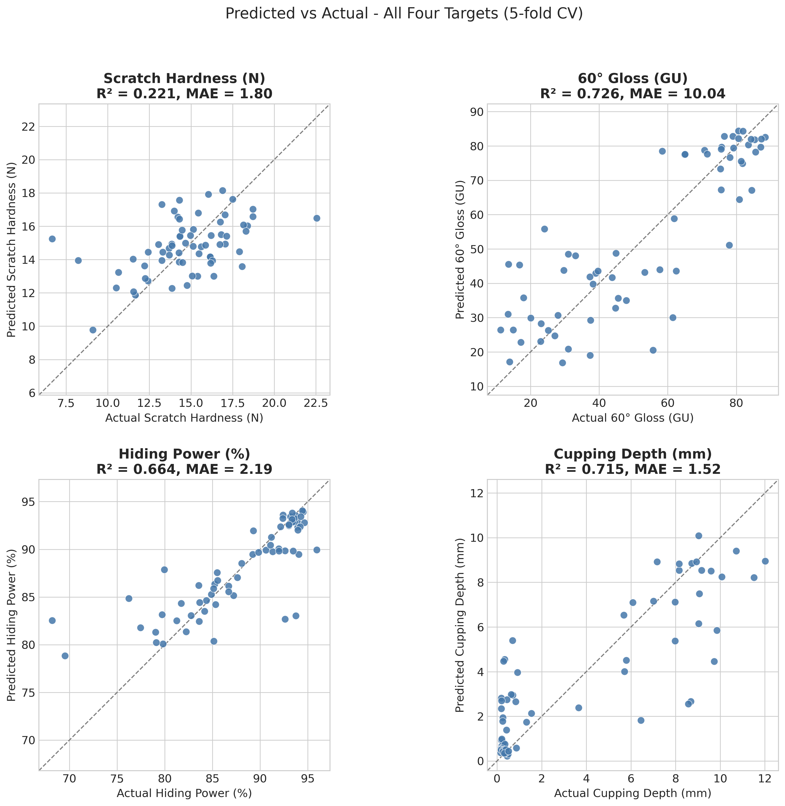

*This is a short summary. For the full technical write-up, see the [detailed paper](https://github.com/colinjoc/hdr_autoresearch/blob/main/applications/paint_formulation/paper.md).*

## The Question

Developing a new industrial lacquer is slow and expensive. A formulation chemist adjusts four or more ingredients -- crosslinker content, isocyanate type, matting agent, pigment loading -- and each combination must be tested for gloss, scratch resistance, hiding power, and flexibility. A single development cycle can consume 30 to 60 lab samples before landing on a satisfactory recipe.

In 2024, researchers at a German coatings institute published the first fully open dataset for this problem: 65 measured two-component polyurethane lacquer samples from six experimental campaigns, with all composition variables and four performance targets included. They trained a single Gaussian Process model on all four targets using 10,000 rounds of automated hyperparameter tuning.

We asked a simpler question: does choosing the best model family and the most useful physics-informed feature for each property independently beat the one-model-fits-all approach?

## What We Found

It does. Matching each property to its own model and adding a single domain-specific feature per target cuts prediction error by 13 to 28 percent on three of the four properties. The fourth -- scratch hardness -- resists prediction by any method, topping out at 22 percent of variance explained.

The pattern is clean and physically interpretable:

- **Scratch hardness** responds to a simple linear model (Ridge regression) with the binder-to-pigment ratio as its key feature. The relationship between binder content and scratch resistance is approximately linear up to the critical pigment volume concentration.

- **Gloss** needs a deeper nonlinear model (XGBoost, depth 7) but only after adding the logarithm of film thickness and a thickness-times-matting-agent interaction term. These features encode the known power-law relationship between film thickness and surface roughness in drying coatings.

- **Hiding power** is best predicted by a randomised ensemble (ExtraTrees) with a single feature: the product of film thickness and pigment concentration. This directly encodes the Kubelka-Munk radiative transfer equation that governs light scattering through pigmented films.

- **Cupping depth** (flexibility before cracking) uses the same ensemble approach with an isocyanate-type interaction and a pigment volume concentration proxy, capturing the combined stiffening effect of rigid isocyanate chemistry and silica filler particles.

## The Surprise

The published study invested 10,000 rounds of automated hyperparameter tuning into a single model family. Our per-target approach uses essentially default settings for each model, with the improvement coming from two decisions: which model family to use, and which single physics-informed feature to add. Domain physics encoded as features outperformed 10,000 rounds of brute-force tuning.

A second surprise was what did not work. Compositional log-ratio features -- which theory says should help because the ingredients sum to a fixed total -- failed on every target. The published dataset's normalisation already removes the constraint they exist to fix. Monotonicity constraints (forcing physically correct relationships like "more matting agent means less gloss") also hurt every target. At 65 samples, the real-world exceptions to these rules are frequent enough that a hard constraint does worse than a learned pattern.

The gloss model, despite having the best overall accuracy, systematically over-predicts at low gloss values (below 30 gloss units). Highly matte finishes, where silica particles create surface micro-asperities, remain harder to model from normalised composition data alone.

## How Robust Are These Results

A leave-one-campaign-out evaluation -- holding out each of the six experimental batches in turn and predicting it from the other five -- shows 2 to 14 percent MAE degradation compared to random cross-validation splits. The improvements survive this harder test, though gloss and cupping predictions degrade most, suggesting batch-level effects in those measurements. Campaign i2, in particular, is consistently the hardest to predict.

Scratch hardness, with an R-squared of 0.22, has no practical predictive value at this sample size. The published sensitivity analysis shows scratch hardness depends on a diffuse mix of variables with no single dominant driver. On 65 samples, that diffuse signal is genuinely below the noise floor. Any claim of better scratch hardness prediction on this dataset should be treated with scepticism.

## What It Means

For coating formulation chemists: when optimising a multi-target coating, fit one model per target. The critical features are well-known coating science -- binder-to-pigment ratio for hardness, the thickness-times-pigment product for hiding power, and the isocyanate-type interaction for flexibility. A formulation discovery sweep using this approach identified a predicted candidate with 81 gloss units at an estimated volatile organic compound content of 106 grams per litre -- inside the low-emission regime defined by EU Directive 2004/42/EC for decorative coatings.

For the machine learning community: cross-validation protocol matters enormously on small datasets. The published study used a single 55 versus 10 train-test split. Under five-fold cross-validation on the same data, the baseline looks meaningfully weaker, and a leave-one-campaign-out evaluation further degrades performance by up to 14 percent. Small-dataset ML papers should report both random-split and structure-aware cross-validation to bound the optimism of their estimates.

## How We Did It

We used the published 65-sample two-component polyurethane lacquer dataset from Zenodo (DOI 10.5281/zenodo.13742098), with four normalised composition variables, film thickness, and four performance targets. We reproduced the published Gaussian Process baseline under five-fold cross-validation, ran a four-family model tournament per target, then 204 single-change experiments testing 22 physics-informed features. Eleven experiments were kept across the four targets (5.5 percent keep rate). A discovery sweep screened 7,785 candidate formulations across five generation strategies, filtering to 4,765 after removing physically infeasible compositions. Full code, data reference, and the complete 204-experiment log are in the [project repository](https://github.com/colinjoc/hdr_autoresearch/tree/main/applications/paint_formulation).

## Further Reading

- Borgert T et al. "High-Throughput and Explainable Machine Learning for Lacquer Formulations." *Progress in Organic Coatings* (2024). [Zenodo doi:10.5281/zenodo.13742098](https://doi.org/10.5281/zenodo.13742098) -- the published baseline this study improves upon.
- Wicks ZW et al. *Organic Coatings: Science and Technology* (Wiley, 2007). -- the comprehensive coating-science textbook covering the physical mechanisms encoded in the kept features.
- Geurts P, Ernst D, Wehenkel L. "Extremely Randomized Trees." *Machine Learning* (2006). [doi:10.1007/s10994-006-6226-1](https://doi.org/10.1007/s10994-006-6226-1) -- the randomised ensemble method that won three of four targets.

---
[HDR methodology](https://github.com/colinjoc/hdr_autoresearch) -- the framework and full project history
