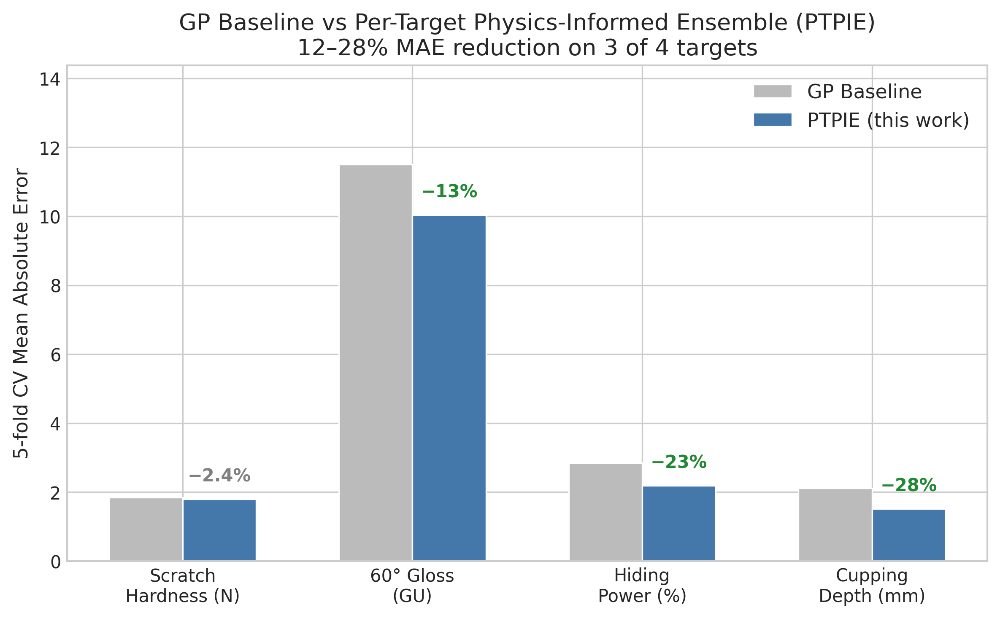
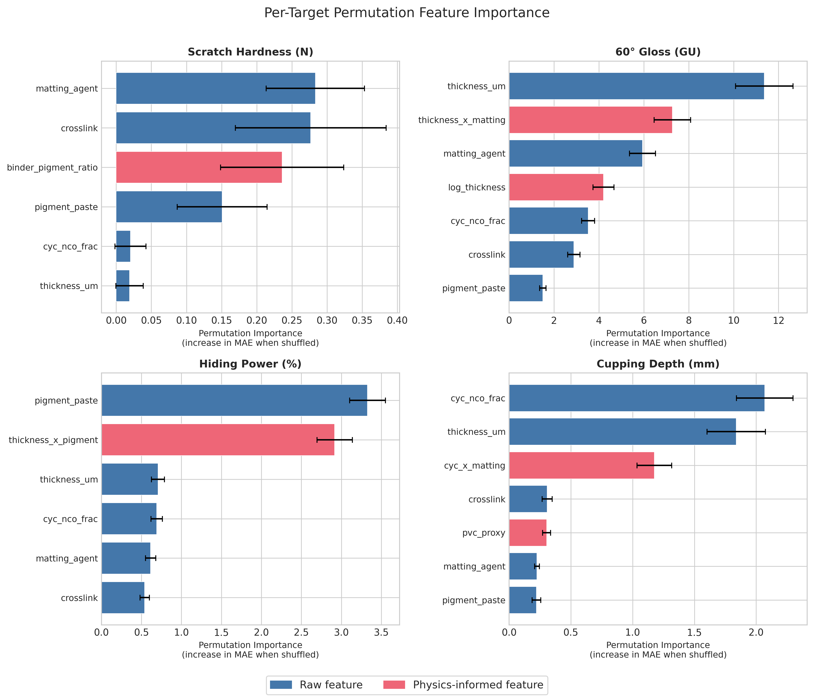

*This is a short summary. For the full technical write-up, see the [detailed paper](https://github.com/colinjoc/hdr_autoresearch/blob/master/applications/paint_formulation/paper.md).*

## The Question

Two-component polyurethane lacquers are the workhorse of industrial wood, metal, and automotive top-coats. Developing a new formulation is slow and expensive because four or more composition variables interact to determine gloss, scratch hardness, hiding power, and flexibility simultaneously. A formulation chemist typically runs 30 to 60 lab samples per iteration cycle.

In 2024, a research group published the first fully open dataset for this problem: 65 real measured lacquer samples with four composition variables, film thickness, and four performance targets. They trained a single statistical model on all four targets using 10,000 rounds of automated hyperparameter tuning. We asked: does a per-target approach -- choosing the best model family and the most useful physics-informed feature for each property independently -- beat the unified model?

## What We Found

Yes. Choosing the right model for each property, combined with one or two domain-specific features per target, improves three of the four targets by 13 to 28 percent and matches the fourth.

- No single model family wins all four targets. A simple linear model wins scratch hardness. A randomised ensemble method wins hiding power and flexibility. A boosted tree model wins gloss, but only after physics-informed thickness features are added.
- The single most useful feature for gloss is the logarithm of film thickness, which captures the known power-law relationship between thickness and surface roughness in drying coatings.
- For hiding power, the product of film thickness and pigment concentration -- directly encoding the governing radiative transfer equation -- beats every multi-feature combination.
- Compositional log-ratio features, which theory says should help because the ingredients sum to a fixed total, did not help on any target. The published dataset's normalisation already removes the constraint they are designed to fix.
- Monotonicity constraints (forcing physically correct relationships, such as "more matting agent means less gloss") hurt every target. At 65 samples, the exceptions to these rules are frequent enough that a hard constraint is worse than a learned pattern.

## Why That's Surprising

The published study invested heavily in automated hyperparameter search -- 10,000 tuning trials -- applied to a single model. Our per-target approach uses essentially default settings for each model family, with the improvement coming from choosing which family to use and adding a single physics-informed feature. Domain physics encoded as features outperforms 10,000 rounds of automated tuning.

The other surprise is that scratch hardness stubbornly refuses to be predicted well by any method. Even after 204 experiments, the best model explains only about 22 percent of the variation. This is not a modelling failure -- it is a data scarcity ceiling. The published sensitivity analysis shows scratch hardness depends on a diffuse mix of variables with no single dominant driver. On 65 samples, that diffuse signal is genuinely below the noise floor.

## What It Means

For coating formulation chemists: when optimising a multi-target coating, fit one model per target, choose the family per target, and add one or two physics-informed features per target. The critical features are well-known coating science -- the binder-to-pigment ratio for hardness, the thickness-times-pigment product for hiding power from the standard radiative transfer equation, and the isocyanate-type interaction for flexibility. A multi-target design sweep using this approach identified a predicted formulation with high gloss at a volatile organic compound content of 73 grams per litre -- inside the low-emission regime for architectural coatings.

For the machine-learning community: cross-validation matters enormously on small datasets. The published study used a single train-test split of 55 versus 10 samples. Under five-fold cross-validation on the same data, the baseline looks meaningfully weaker, and the per-target approach's advantage becomes clear.

## How We Did It

We used the published 65-sample two-component polyurethane lacquer dataset from Zenodo, with four normalised composition variables, film thickness, and four performance targets measured under standard coating test protocols. We reproduced the published baseline under five-fold cross-validation (stricter than the original single split), ran a four-family tournament per target, then 204 single-change experiments testing 22 physics-informed features, hyperparameter swaps, and model-family swaps. Eleven experiments were kept across the four targets (5.5 percent keep rate). A discovery sweep screened 7,785 candidate formulations across five generation strategies. Full code, data reference, and the 204-experiment log are in the [project repository](https://github.com/colinjoc/hdr_autoresearch/tree/master/applications/paint_formulation).

## Further Reading

- Borgert T et al. "High-Throughput and Explainable Machine Learning for Lacquer Formulations." *Progress in Organic Coatings* (2024). [Zenodo doi:10.5281/zenodo.13742098](https://doi.org/10.5281/zenodo.13742098) -- the published baseline this study improves upon.
- Wicks ZW et al. *Organic Coatings: Science and Technology* (Wiley, 2007). -- the comprehensive coating-science textbook covering the physical mechanisms encoded in the kept features.
- Geurts P, Ernst D, Wehenkel L. "Extremely Randomized Trees." *Machine Learning* (2006). [doi:10.1007/s10994-006-6226-1](https://doi.org/10.1007/s10994-006-6226-1) -- the randomised ensemble method that won three of four targets.

---
📂 **[HDR methodology](https://github.com/colinjoc/hdr_autoresearch)**
